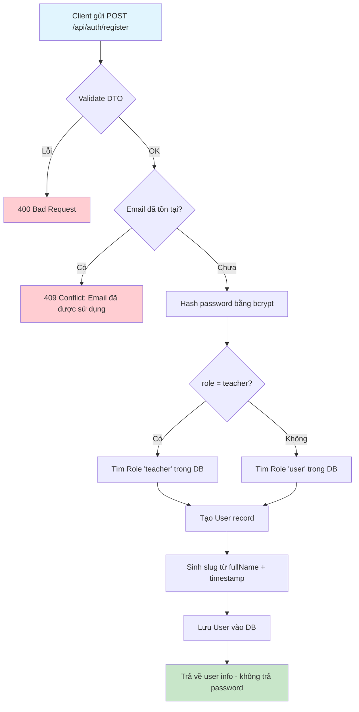
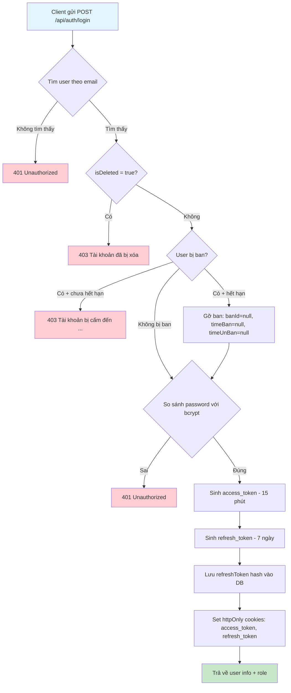
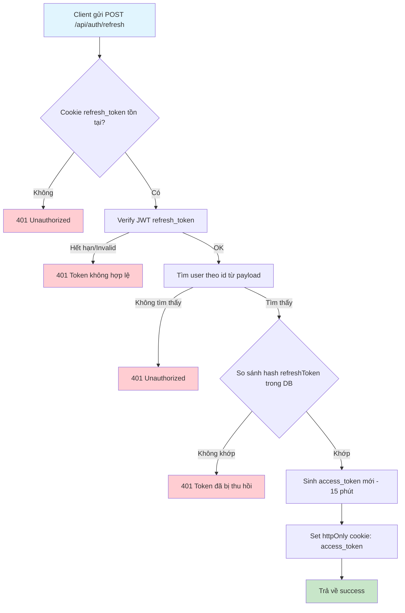
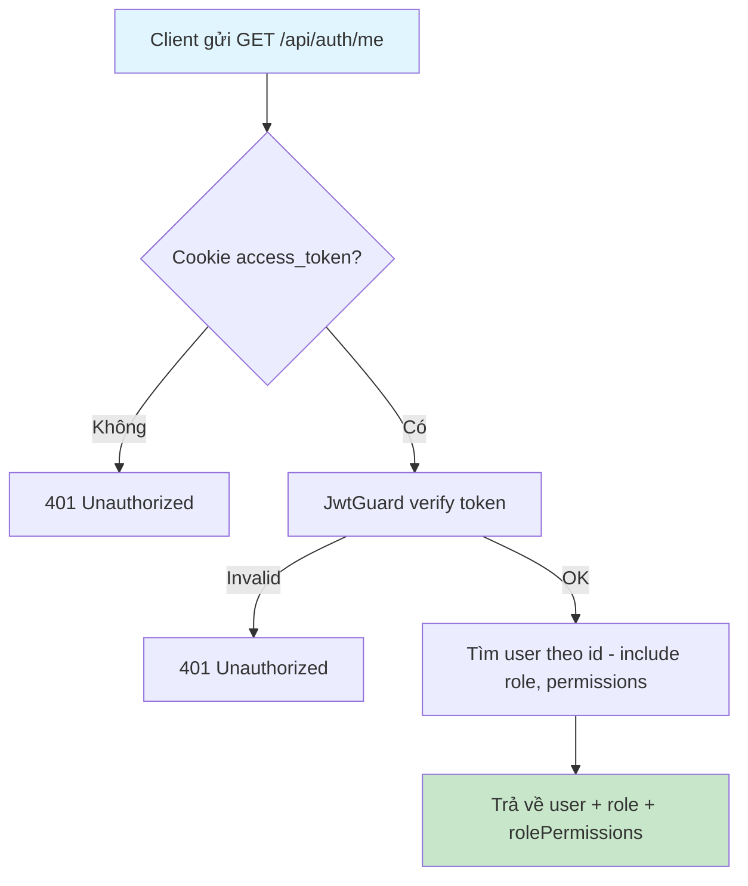
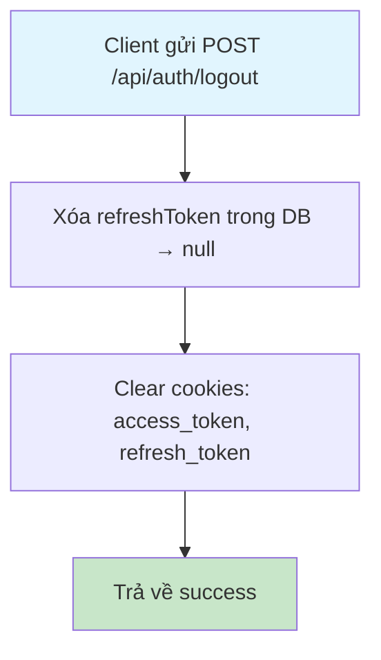
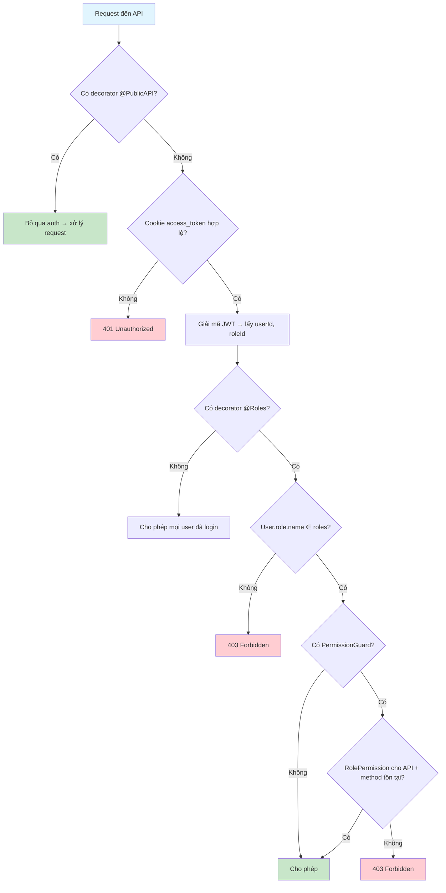

# Flow 01: Xác thực & Phân quyền (Authentication & Authorization)

## Tổng quan
Hệ thống sử dụng JWT (access_token + refresh_token) lưu trong httpOnly cookie.  
Có 3 role chính: **User**, **Teacher**, **Admin**.

---

## 1. Đăng ký (Register)

### Database Changes
| Bảng | Hành động | Dữ liệu |
|------|-----------|----------|
| `users` | INSERT | fullName, email, hashedPassword, roleId, slug, availableAmount=0 |

---

## 2. Đăng nhập (Login)

### Database Changes
| Bảng | Hành động | Dữ liệu |
|------|-----------|----------|
| `users` | UPDATE | refreshToken = hash(token) |
| `users` | UPDATE (nếu hết hạn ban) | banId=null, timeBan=null, timeUnBan=null |

---

## 3. Refresh Token

---

## 4. Lấy thông tin user hiện tại (Fetch Me)

---

## 5. Đăng xuất (Logout)

### Database Changes
| Bảng | Hành động | Dữ liệu |
|------|-----------|----------|
| `users` | UPDATE | refreshToken = null |

---

## 6. Luồng phân quyền (Authorization Flow)

---

## Tổng hợp API

| Method | Endpoint | Auth | Role |
|--------|----------|------|------|
| POST | `/api/auth/register` | Public | — |
| POST | `/api/auth/login` | Public | — |
| POST | `/api/auth/refresh` | Cookie | — |
| GET | `/api/auth/me` | Cookie | Mọi role |
| POST | `/api/auth/logout` | Cookie | Mọi role |
