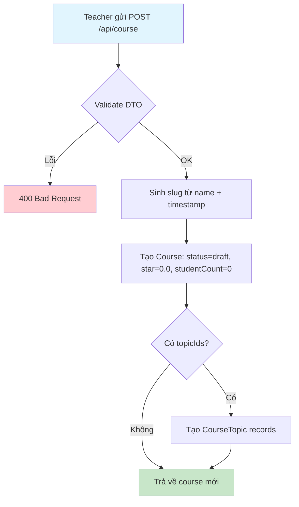
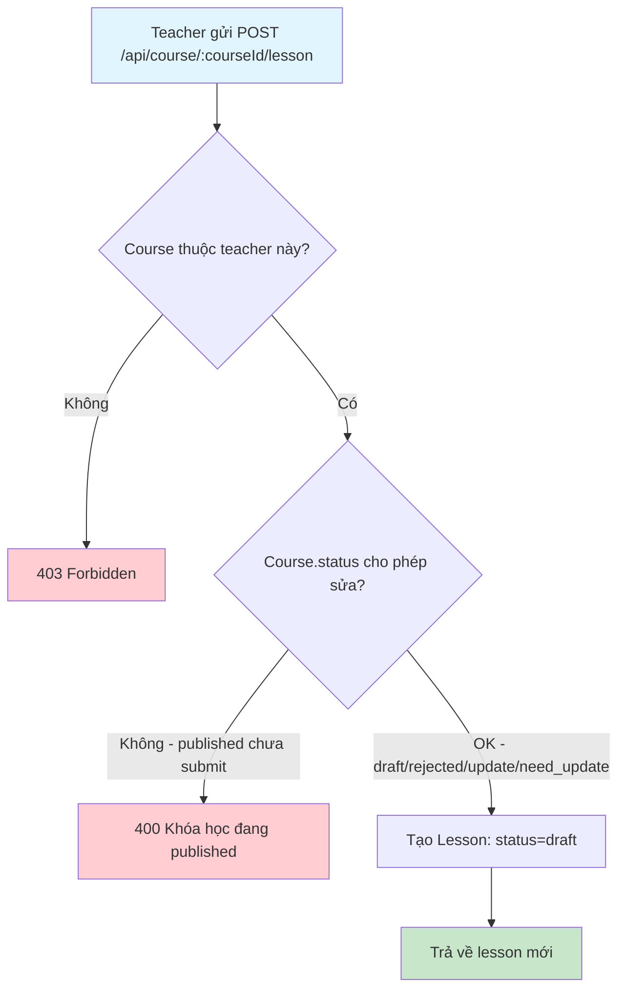
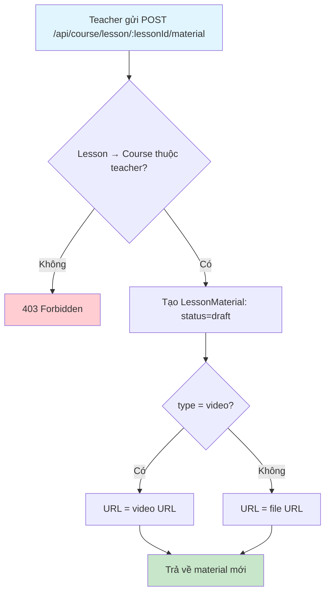
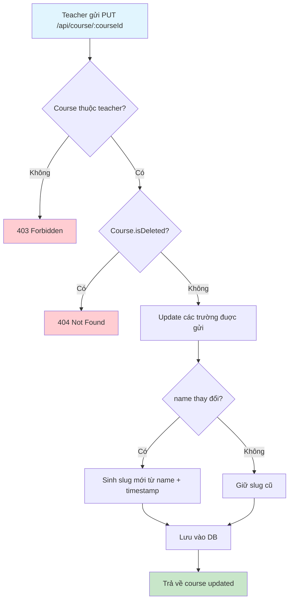
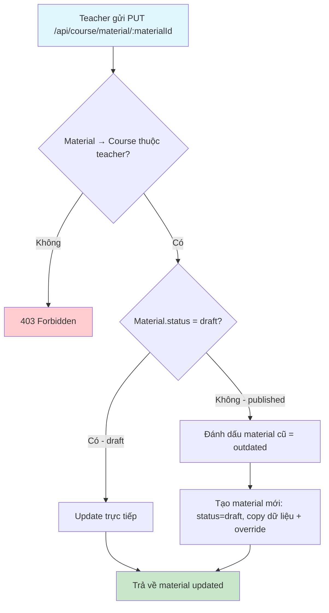
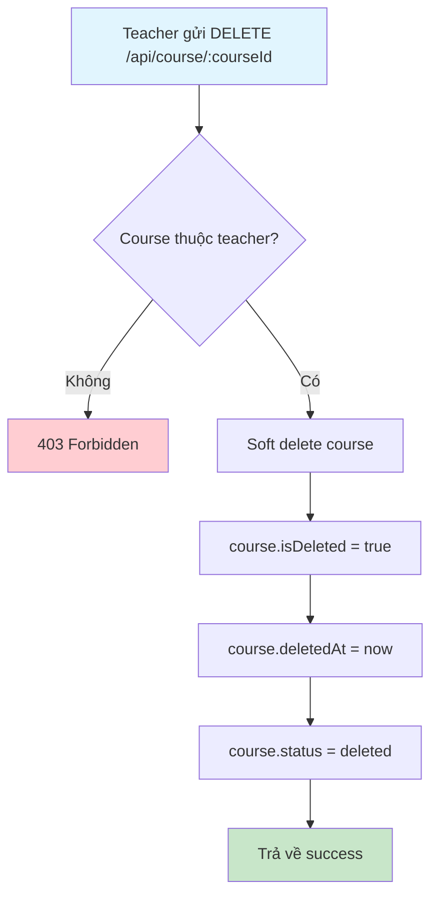
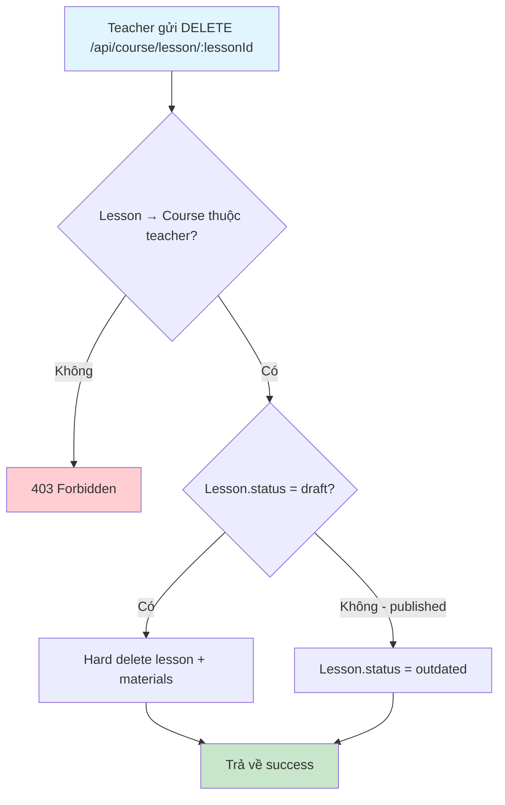
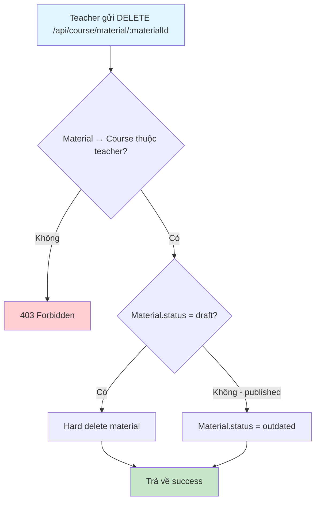
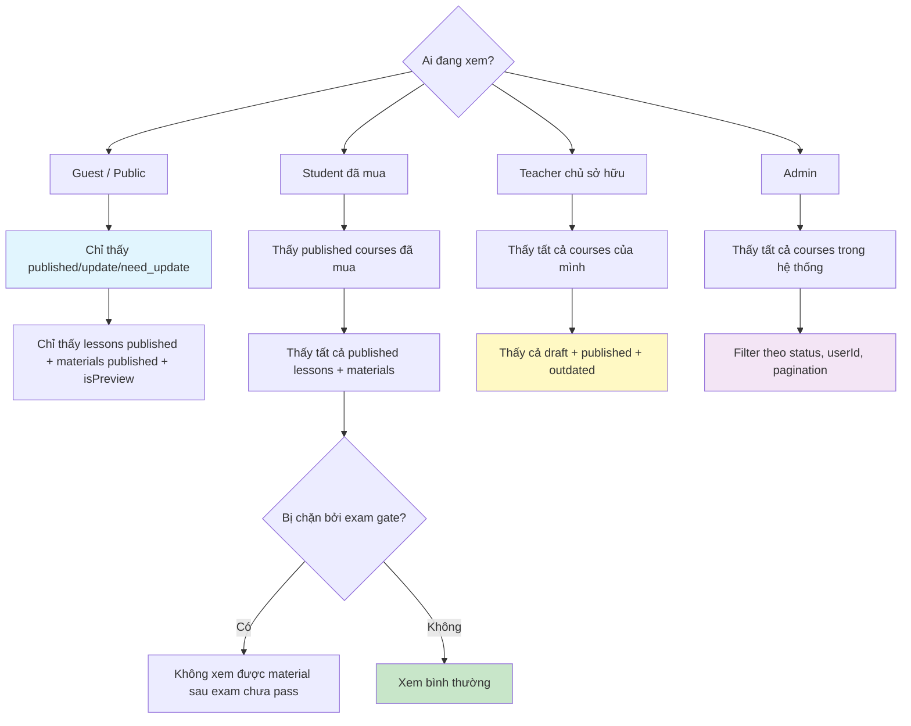
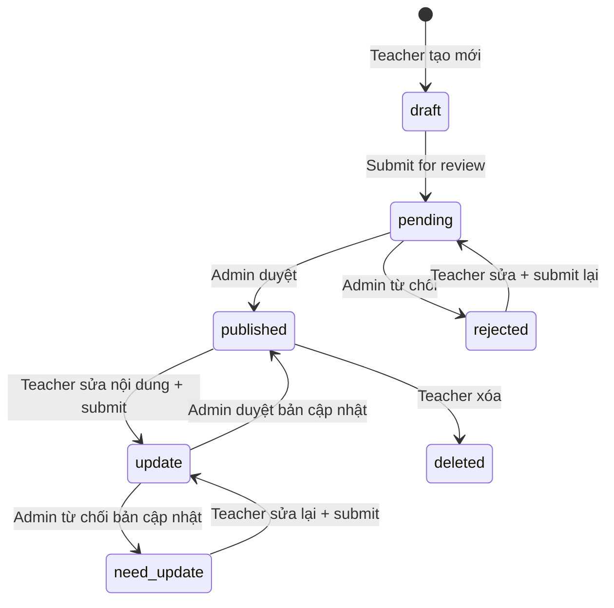

# Flow 02: Quản lý Khóa học (Course CRUD)

## Tổng quan
Teacher tạo khóa học ở trạng thái `draft`, thêm bài học và tài liệu, sau đó gửi duyệt cho Admin.  
Mỗi khóa học có: lessons → lesson_materials (video, pdf, img, link, other).

---

## 1. Tạo khóa học (Create Course)



### Database Changes
| Bảng | Hành động | Dữ liệu |
|------|-----------|----------|
| `courses` | INSERT | name, price, thumbnail, content, description, slug, userId, status=draft, star=0.0 |
| `course_topics` | INSERT (multiple) | courseId, topicId |

---

## 2. Thêm bài học (Create Lesson)



### Database Changes
| Bảng | Hành động | Dữ liệu |
|------|-----------|----------|
| `lessons` | INSERT | courseId, name, status=draft |

---

## 3. Thêm tài liệu bài học (Create Lesson Material)



### Database Changes
| Bảng | Hành động | Dữ liệu |
|------|-----------|----------|
| `lesson_materials` | INSERT | lessonId, type, name, url, status=draft, isPreview |

---

## 4. Cập nhật khóa học (Update Course)



### Các trường có thể cập nhật (KHÔNG cần duyệt lại)
- `name`, `price`, `description`, `thumbnail`, `content`

---

## 5. Cập nhật tài liệu bài học (Update Lesson Material)



### Logic quan trọng: Published Material → Outdated + New Draft
```
Material (published) → status = outdated
     ↓
Material (draft) ← bản mới với nội dung cập nhật
```

### Database Changes
| Bảng | Hành động | Điều kiện | Dữ liệu |
|------|-----------|-----------|----------|
| `lesson_materials` | UPDATE | status=draft | Cập nhật trực tiếp |
| `lesson_materials` | UPDATE | status=published | status → outdated |
| `lesson_materials` | INSERT | status=published | Bản mới: status=draft |

---

## 6. Xóa khóa học (Delete Course)



---

## 7. Xóa bài học (Delete Lesson)



---

## 8. Xóa tài liệu bài học (Delete Lesson Material)



---

## 9. Xem danh sách khóa học (theo vai trò)



---

## Tổng hợp trạng thái



---

## Tổng hợp API

| Method | Endpoint | Role | Mô tả |
|--------|----------|------|--------|
| POST | `/api/course` | Teacher | Tạo khóa học |
| PUT | `/api/course/:courseId` | Teacher | Cập nhật khóa học |
| DELETE | `/api/course/:courseId` | Teacher | Xóa khóa học |
| POST | `/api/course/:courseId/lesson` | Teacher | Tạo bài học |
| PUT | `/api/course/lesson/:lessonId` | Teacher | Cập nhật bài học |
| DELETE | `/api/course/lesson/:lessonId` | Teacher | Xóa bài học |
| POST | `/api/course/lesson/:lessonId/material` | Teacher | Thêm tài liệu |
| PUT | `/api/course/material/:materialId` | Teacher | Cập nhật tài liệu |
| DELETE | `/api/course/material/:materialId` | Teacher | Xóa tài liệu |
| GET | `/api/course` | Public | Danh sách khóa học |
| GET | `/api/course/:key` | Public | Chi tiết khóa học |
| GET | `/api/course/user/:userId` | Public | Khóa học của giảng viên |
| GET | `/api/course/purchased` | User | Khóa học đã mua |
| GET | `/api/course/admin/all` | Admin | Tất cả khóa học + filter |
