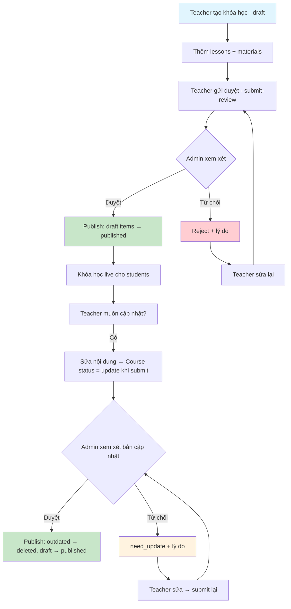
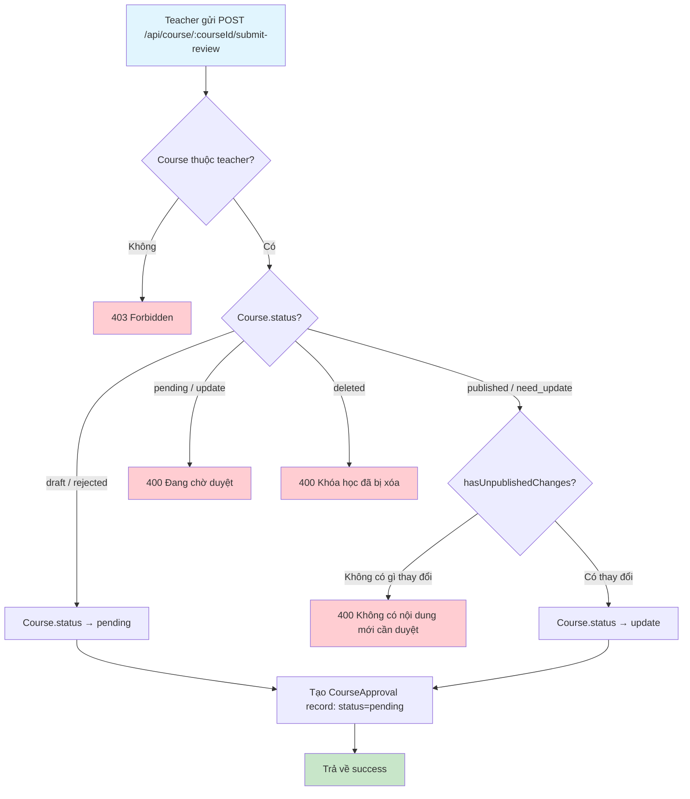
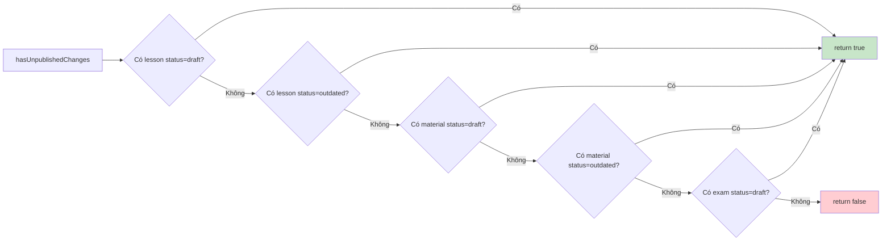
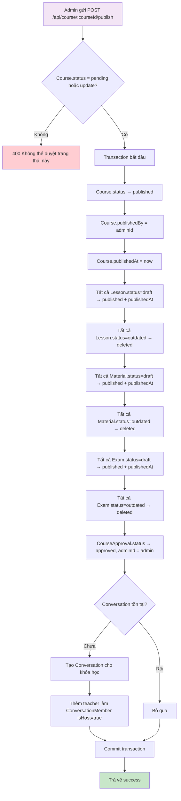
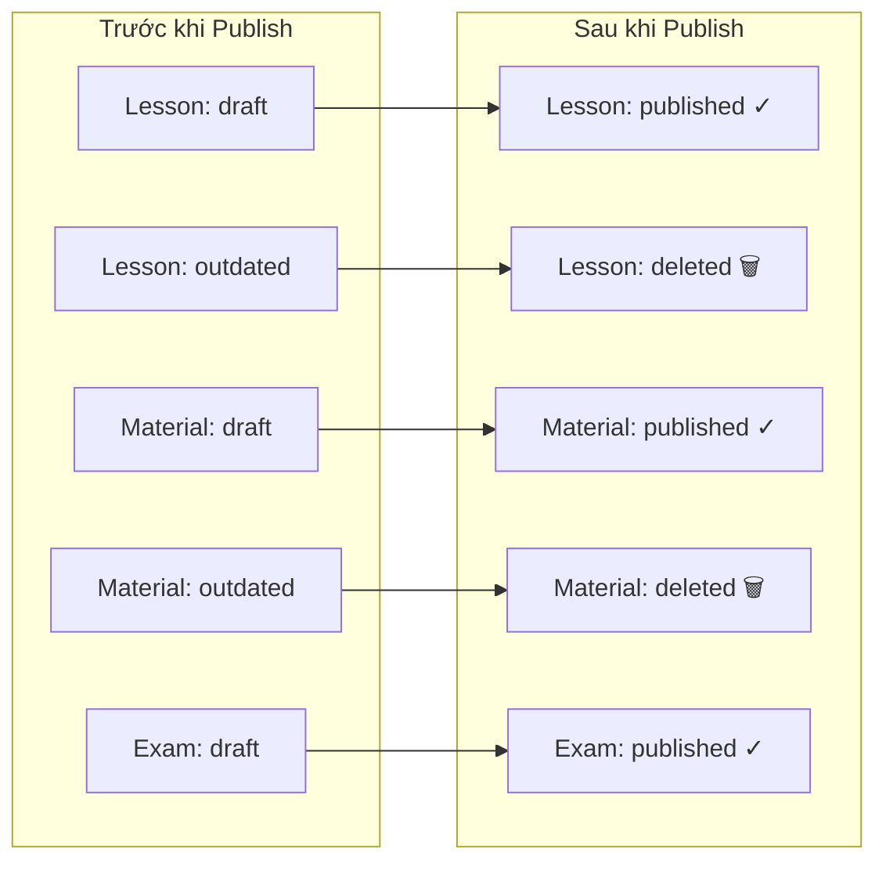
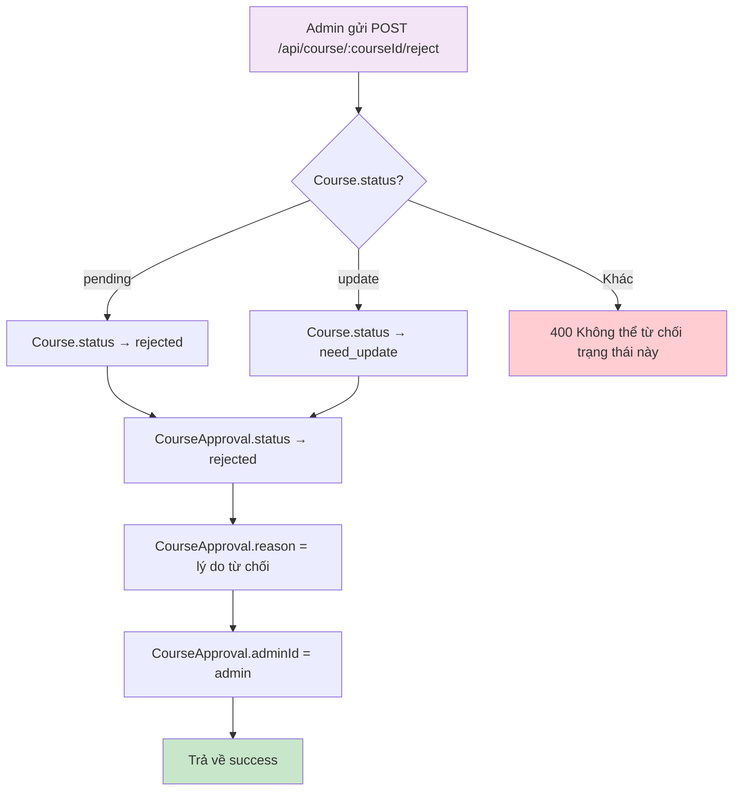
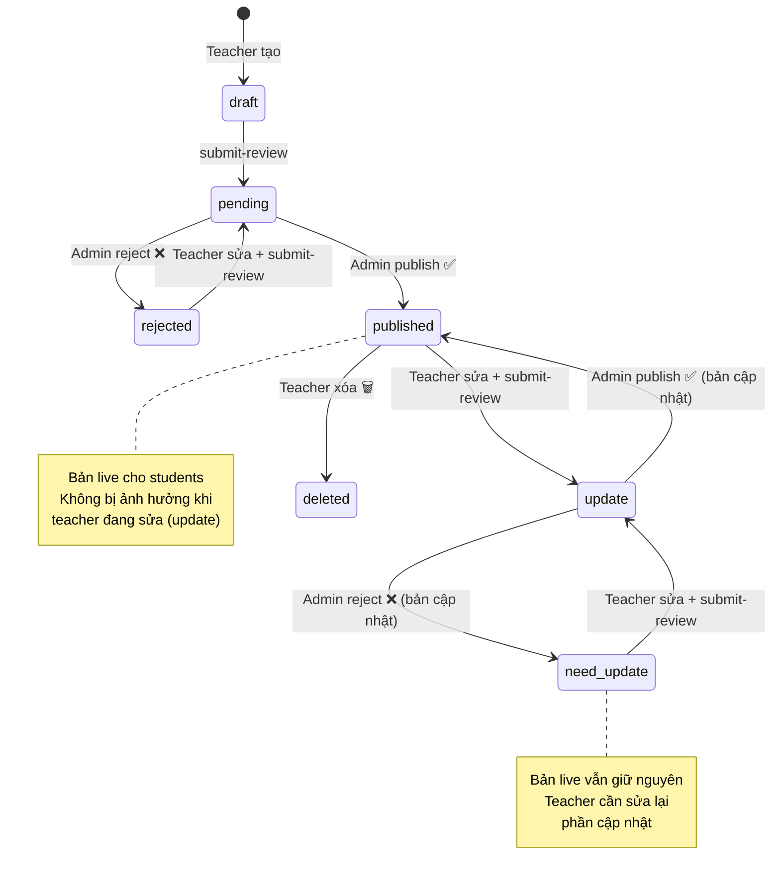

# Flow 03: Phê duyệt Khóa học (Course Approval)

## Tổng quan
Teacher gửi khóa học để Admin duyệt. Admin có thể duyệt (publish) hoặc từ chối (reject).  
Khóa học đã published khi cập nhật sẽ vào trạng thái `update`, không ảnh hưởng bản đang live.

---

## 1. Luồng tổng thể

---

## 2. Submit for Review (Gửi duyệt)

### Kiểm tra hasUnpublishedChanges

### Database Changes
| Bảng | Hành động | Dữ liệu |
|------|-----------|----------|
| `courses` | UPDATE | status → pending hoặc update |
| `course_approvals` | INSERT | courseId, teacherId, description, status=pending |

---

## 3. Admin Publish (Duyệt khóa học)

### Quy trình chuyển trạng thái khi Publish

### Database Changes (Transaction)
| Bảng | Hành động | Dữ liệu |
|------|-----------|----------|
| `courses` | UPDATE | status=published, publishedBy, publishedAt |
| `lessons` | UPDATE (batch) | draft → published; outdated → deleted |
| `lesson_materials` | UPDATE (batch) | draft → published; outdated → deleted |
| `exams` | UPDATE (batch) | draft → published; outdated → deleted |
| `course_approvals` | UPDATE | status=approved, adminId |
| `conversations` | INSERT (nếu chưa có) | courseId, name |
| `conversation_members` | INSERT | conversationId, userId=teacher, isHost=true |

---

## 4. Admin Reject (Từ chối khóa học)

### Database Changes
| Bảng | Hành động | Dữ liệu |
|------|-----------|----------|
| `courses` | UPDATE | status → rejected hoặc need_update |
| `course_approvals` | UPDATE | status=rejected, reason, adminId |

---

## 5. Sơ đồ trạng thái đầy đủ

---

## Tổng hợp API

| Method | Endpoint | Role | Mô tả |
|--------|----------|------|--------|
| POST | `/api/course/:courseId/submit-review` | Teacher | Gửi duyệt |
| POST | `/api/course/:courseId/publish` | Admin | Duyệt khóa học |
| POST | `/api/course/:courseId/reject` | Admin | Từ chối + lý do |
| GET | `/api/course/admin/all?status=pending` | Admin | Danh sách chờ duyệt |
