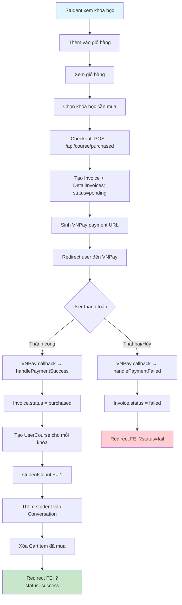
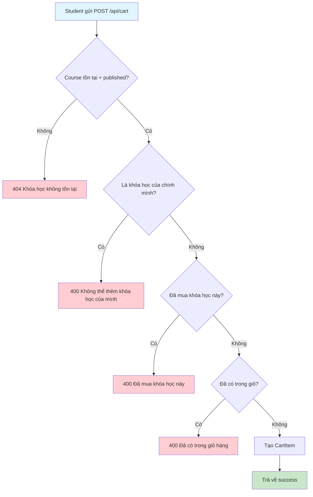
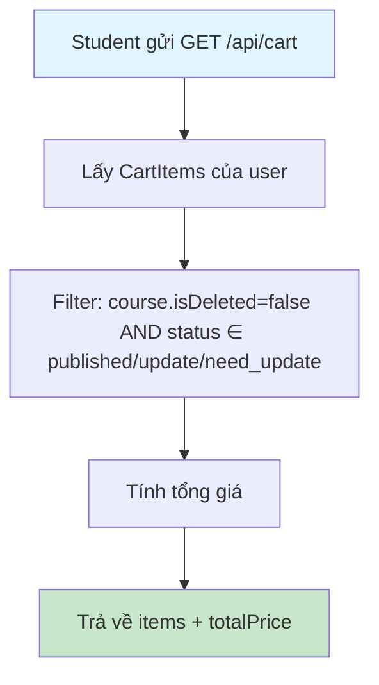
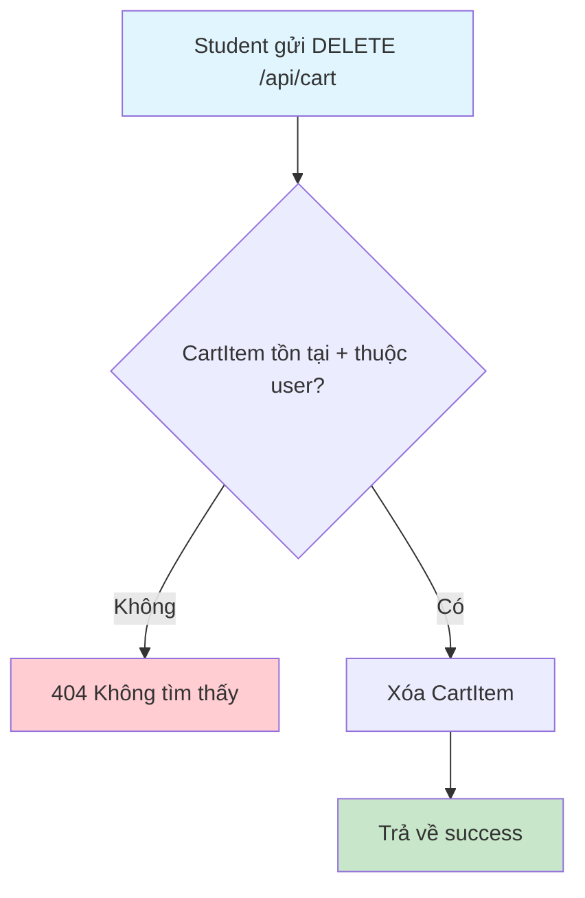
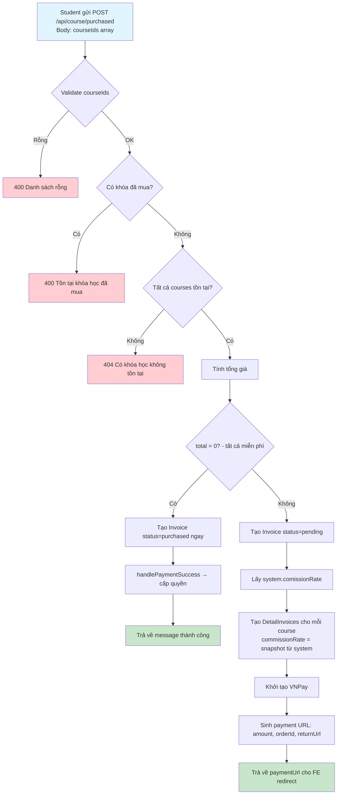
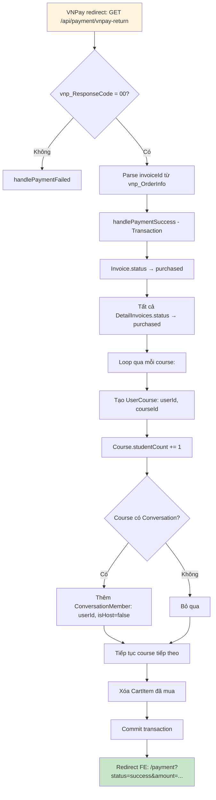
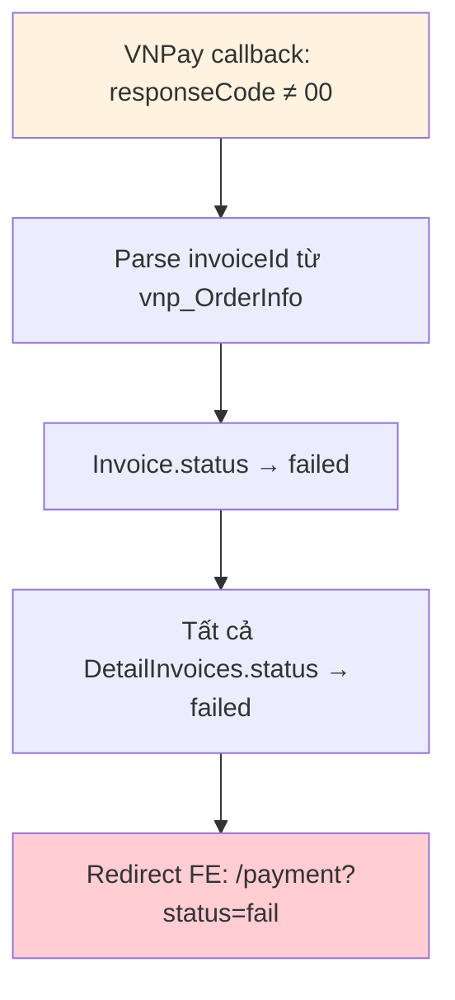
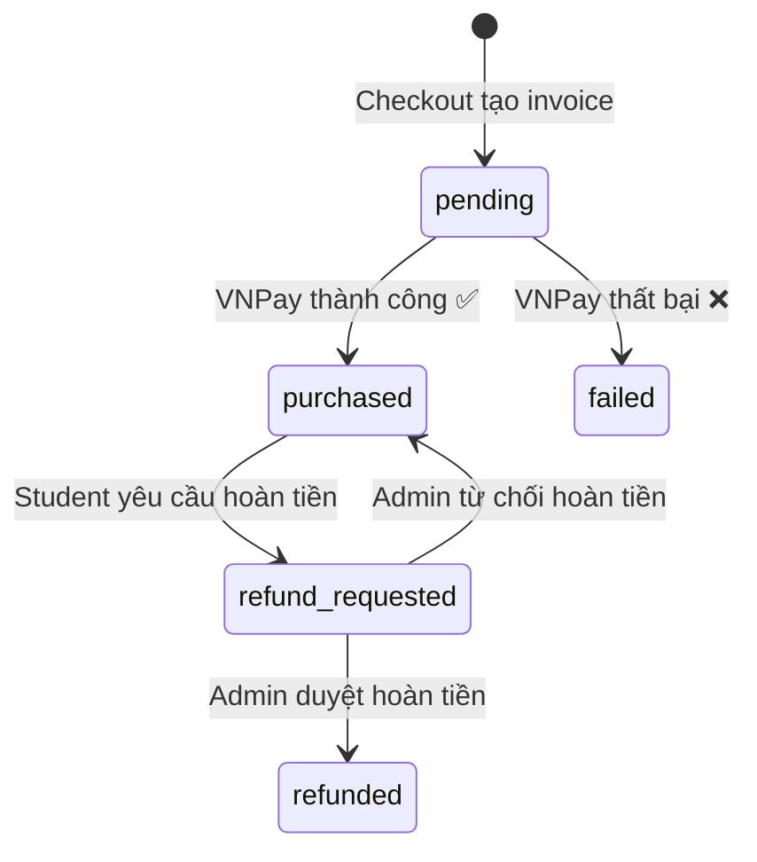

# Flow 04: Giỏ hàng & Mua khóa học (Cart & Purchase)

## Tổng quan
Student thêm khóa học vào giỏ → Checkout → Thanh toán qua VNPay → Nhận quyền truy cập.  
Hệ thống tạo Invoice + DetailInvoices, sau đó VNPay callback xử lý kết quả.

---

## 1. Luồng tổng thể (End-to-End)



---

## 2. Thêm vào giỏ hàng (Add to Cart)



### Database Changes
| Bảng | Hành động | Dữ liệu |
|------|-----------|----------|
| `cart_items` | INSERT | userId, courseId |

---

## 3. Xem giỏ hàng (Get Cart)



### Response
```json
{
  "data": [
    {
      "id": "cart-item-id",
      "course": {
        "id": "course-id",
        "name": "Khóa React",
        "thumbnail": "...",
        "price": 500000,
        "star": "4.5",
        "user": { "id": "teacher-id", "fullName": "Nguyễn Văn A" }
      }
    }
  ],
  "totalPrice": 500000
}
```

---

## 4. Xóa khỏi giỏ hàng (Remove from Cart)



---

## 5. Checkout - Tạo hóa đơn + VNPay URL



### Database Changes (Transaction)
| Bảng | Hành động | Dữ liệu |
|------|-----------|----------|
| `invoices` | INSERT | userId, amount=total, status=pending, vnpayTxnRef |
| `detail_invoices` | INSERT (per course) | coursePurchaseId, courseId, price, commissionRate, status=pending |

---

## 6. VNPay Callback - Thanh toán thành công



### Database Changes (Transaction)
| Bảng | Hành động | Dữ liệu |
|------|-----------|----------|
| `invoices` | UPDATE | status=purchased |
| `detail_invoices` | UPDATE (batch) | status=purchased |
| `user_courses` | INSERT (per course) | userId, courseId |
| `courses` | UPDATE (per course) | studentCount += 1 |
| `conversation_members` | INSERT (per course) | conversationId, userId, isHost=false |
| `cart_items` | DELETE | userId + courseIds đã mua |

---

## 7. VNPay Callback - Thanh toán thất bại



---

## 8. Sơ đồ trạng thái Invoice



---

## Tổng hợp API

| Method | Endpoint | Role | Mô tả |
|--------|----------|------|--------|
| POST | `/api/cart` | User | Thêm vào giỏ hàng |
| GET | `/api/cart` | User | Xem giỏ hàng |
| DELETE | `/api/cart` | User | Xóa khỏi giỏ hàng |
| POST | `/api/course/purchased` | User | Checkout + tạo VNPay URL |
| GET | `/api/payment/vnpay-return` | Public | VNPay callback (tự động) |
