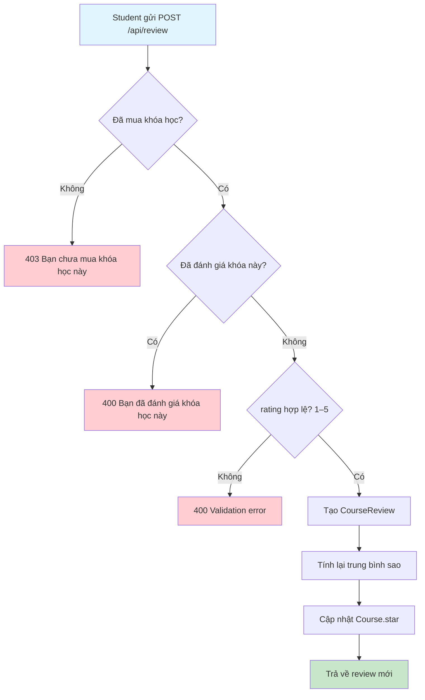
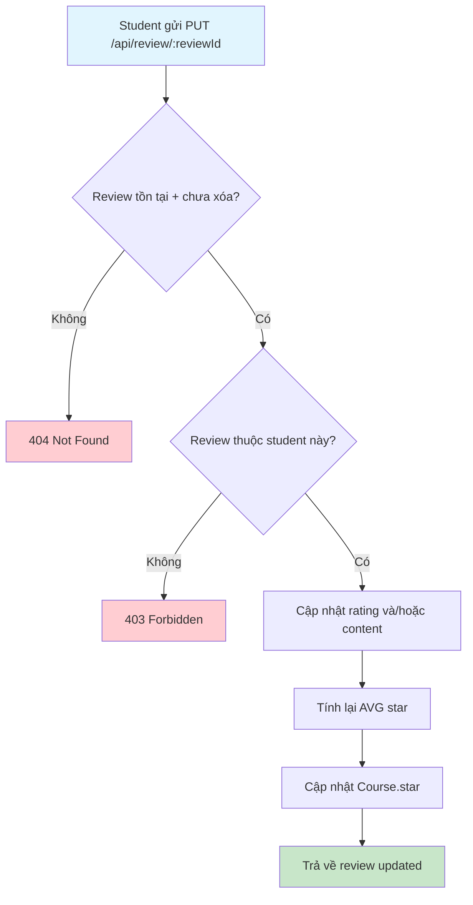
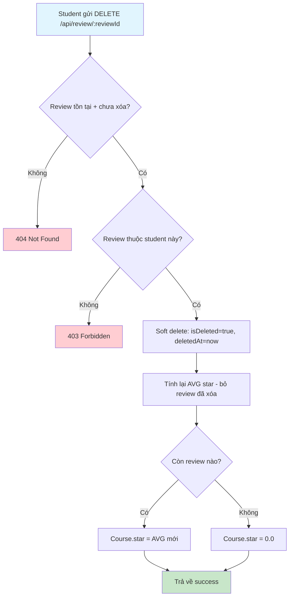
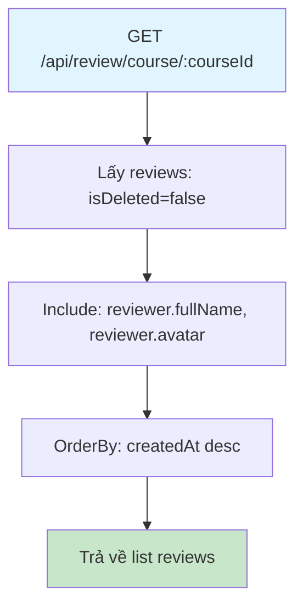
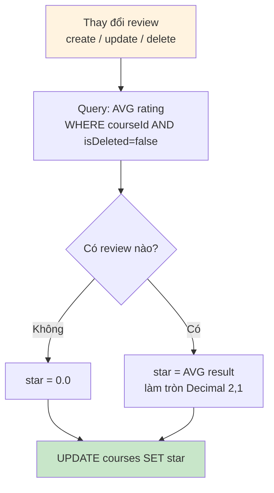
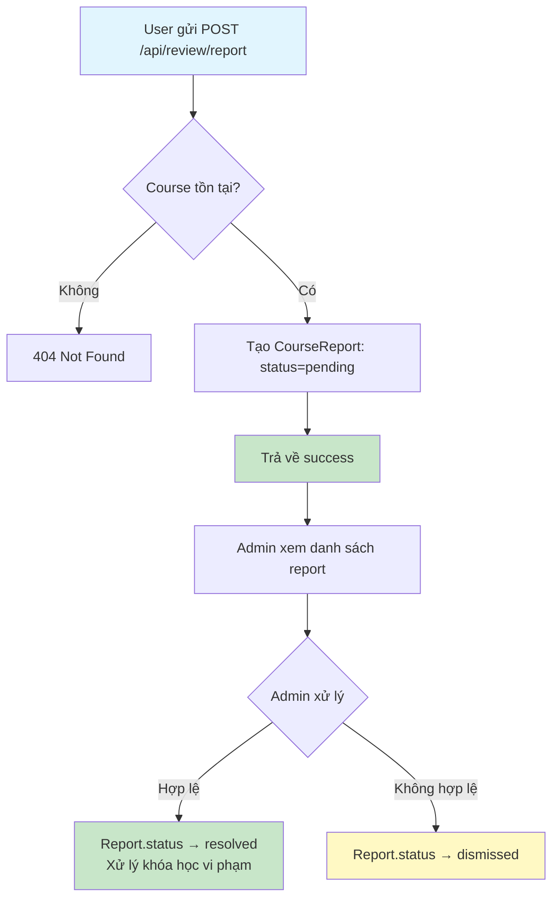
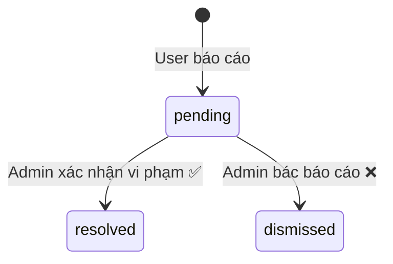

# Flow 05: Đánh giá & Báo cáo Khóa học (Review & Report)

## Tổng quan
Student đã mua khóa học có thể đánh giá (1–5 sao + nội dung).  
Mỗi student chỉ đánh giá 1 lần/khóa. Điểm trung bình tự cập nhật.  
Mọi user có thể báo cáo khóa học vi phạm.

---

## 1. Tạo đánh giá (Create Review)



### Công thức tính sao
```
star = AVG(rating) của tất cả review có isDeleted=false
     = SUM(rating) / COUNT(reviews)
     → làm tròn 1 chữ số thập phân (Decimal(2,1))
```

### Database Changes (Transaction)
| Bảng | Hành động | Dữ liệu |
|------|-----------|----------|
| `course_reviews` | INSERT | reviewerId, courseId, rating, content |
| `courses` | UPDATE | star = AVG(rating) |

---

## 2. Cập nhật đánh giá (Update Review)



### Database Changes (Transaction)
| Bảng | Hành động | Dữ liệu |
|------|-----------|----------|
| `course_reviews` | UPDATE | rating, content |
| `courses` | UPDATE | star = AVG(rating) |

---

## 3. Xóa đánh giá (Delete Review)



---

## 4. Xem đánh giá khóa học (List Reviews)



---

## 5. Luồng tính sao chi tiết



### Ví dụ minh họa
```
Reviews: [5, 4, 5, 3, 4]
AVG = (5+4+5+3+4) / 5 = 4.2
Course.star = 4.2

Xóa review rating=3:
Reviews: [5, 4, 5, 4]
AVG = (5+4+5+4) / 4 = 4.5
Course.star = 4.5
```

---

## 6. Báo cáo khóa học (Report Course)



### Sơ đồ trạng thái Report



### Database Changes
| Bảng | Hành động | Dữ liệu |
|------|-----------|----------|
| `course_reports` | INSERT | courseId, reporterId, reason, status=pending |
| `course_reports` | UPDATE (admin) | processorId, status=resolved/dismissed |

---

## Tổng hợp API

| Method | Endpoint | Role | Mô tả |
|--------|----------|------|--------|
| POST | `/api/review` | User (đã mua) | Tạo đánh giá |
| GET | `/api/review/course/:courseId` | Public | Xem đánh giá của khóa |
| GET | `/api/review/:reviewId` | Public | Chi tiết 1 đánh giá |
| PUT | `/api/review/:reviewId` | User (chủ review) | Sửa đánh giá |
| DELETE | `/api/review/:reviewId` | User (chủ review) | Xóa đánh giá |
| POST | `/api/review/report` | User | Báo cáo khóa học |
