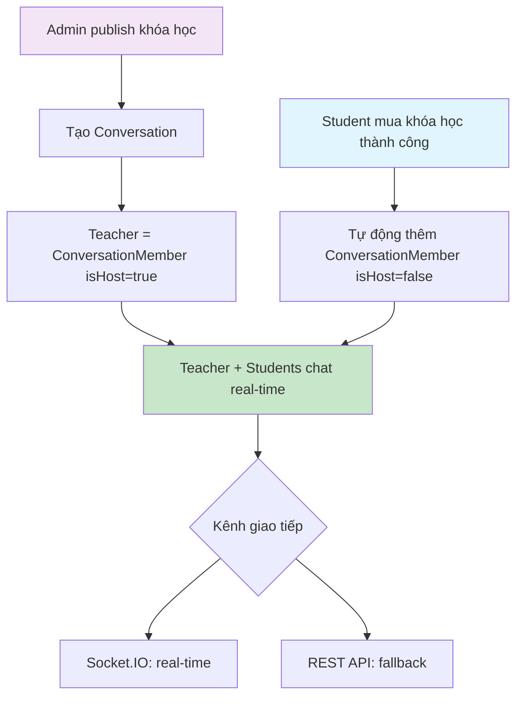
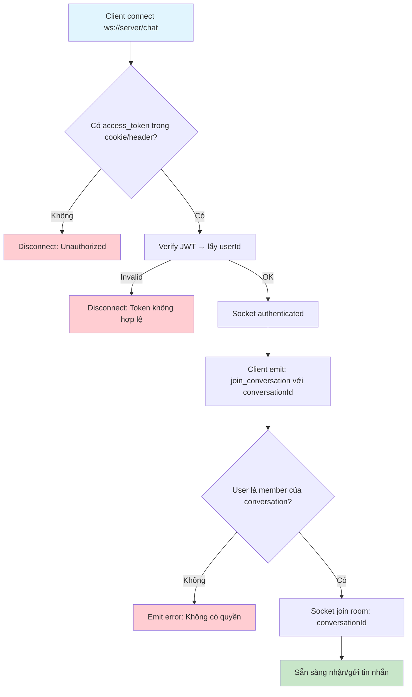
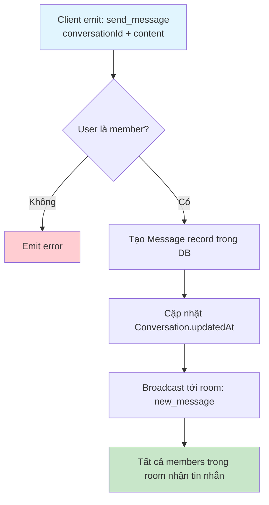
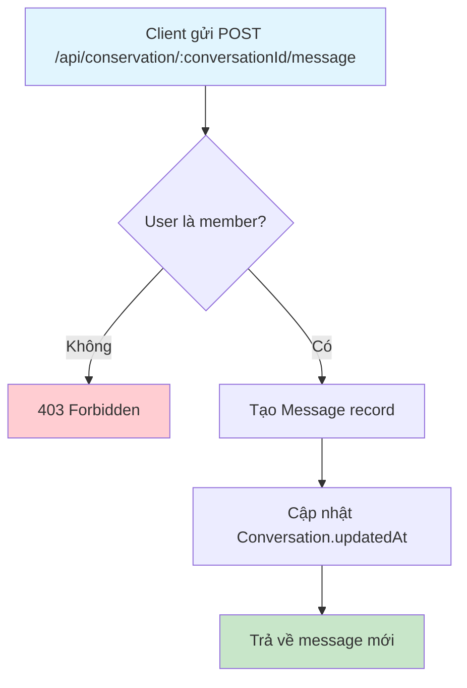
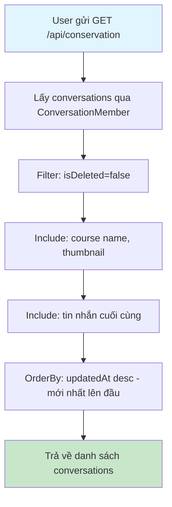
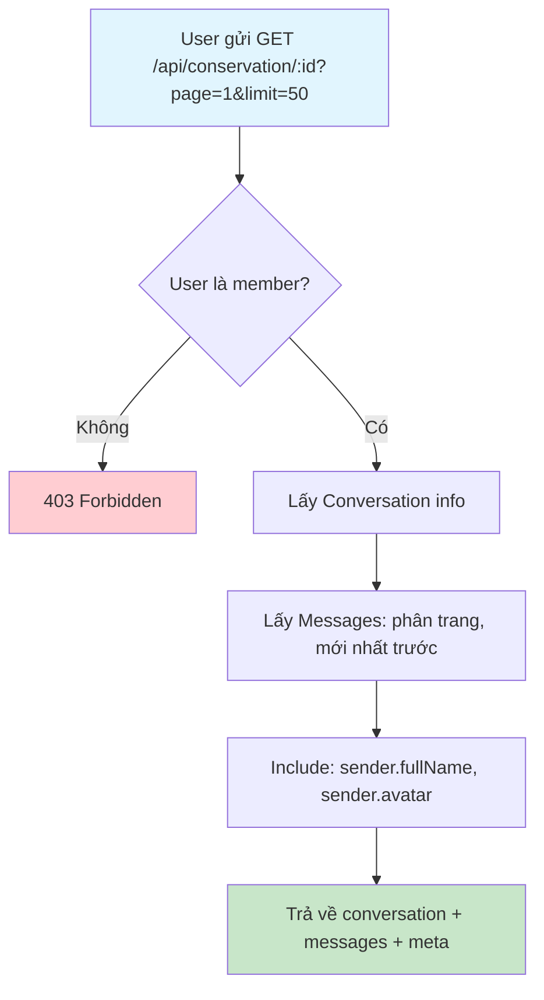
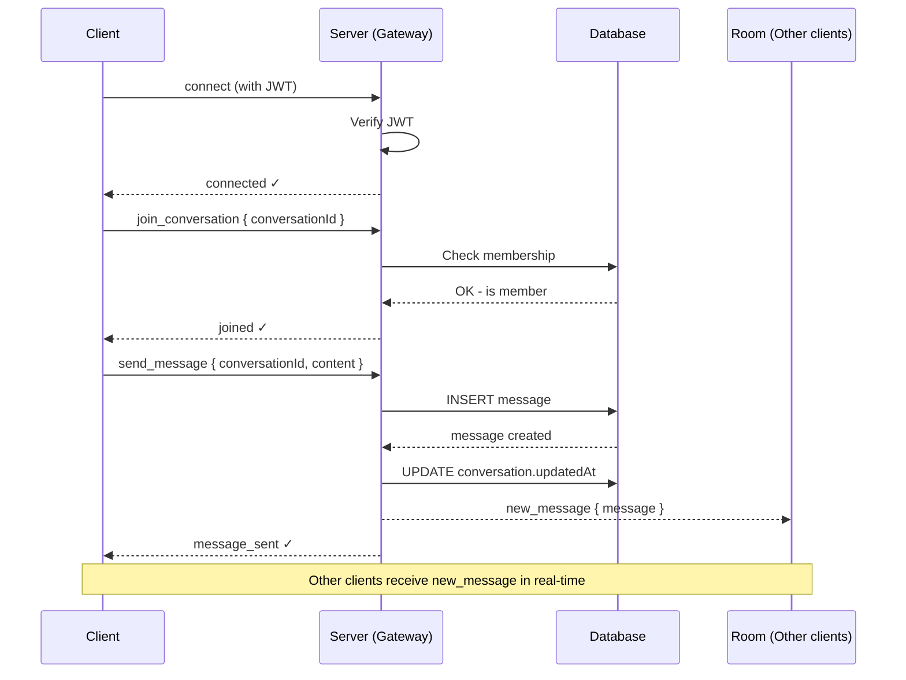
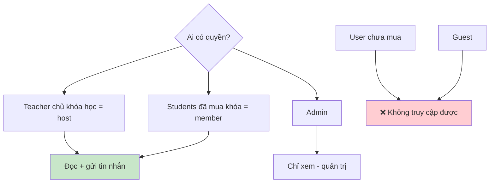

# Flow 06: Chat / Trao đổi trong khóa học (Conversation & Messaging)

## Tổng quan
Mỗi khóa học published có 1 Conversation. Teacher là host, students được thêm tự động khi mua.  
Chat real-time qua **Socket.IO** + REST API fallback.

---

## 1. Luồng tổng thể



---

## 2. Kết nối Socket.IO



---

## 3. Gửi tin nhắn (Send Message)

### Qua Socket.IO (Real-time)



### Qua REST API (Fallback)



### Database Changes
| Bảng | Hành động | Dữ liệu |
|------|-----------|----------|
| `messages` | INSERT | conversationId, senderId, content |
| `conversations` | UPDATE | updatedAt = now |

---

## 4. Xem danh sách cuộc trò chuyện



### Response
```json
{
  "data": [
    {
      "id": "conv-id",
      "name": "Khóa React Nâng Cao",
      "course": { "id": "...", "name": "...", "thumbnail": "..." },
      "lastMessage": {
        "content": "Bài tập tuần 3...",
        "sender": { "fullName": "Nguyễn Văn A" },
        "createdAt": "2026-04-09T..."
      },
      "updatedAt": "2026-04-09T..."
    }
  ]
}
```

---

## 5. Xem chi tiết cuộc trò chuyện + tin nhắn (phân trang)



---

## 6. Sơ đồ Socket.IO Events



---

## 7. Quyền truy cập Conversation



---

## Tổng hợp API

| Method | Endpoint | Role | Mô tả |
|--------|----------|------|--------|
| GET | `/api/conservation` | Auth | Danh sách conversations |
| GET | `/api/conservation/:id` | Auth (member) | Chi tiết + messages |
| POST | `/api/conservation/:id/message` | Auth (member) | Gửi tin nhắn (REST) |

### Socket.IO Events

| Event | Direction | Payload | Mô tả |
|-------|-----------|---------|--------|
| `join_conversation` | Client → Server | `{ conversationId }` | Tham gia room |
| `send_message` | Client → Server | `{ conversationId, content }` | Gửi tin nhắn |
| `new_message` | Server → Room | `{ message }` | Broadcast tin nhắn mới |
| `message_sent` | Server → Client | `{ message }` | Xác nhận gửi thành công |
| `error` | Server → Client | `{ message }` | Thông báo lỗi |
