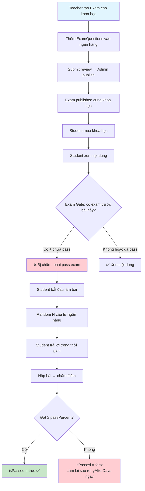
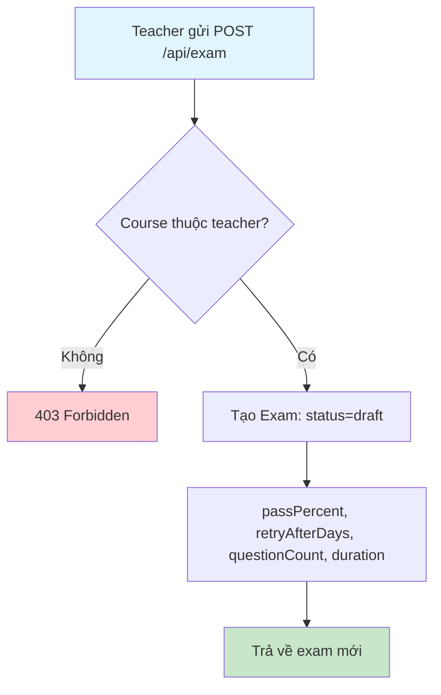
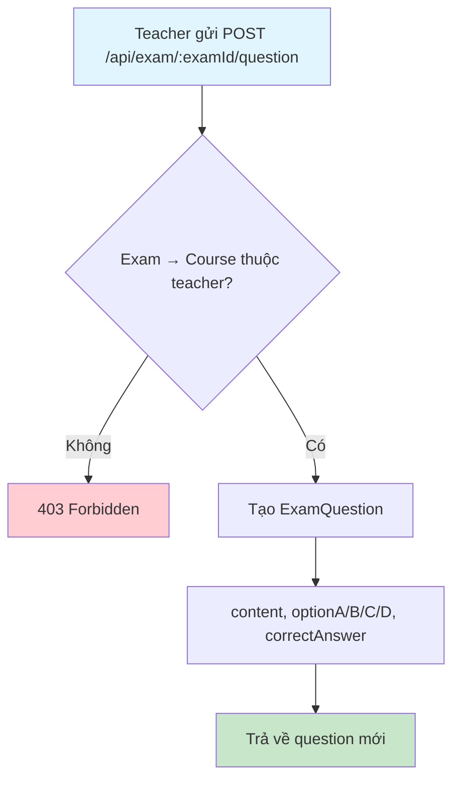
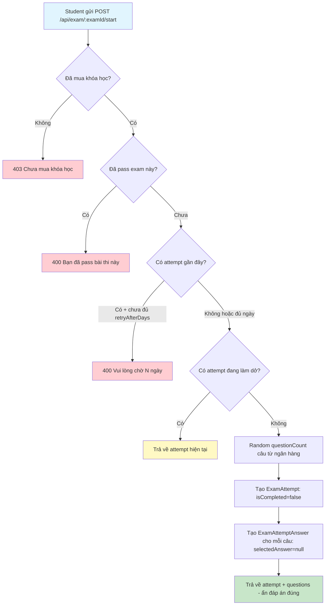
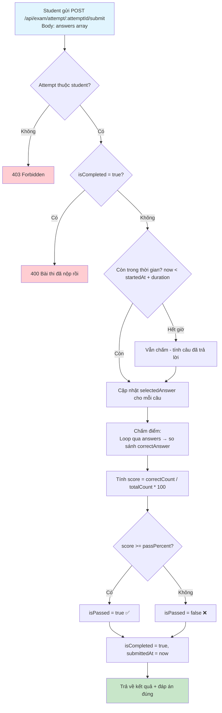
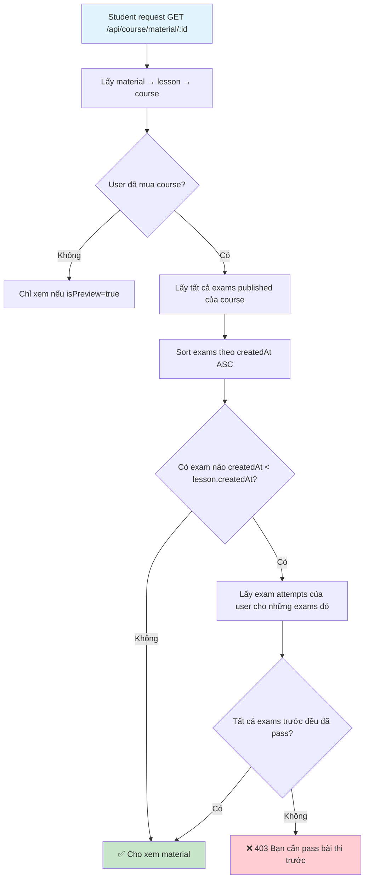
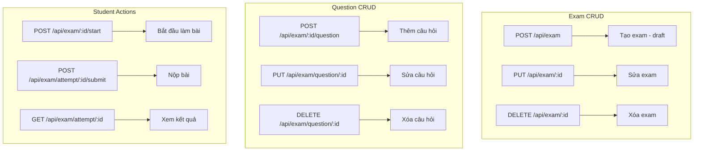
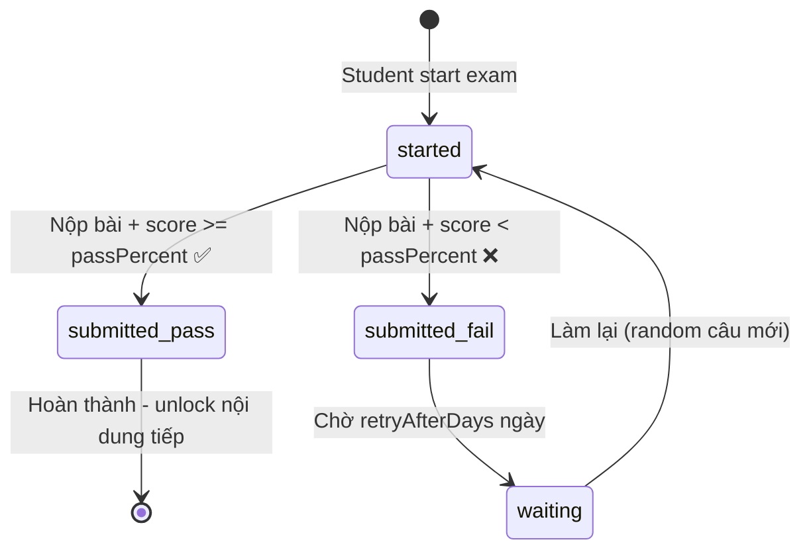

# Flow 07: Hệ thống Đề thi (Exam System)

## Tổng quan
Teacher tạo đề thi cho khóa học với ngân hàng câu hỏi.  
Student làm bài → hệ thống random N câu → chấm điểm → pass/fail.  
**Exam Gate**: Student phải pass exam trước mới được xem bài học phía sau.

---

## 1. Luồng tổng thể



---

## 2. Teacher tạo đề thi (Create Exam)



### Các trường Exam
| Trường | Kiểu | Mô tả |
|--------|------|--------|
| `passPercent` | Int | % cần đạt để pass (vd: 70) |
| `retryAfterDays` | Int | Số ngày chờ trước khi làm lại (vd: 3) |
| `questionCount` | Int | Số câu random mỗi lần thi (vd: 10) |
| `duration` | Int | Thời gian làm bài (phút, vd: 30) |

---

## 3. Thêm câu hỏi (Add Questions)



### Database Changes
| Bảng | Hành động | Dữ liệu |
|------|-----------|----------|
| `exam_questions` | INSERT | examId, content, optionA/B/C/D, correctAnswer |

---

## 4. Student bắt đầu làm bài (Start Attempt)



### Response - Questions (ẩn correctAnswer)
```json
{
  "data": {
    "attemptId": "attempt-id",
    "startedAt": "2026-04-10T10:00:00Z",
    "duration": 30,
    "questions": [
      {
        "id": "question-id",
        "content": "React hook nào dùng để quản lý state?",
        "optionA": "useEffect",
        "optionB": "useState",
        "optionC": "useRef",
        "optionD": "useMemo"
      }
    ]
  }
}
```

### Database Changes (Transaction)
| Bảng | Hành động | Dữ liệu |
|------|-----------|----------|
| `exam_attempts` | INSERT | examId, userId, isCompleted=false, startedAt=now |
| `exam_attempt_answers` | INSERT (per question) | attemptId, questionId, selectedAnswer=null, isCorrect=false |

---

## 5. Student nộp bài (Submit Attempt)



### Công thức chấm điểm
```
score = (số câu đúng / tổng số câu) × 100
isPassed = score >= exam.passPercent
```

### Database Changes (Transaction)
| Bảng | Hành động | Dữ liệu |
|------|-----------|----------|
| `exam_attempt_answers` | UPDATE (per answer) | selectedAnswer, isCorrect |
| `exam_attempts` | UPDATE | score, isPassed, isCompleted=true, submittedAt=now |

---

## 6. Exam Gate - Chặn nội dung



### Logic chi tiết Exam Gate
```
Exams sorted by createdAt: [Exam1, Exam2, Exam3]
Lessons sorted by createdAt: [L1, L2, L3, L4, L5]

Timeline:
  L1 → L2 → Exam1 → L3 → Exam2 → L4 → L5 → Exam3

Quy tắc:
  - L1, L2: Xem tự do (không có exam trước)
  - L3: Phải pass Exam1
  - L4, L5: Phải pass Exam1 + Exam2
  - (Sau Exam3 nếu có lesson): Phải pass tất cả 3 exams
```

---

## 7. Quản lý đề thi (Teacher CRUD)



---

## 8. Sơ đồ trạng thái Exam Attempt



---

## Tổng hợp API

| Method | Endpoint | Role | Mô tả |
|--------|----------|------|--------|
| POST | `/api/exam` | Teacher | Tạo đề thi |
| PUT | `/api/exam/:examId` | Teacher | Sửa đề thi |
| DELETE | `/api/exam/:examId` | Teacher | Xóa đề thi |
| GET | `/api/exam/:examId` | Auth | Xem đề thi |
| POST | `/api/exam/:examId/question` | Teacher | Thêm câu hỏi |
| PUT | `/api/exam/question/:questionId` | Teacher | Sửa câu hỏi |
| DELETE | `/api/exam/question/:questionId` | Teacher | Xóa câu hỏi |
| POST | `/api/exam/:examId/start` | User (đã mua) | Bắt đầu làm bài |
| POST | `/api/exam/attempt/:attemptId/submit` | User | Nộp bài |
| GET | `/api/exam/attempt/:attemptId` | User | Xem kết quả |
