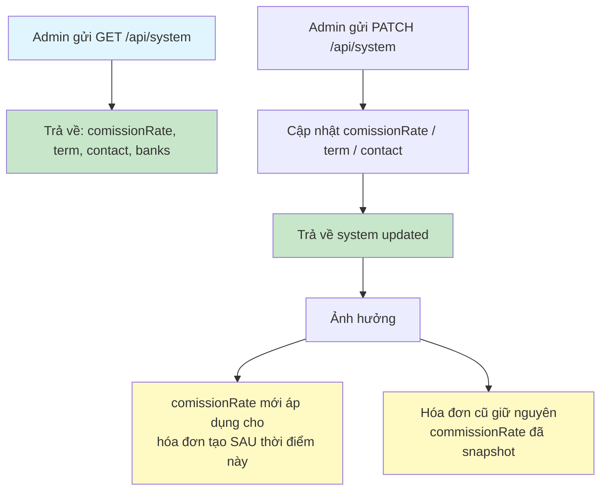
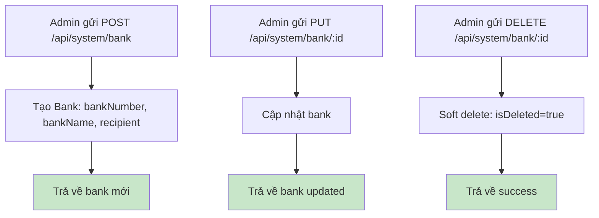
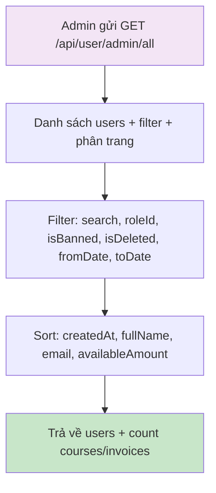
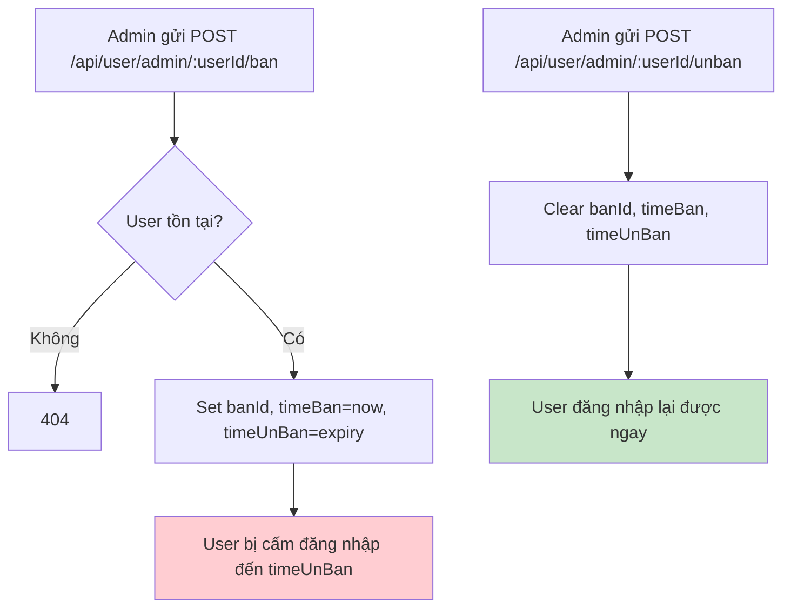
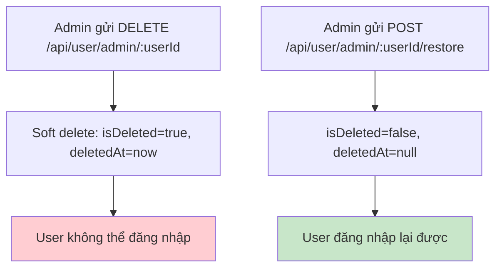
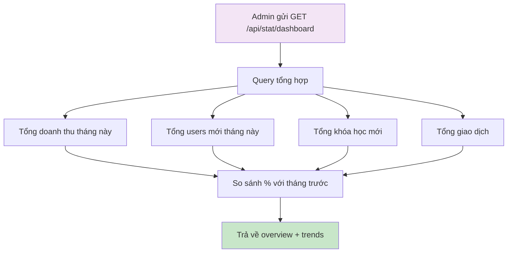
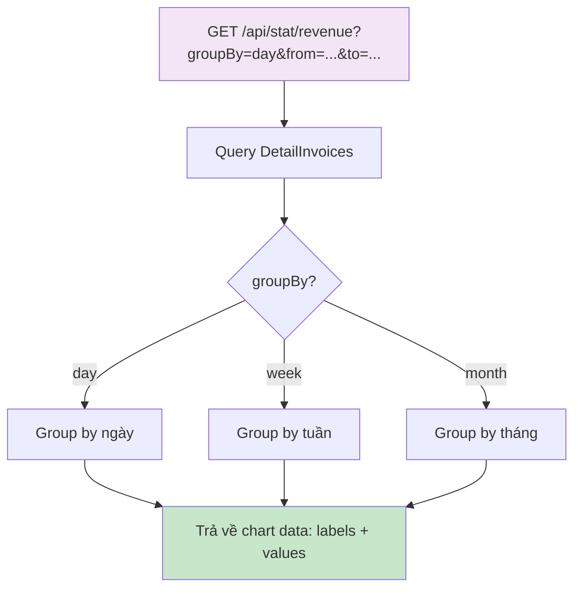
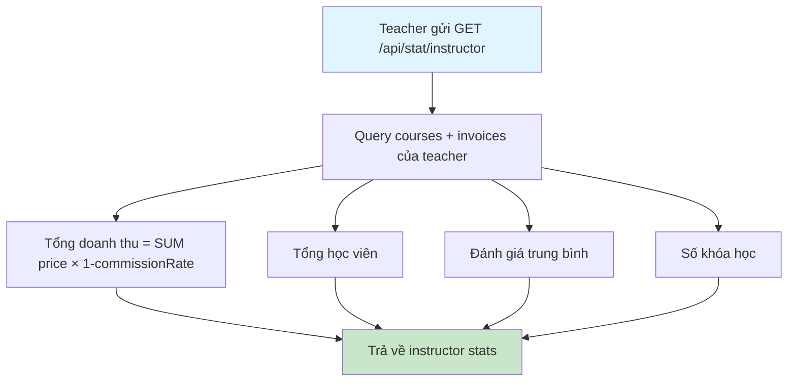

# Flow 08: Quản trị hệ thống & Thống kê (Admin & Statistics)

## Tổng quan
Admin quản lý: cấu hình system, ngân hàng, user, xem thống kê doanh thu + tăng trưởng.

---

## 1. Cấu hình hệ thống (System Config)



### Cơ chế Snapshot Commission Rate
```
Thời điểm T1: system.comissionRate = 10%
Student A mua → DetailInvoice.commissionRate = 10% (snapshot)

Thời điểm T2: Admin đổi comissionRate = 15%
Student B mua → DetailInvoice.commissionRate = 15% (snapshot)

→ Student A vẫn giữ 10%, Student B là 15%
```

---

## 2. Quản lý ngân hàng (Bank CRUD)



---

## 3. Quản lý người dùng (User Management)



### Cấm/Gỡ cấm người dùng



### Xóa/Khôi phục người dùng



---

## 4. Thống kê Dashboard



### Response Dashboard Overview
```json
{
  "data": {
    "revenue": { "current": 15000000, "previous": 12000000, "change": 25.0 },
    "users": { "current": 150, "previous": 120, "change": 25.0 },
    "courses": { "current": 20, "previous": 15, "change": 33.3 },
    "transactions": { "current": 200, "previous": 180, "change": 11.1 }
  }
}
```

---

## 5. Thống kê doanh thu chi tiết



---

## 6. Thống kê theo giảng viên / khóa học

```mermaid
flowchart TD
    subgraph Revenue by Teacher
        A1[GET /api/stat/revenue/teacher] --> A2[Top teachers by doanh thu]
        A2 --> A3["teacher, totalRevenue, courseCount, orderCount"]
    end
    
    subgraph Revenue by Course
        B1[GET /api/stat/revenue/course] --> B2[Top courses by doanh thu]
        B2 --> B3["course, totalRevenue, orderCount, avgPrice"]
    end
    
    subgraph User Stats
        C1[GET /api/stat/users] --> C2[Tăng trưởng users]
        C2 --> C3["roleDistribution, newUsersChart, growthRate"]
    end
    
    subgraph Course Stats
        D1[GET /api/stat/courses] --> D2[Thống kê khóa học]
        D2 --> D3["statusDistribution, topicDistribution, creationChart"]
    end
```



---

## 7. Thống kê giảng viên (Instructor Dashboard)



### Công thức doanh thu giảng viên
```
teacher_revenue = SUM(detail_invoice.price × (1 - detail_invoice.commissionRate / 100))
                  WHERE course.userId = teacherId
                  AND invoice.status = 'purchased'
```

---

## Tổng hợp API

| Method | Endpoint | Role | Mô tả |
|--------|----------|------|--------|
| GET | `/api/system` | Public | Xem cấu hình hệ thống |
| PATCH | `/api/system` | Admin | Cập nhật cấu hình |
| POST | `/api/system/bank` | Admin | Thêm ngân hàng |
| PUT | `/api/system/bank/:id` | Admin | Sửa ngân hàng |
| DELETE | `/api/system/bank/:id` | Admin | Xóa ngân hàng |
| GET | `/api/user/admin/all` | Admin | Danh sách users |
| GET | `/api/user/admin/:userId` | Admin | Chi tiết user |
| PUT | `/api/user/admin/:userId` | Admin | Sửa user |
| POST | `/api/user/admin/:userId/ban` | Admin | Cấm user |
| POST | `/api/user/admin/:userId/unban` | Admin | Gỡ cấm |
| DELETE | `/api/user/admin/:userId` | Admin | Xóa user |
| POST | `/api/user/admin/:userId/restore` | Admin | Khôi phục user |
| GET | `/api/stat/dashboard` | Admin | Tổng quan dashboard |
| GET | `/api/stat/revenue` | Admin | Doanh thu chi tiết |
| GET | `/api/stat/revenue/teacher` | Admin | Doanh thu theo GV |
| GET | `/api/stat/revenue/course` | Admin | Doanh thu theo khóa |
| GET | `/api/stat/users` | Admin | Thống kê users |
| GET | `/api/stat/courses` | Admin | Thống kê khóa học |
| GET | `/api/stat/instructor` | Teacher | Thống kê giảng viên |
