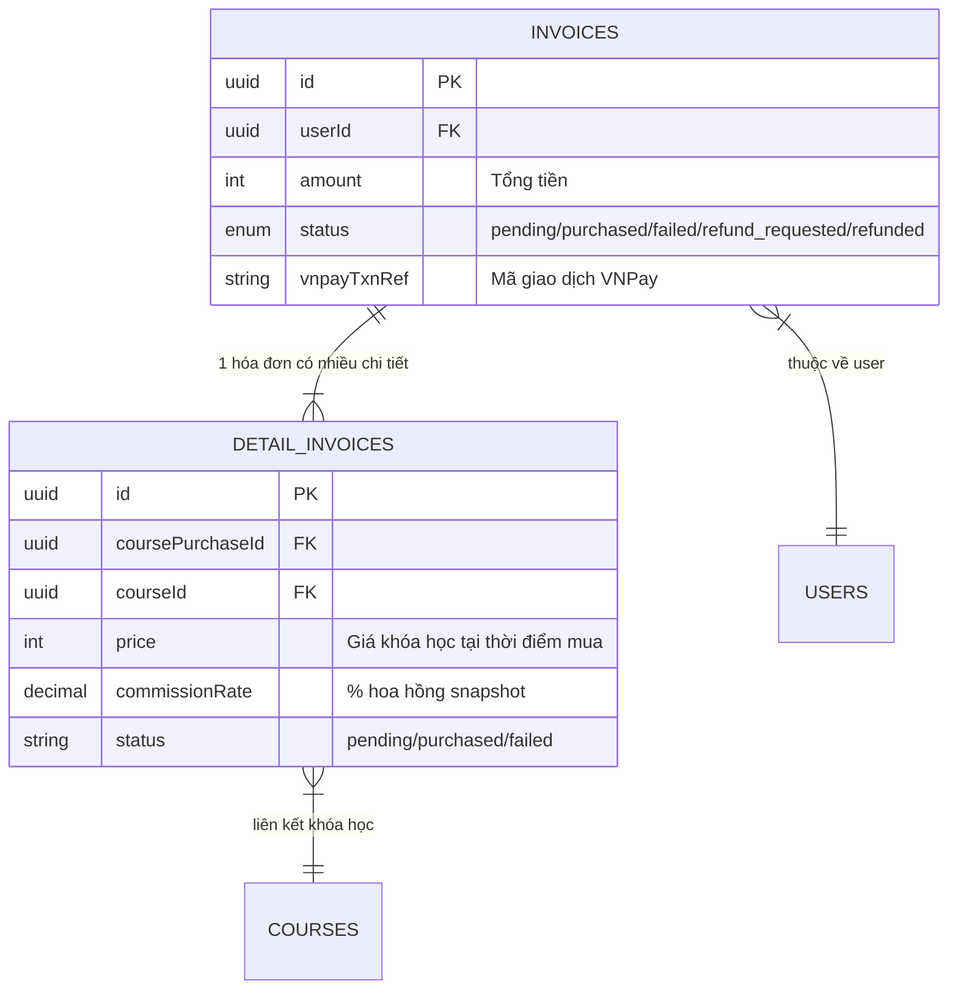
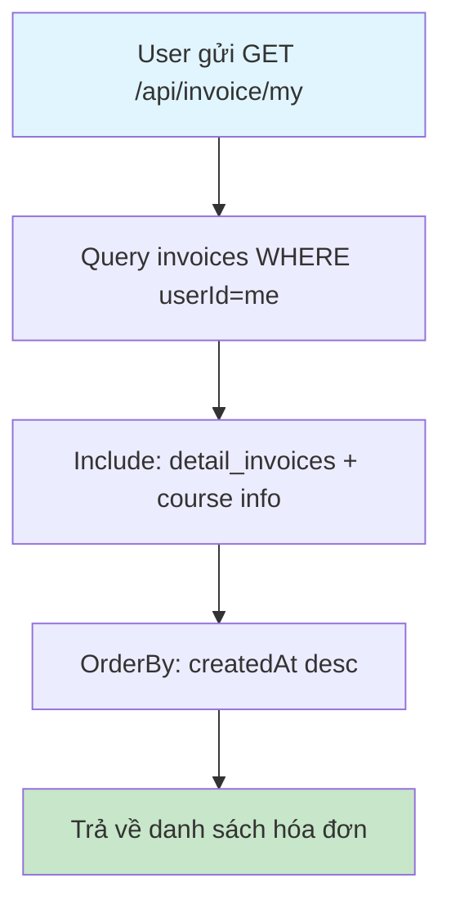
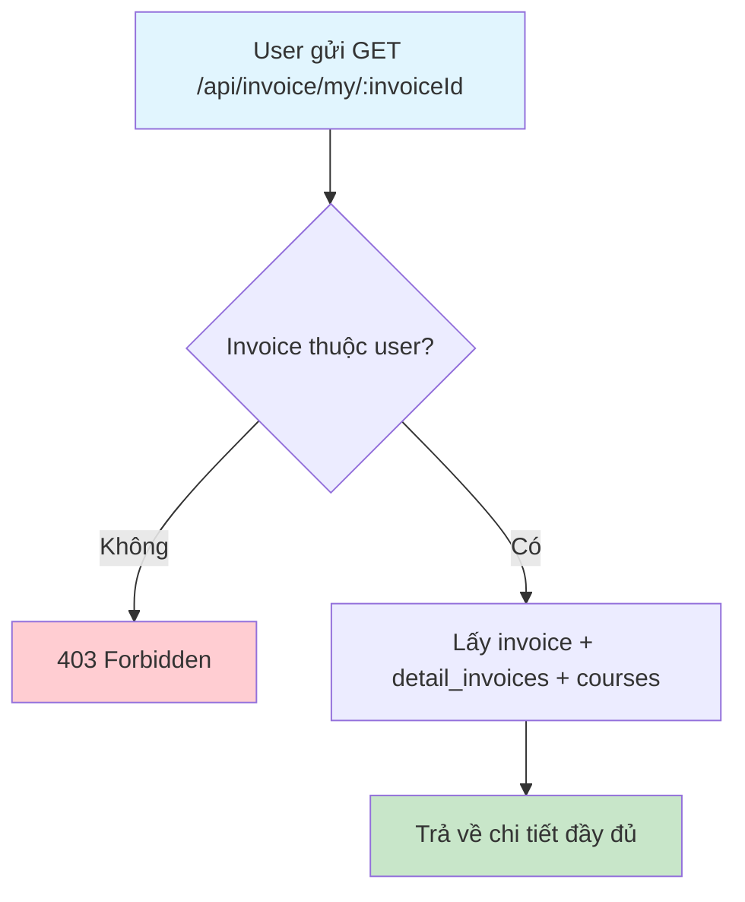
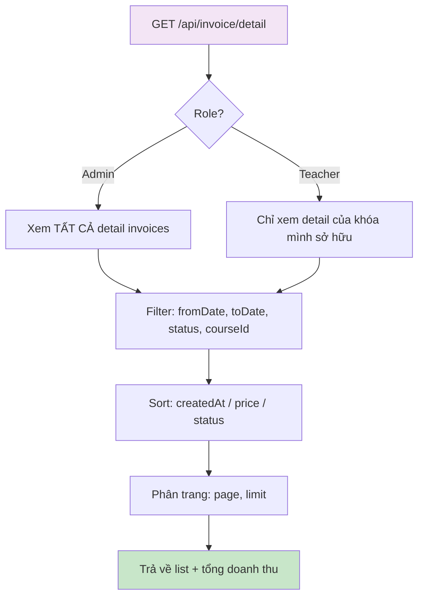
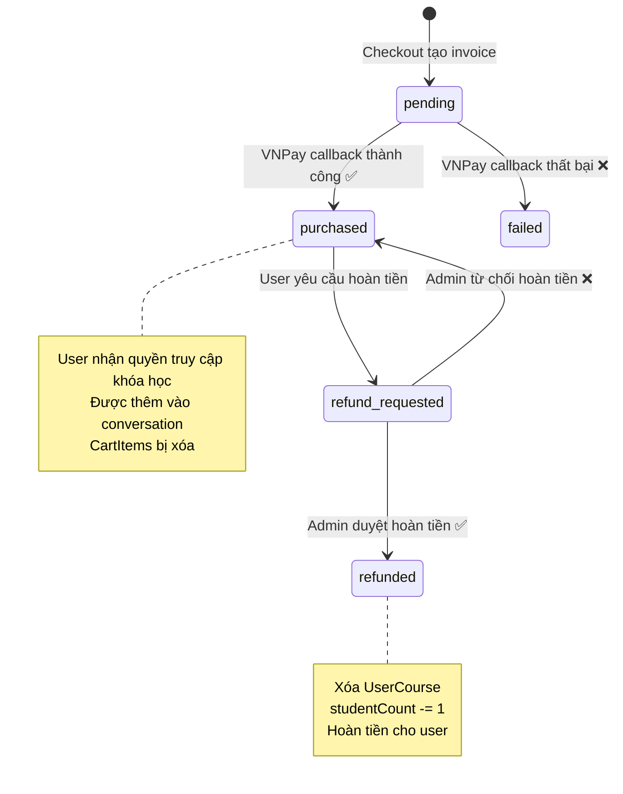
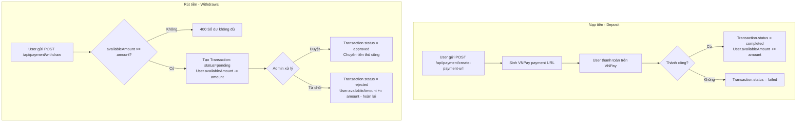
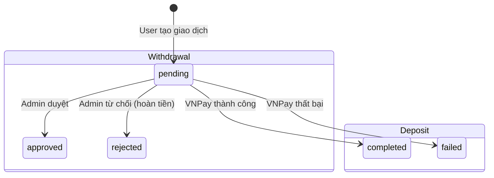
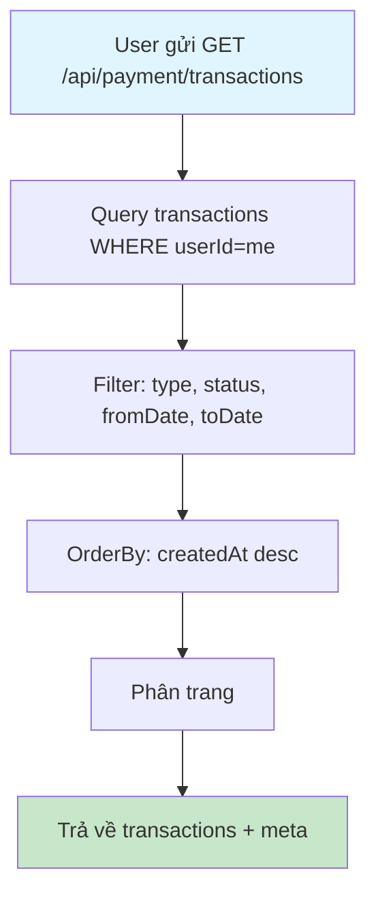

# Flow 09: Hóa đơn & Lịch sử giao dịch (Invoice & Transaction)

## Tổng quan
Sau khi mua khóa học, hệ thống tạo Invoice (hóa đơn tổng) + DetailInvoices (chi tiết từng khóa).  
Admin/Teacher xem doanh thu, User xem lịch sử mua.

---

## 1. Cấu trúc dữ liệu



---

## 2. User xem lịch sử mua (My Invoices)



### Response
```json
{
  "data": [
    {
      "id": "invoice-id",
      "amount": 799000,
      "status": "purchased",
      "vnpayTxnRef": "TXN123456",
      "createdAt": "2026-04-09T...",
      "detail_invoices": [
        {
          "courseId": "course-1",
          "price": 299000,
          "commissionRate": "10.00",
          "status": "purchased",
          "courses": {
            "name": "Khóa React",
            "thumbnail": "..."
          }
        },
        {
          "courseId": "course-2",
          "price": 500000,
          "commissionRate": "10.00",
          "status": "purchased",
          "courses": {
            "name": "Khóa Node.js",
            "thumbnail": "..."
          }
        }
      ]
    }
  ]
}
```

---

## 3. User xem chi tiết 1 hóa đơn



---

## 4. Admin/Teacher xem DetailInvoices (Doanh thu)



### Tính doanh thu Teacher
```
teacherEarning = price × (1 - commissionRate / 100)

Ví dụ:
  price = 500,000đ
  commissionRate = 10%
  teacherEarning = 500,000 × 0.9 = 450,000đ
  platformFee = 500,000 × 0.1 = 50,000đ
```

---

## 5. Luồng trạng thái Invoice đầy đủ



---

## 6. Luồng giao dịch nạp/rút tiền (Transactions)



### Sơ đồ trạng thái Transaction



---

## 7. Xem lịch sử giao dịch



---

## Tổng hợp API

| Method | Endpoint | Role | Mô tả |
|--------|----------|------|--------|
| GET | `/api/invoice/my` | User | Lịch sử hóa đơn |
| GET | `/api/invoice/my/:invoiceId` | User | Chi tiết hóa đơn |
| GET | `/api/invoice/detail` | Admin/Teacher | Danh sách chi tiết hóa đơn |
| POST | `/api/payment/create-payment-url` | User | Tạo URL nạp tiền VNPay |
| GET | `/api/payment/vnpay-return` | Public | VNPay callback |
| GET | `/api/payment/transactions` | User | Lịch sử giao dịch |
