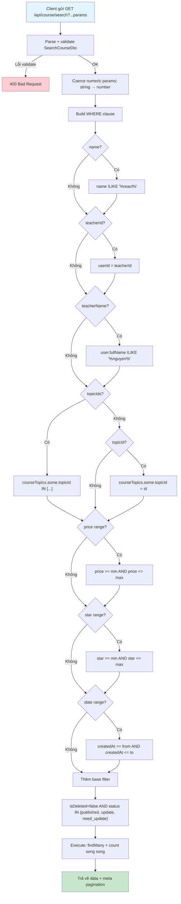
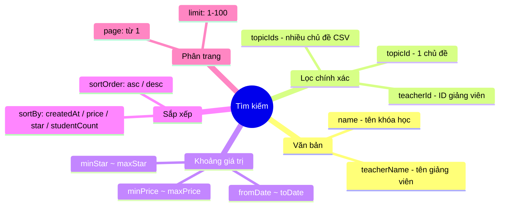
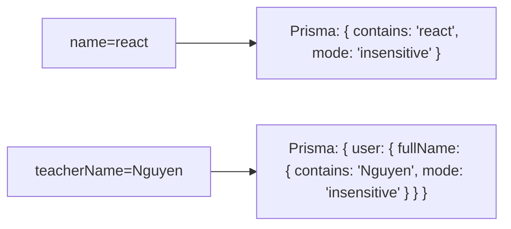
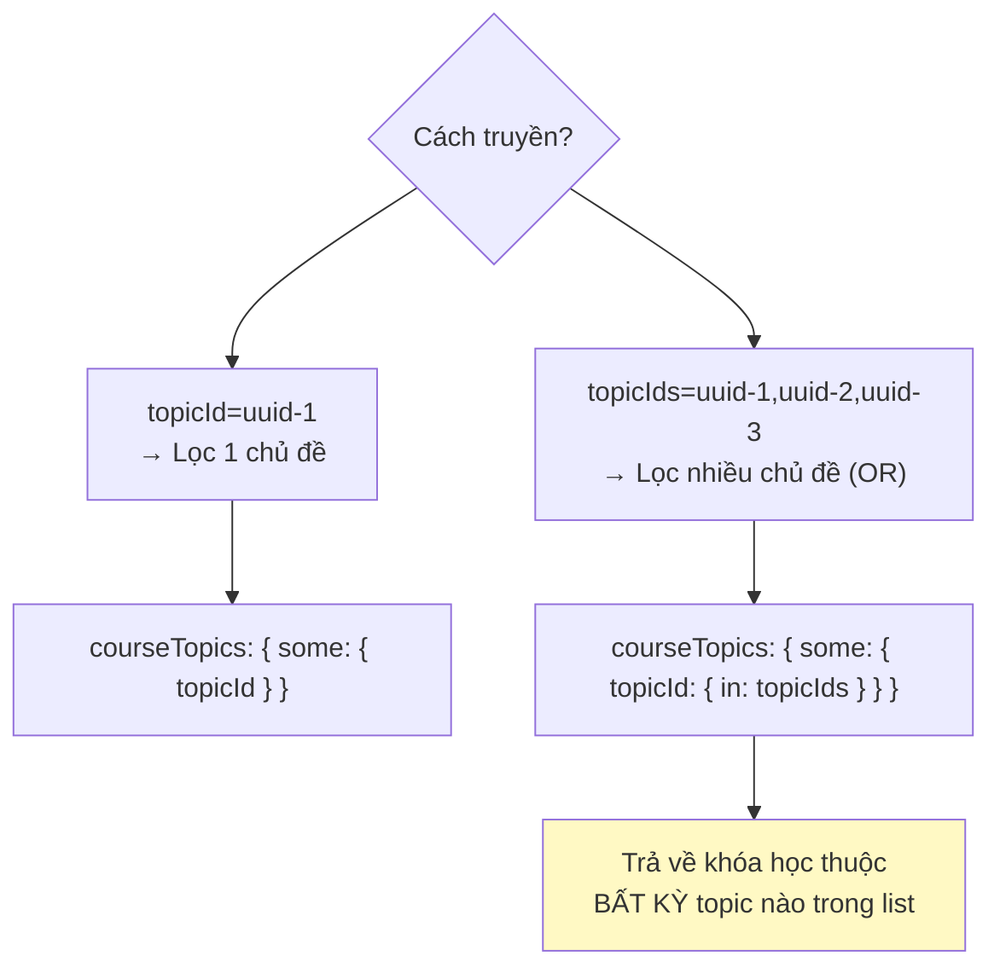
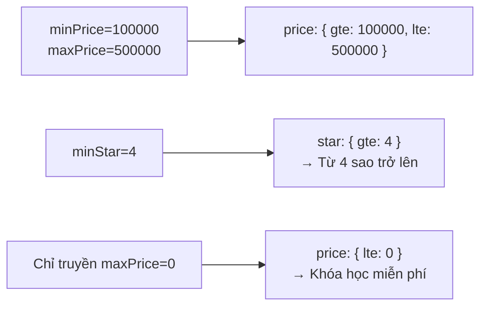
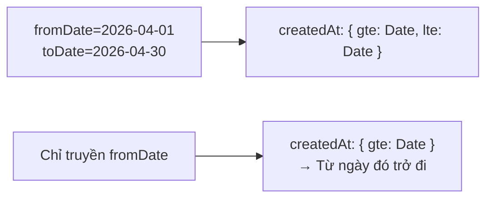
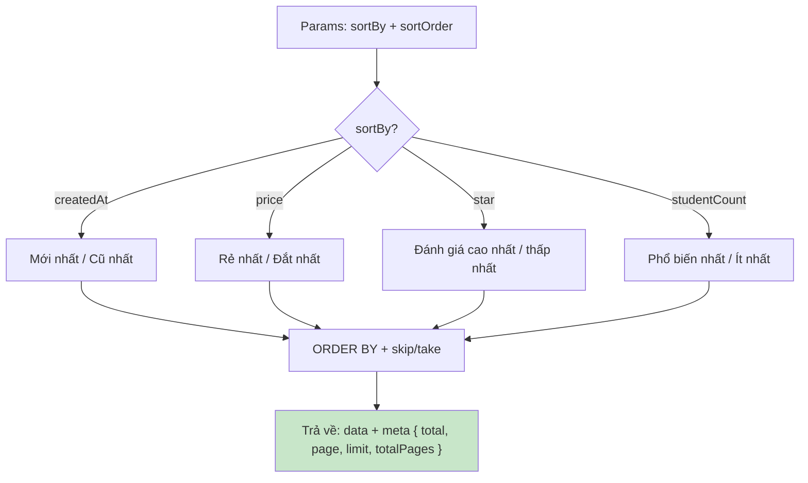
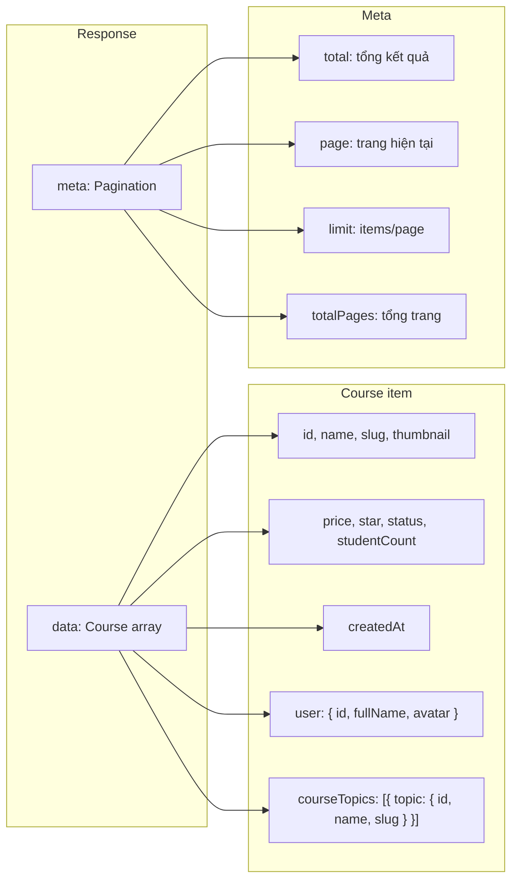

# Flow 10: Tìm kiếm Khóa học (Course Search)

## Tổng quan
API public cho phép tìm kiếm khóa học theo nhiều tiêu chí: tên, giảng viên, chủ đề, giá, sao, ngày.  
Hỗ trợ phân trang + sắp xếp linh hoạt.

---

## 1. Luồng tìm kiếm

---

## 2. Các tiêu chí tìm kiếm

---

## 3. Xử lý từng filter chi tiết

### Text Search (case-insensitive contains)

### Topic Filter

### Price & Star Range

### Date Range

---

## 4. Sorting & Pagination

---

## 5. Response cấu trúc

---

## 6. Ví dụ kịch bản sử dụng

```mermaid
flowchart TD
    subgraph "Kịch bản 1: Trang chủ - Phổ biến nhất"
        A1["GET /course/search?sortBy=studentCount&sortOrder=desc&limit=8"]
    end
    
    subgraph "Kịch bản 2: Filter sidebar"
        A2["GET /course/search?topicIds=fe-id,be-id&minPrice=0&maxPrice=500000&minStar=4&page=1"]
    end
    
    subgraph "Kịch bản 3: Tìm kiếm thanh search"
        A3["GET /course/search?name=react&sortBy=star&sortOrder=desc"]
    end
    
    subgraph "Kịch bản 4: Khóa học miễn phí"
        A4["GET /course/search?maxPrice=0&sortBy=studentCount&sortOrder=desc"]
    end
    
    subgraph "Kịch bản 5: Khóa học mới trong tháng"
        A5["GET /course/search?fromDate=2026-04-01&sortBy=createdAt&sortOrder=desc"]
    end
```

---

## Tổng hợp API

| Method | Endpoint | Role | Mô tả |
|--------|----------|------|--------|
| GET | `/api/course/search` | Public | Tìm kiếm đa tiêu chí |
