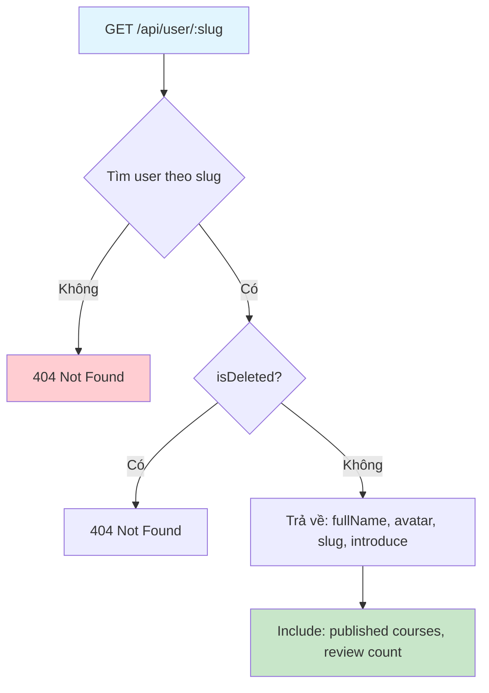
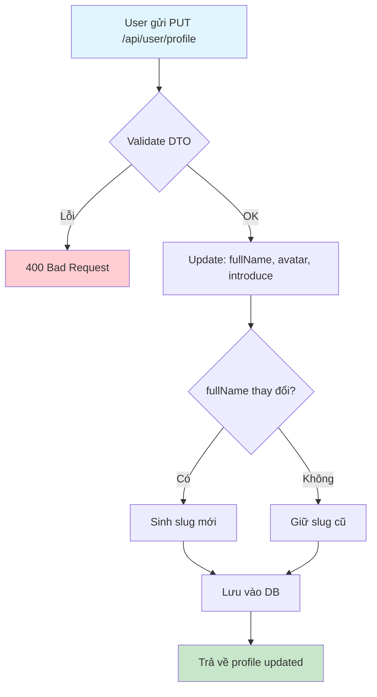
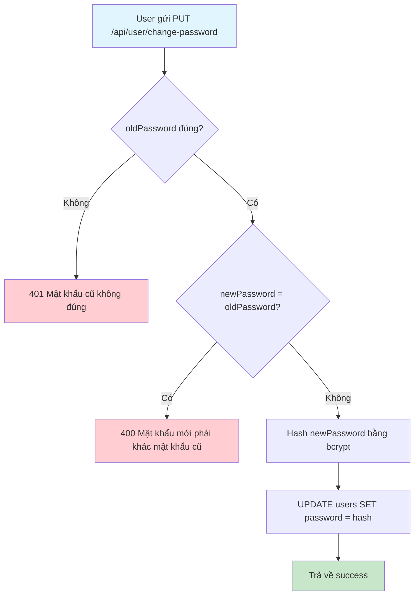

# Flow 11: Quản lý Profile & Xác thực người dùng (User Profile)

## Tổng quan
User tự quản lý profile (avatar, tên, giới thiệu) và đổi mật khẩu.  
Public có thể xem profile theo slug.

---

## 1. Xem profile public

---

## 2. Cập nhật profile

---

## 3. Đổi mật khẩu

---

## Tổng hợp API

| Method | Endpoint | Role | Mô tả |
|--------|----------|------|--------|
| GET | `/api/user/:slug` | Public | Xem profile |
| PUT | `/api/user/profile` | Auth | Sửa profile |
| PUT | `/api/user/change-password` | Auth | Đổi mật khẩu |
