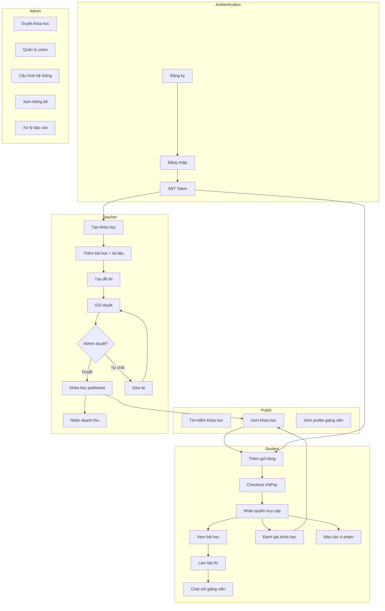

# Sơ đồ luồng dữ liệu - OnLearn Platform

> Tất cả file sử dụng **Mermaid diagrams** — render trực tiếp trên GitHub, VS Code (extension Mermaid), hoặc paste vào [mermaid.live](https://mermaid.live) để export PNG/SVG.

---

## Danh sách Flow

| # | File | Mô tả | Actors |
|---|------|--------|--------|
| 01 | [01-auth.md](01-auth.md) | Đăng ký, đăng nhập, refresh token, phân quyền | User, Teacher, Admin |
| 02 | [02-course-crud.md](02-course-crud.md) | Tạo/sửa/xóa khóa học, bài học, tài liệu | Teacher |
| 03 | [03-course-approval.md](03-course-approval.md) | Gửi duyệt, publish, reject khóa học | Teacher, Admin |
| 04 | [04-cart-purchase.md](04-cart-purchase.md) | Giỏ hàng, checkout, VNPay payment, cấp quyền | User, VNPay |
| 05 | [05-review-report.md](05-review-report.md) | Đánh giá khóa học, tính sao, báo cáo vi phạm | User, Admin |
| 06 | [06-chat.md](06-chat.md) | Chat real-time Socket.IO, conversations | User, Teacher |
| 07 | [07-exam.md](07-exam.md) | Đề thi, làm bài, chấm điểm, exam gate | Teacher, User |
| 08 | [08-admin-stats.md](08-admin-stats.md) | Cấu hình system, quản lý user, thống kê | Admin |
| 09 | [09-invoice-transaction.md](09-invoice-transaction.md) | Hóa đơn, chi tiết giao dịch, doanh thu | User, Teacher, Admin |
| 10 | [10-search.md](10-search.md) | Tìm kiếm khóa học đa tiêu chí | Public |
| 11 | [11-user-profile.md](11-user-profile.md) | Quản lý profile, đổi mật khẩu | User |

---

## Luồng tổng thể hệ thống

---

## Cách sử dụng

### Xem trong VS Code
Cài extension: [Markdown Preview Mermaid Support](https://marketplace.visualstudio.com/items?itemName=bierner.markdown-mermaid)

### Export ra hình ảnh
1. Mở [mermaid.live](https://mermaid.live)
2. Copy block `mermaid` từ file `.md`
3. Export PNG / SVG

### Render trong báo cáo
Mermaid hỗ trợ trong: GitHub README, GitLab, Notion, Docusaurus, VuePress.
