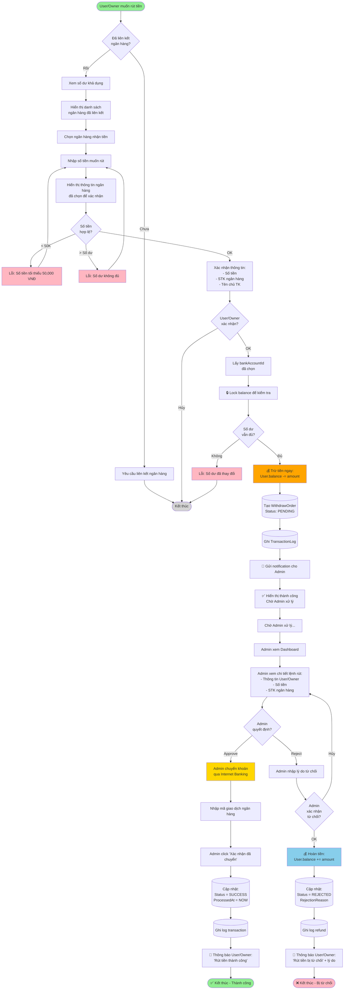
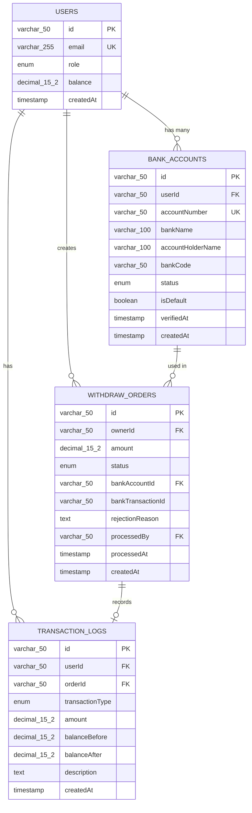

# QT-2: RÚT TIỀN

## Mục Lục
- [Mô Tả Tổng Quan](#mô-tả-tổng-quan)
- [Vai Trò Tham Gia](#vai-trò-tham-gia)
- [Luồng Nghiệp Vụ](#luồng-nghiệp-vụ)
- [Flowchart](#flowchart)
- [Sequence Diagram](#sequence-diagram)
- [Data Model](#data-model)
- [API Documentation](#api-documentation)
- [Business Rules](#business-rules)
- [Error Handling](#error-handling)

---

## Mô Tả Tổng Quan

### Mục Đích
Cho phép User và Owner rút tiền từ số dư tài khoản về tài khoản ngân hàng cá nhân. Hệ thống áp dụng cơ chế trừ tiền trước, Admin duyệt sau để đảm bảo tính minh bạch và chống gian lận.

### Tính Năng Chính
- User/Owner tự tạo lệnh rút tiền
- Trừ tiền ngay lập tức khi tạo lệnh
- Admin xem danh sách và duyệt rút tiền
- Tracking lịch sử rút tiền
- Hoàn tiền nếu Admin từ chối
- Mỗi account có thể liên kết nhiều ngân hàng

### Đặc Điểm Kỹ Thuật
- **Phương thức rút:** Chuyển khoản ngân hàng
- **Xử lý:** Thủ công bởi Admin
- **Trạng thái:** PENDING → SUCCESS/REJECTED
- **Bảo mật:** Xác thực 2 lớp (User/Owner + Admin)
- **Liên kết ngân hàng:** 1 account nhiều bank, 1 bank chỉ 1 account

---

## Vai Trò Tham Gia

### 1. User/Owner (Người Dùng)
**Trách nhiệm:**
- Liên kết tài khoản ngân hàng (có thể nhiều ngân hàng)
- Tạo lệnh rút tiền
- Chọn ngân hàng nhận tiền
- Theo dõi trạng thái rút tiền
- Nhận thông báo kết quả

**Quyền hạn:**
- Xem số dư khả dụng
- Quản lý danh sách ngân hàng liên kết
- Tạo lệnh rút tiền (nếu đủ số dư)
- Xem lịch sử rút tiền
- Hủy lệnh rút (chỉ khi PENDING)

**Điều kiện:**
- Phải có tài khoản hệ thống (User/Owner)
- Đã liên kết ít nhất 1 ngân hàng được xác thực
- Có số dư > 0
- Mỗi ngân hàng chỉ được liên kết với 1 tài khoản duy nhất

### 2. Admin (Quản Trị Viên)
**Trách nhiệm:**
- Xem danh sách lệnh rút tiền
- Kiểm tra thông tin rút tiền
- Xác thực tài khoản ngân hàng mới
- Thực hiện chuyển khoản thủ công
- Xác nhận hoặc từ chối lệnh rút
- Ghi chú lý do (nếu từ chối)

**Quyền hạn:**
- Xem tất cả lệnh rút tiền
- Approve/Reject lệnh rút
- Xác thực/từ chối liên kết ngân hàng
- Xem lịch sử giao dịch của User/Owner
- Phát hiện ngân hàng trùng lặp
- Báo cáo tài chính

**Công cụ:**
- Dashboard quản lý rút tiền
- Thông tin User/Owner đầy đủ
- Lịch sử giao dịch
- Công cụ kiểm tra trùng lặp ngân hàng

### 3. System (Hệ Thống)
**Trách nhiệm:**
- Validate số dư trước khi rút
- Kiểm tra ngân hàng không trùng lặp khi liên kết
- Trừ tiền ngay khi tạo lệnh
- Gửi notification cho Admin
- Cập nhật trạng thái
- Hoàn tiền nếu bị từ chối
- Log toàn bộ giao dịch
- Ngăn chặn liên kết ngân hàng đã tồn tại

---

## Luồng Nghiệp Vụ

### Phase 1: User/Owner Tạo Lệnh Rút Tiền

#### Bước 1: Kiểm Tra Điều Kiện
1. User/Owner truy cập trang "Rút tiền"
2. Hệ thống hiển thị:
   - Số dư khả dụng
   - Danh sách ngân hàng đã liên kết (có thể nhiều ngân hàng)
   - Lịch sử rút tiền gần nhất

#### Bước 2: Nhập Thông Tin Rút
1. User/Owner nhập:
   - Chọn ngân hàng nhận tiền (từ danh sách đã liên kết)
   - Số tiền muốn rút (min: 50,000 VNĐ)
   - Nhập ghi chú (optional)
2. Hệ thống hiển thị:
   - Thông tin ngân hàng được chọn để xác nhận
3. Hệ thống validate:
   - Số dư đủ không?
   - Số tiền >= min amount?
   - Ngân hàng đã được xác thực?

#### Bước 3: Xác Nhận và Tạo Lệnh
1. User/Owner xác nhận rút tiền (sau khi kiểm tra thông tin STK hiển thị)
2. Hệ thống thực hiện:
   ```
   BEGIN TRANSACTION
   
   - Lấy bankAccountId được chọn từ danh sách
   - Kiểm tra lại số dư (race condition)
   - Trừ tiền: User.balance -= amount
   - Tạo WithdrawOrder với bankAccountId đã chọn, status PENDING
   - Ghi log transaction
   
   COMMIT
   ```
3. Gửi notification cho Admin
4. Hiển thị thông báo thành công cho User/Owner

### Phase 2: Admin Xử Lý Lệnh Rút

#### Bước 4: Admin Review
1. Admin truy cập "Dashboard Rút Tiền"
2. Xem danh sách lệnh PENDING:
   - Thông tin User/Owner
   - Số tiền rút
   - Thông tin ngân hàng
   - Thời gian tạo lệnh
3. Click vào lệnh cần xử lý

#### Bước 5: Kiểm Tra Và Quyết Định
Admin kiểm tra:
- Thông tin User/Owner hợp lệ?
- Số tiền hợp lý?
- Tài khoản ngân hàng đúng?
- Có dấu hiệu gian lận không?
- Ngân hàng này đã liên kết với tài khoản khác chưa?

**Quyết định:**
- **APPROVE:** Thực hiện chuyển khoản
- **REJECT:** Từ chối và hoàn tiền

#### Bước 6: Thực Hiện Chuyển Khoản
1. Admin chuyển khoản thủ công qua Internet Banking
2. Nhập mã giao dịch ngân hàng
3. Click "Xác nhận đã chuyển"
4. Hệ thống:
   - Cập nhật status = SUCCESS
   - Lưu mã giao dịch
   - Lưu thời gian xử lý
   - Gửi notification cho User/Owner

#### Bước 7: Hoặc Từ Chối
1. Admin click "Từ chối"
2. Nhập lý do từ chối
3. Hệ thống:
   ```
   BEGIN TRANSACTION
   
   - Hoàn tiền: User.balance += amount
   - Cập nhật status = REJECTED
   - Lưu lý do từ chối
   - Ghi log transaction
   
   COMMIT
   ```
4. Gửi notification cho User/Owner (kèm lý do)

---

## Flowchart



---

## Sequence Diagram

```mermaid
sequenceDiagram
    participant U as User/Owner
    participant FE as Frontend
    participant BE as Backend API
    participant DB as Database
    participant Lock as Redis Lock
    participant Admin as Admin Dashboard
    participant Notif as Notification Service
    participant Bank as Internet Banking

    Note over U,Bank: PHASE 1: USER/OWNER TẠO LỆNH RÚT TIỀN
    
    U->>FE: 1. Click "Rút tiền"
    FE->>BE: 2. GET /api/withdraw/info
    activate BE
    BE->>DB: 3. SELECT balance FROM Users<br/>+ SELECT * FROM BankAccounts WHERE userId
    activate DB
    DB-->>BE: 4. balance: 5,000,000 VNĐ<br/>banks: [{bank_001: VCB}, {bank_002: TCB}]
    deactivate DB
    BE-->>FE: 5. {balance: 5000000, bankAccounts: [...]}
    deactivate BE
    
    FE->>U: 6. Hiển thị form rút tiền<br/>+ Danh sách ngân hàng đã liên kết
    U->>FE: 7. Chọn ngân hàng: bank_001 (VCB)<br/>Nhập: amount = 2,000,000 VNĐ
    FE->>FE: 8. Validate: 50K <= amount <= balance
    FE->>U: 8.5. Hiển thị xác nhận:<br/>Số tiền + STK nhận tiền (VCB)
    
    U->>FE: 9. Click "Xác nhận rút tiền"
    FE->>BE: 10. POST /api/withdraw/create<br/>{amount: 2000000, bankAccountId: 'bank_001'}
    activate BE
    
    BE->>Lock: 11. Acquire lock: "withdraw:user_001"
    activate Lock
    Lock-->>BE: 12. Lock acquired
    
    BE->>DB: 13. SELECT balance FROM Users<br/>WHERE id='user_001' FOR UPDATE<br/>+ VERIFY bankAccountId='bank_001' belongs to user
    activate DB
    DB-->>BE: 14. balance: 5,000,000<br/>bankAccountId: valid
    
    alt Số dư đủ
        BE->>BE: 15. Validate:<br/>✅ 2,000,000 <= 5,000,000<br/>✅ bankAccountId belongs to user<br/>✅ bank status = VERIFIED
        
        BE->>DB: 16. BEGIN TRANSACTION
        
        BE->>DB: 17. UPDATE Users<br/>SET balance = balance - 2000000<br/>WHERE id = 'user_001'
        
        BE->>DB: 18. INSERT WithdrawOrders<br/>(id, ownerId='user_001', bankAccountId='bank_001',<br/>amount, status='PENDING')
        
        BE->>DB: 19. INSERT TransactionLogs<br/>(type: 'WITHDRAW_REQUEST', amount, balanceBefore, balanceAfter)
        
        BE->>DB: 20. COMMIT
        DB-->>BE: 21. Transaction committed
        
        BE->>Lock: 22. Release lock
        
        BE->>Notif: 23. Send notification to Admin<br/>"Lệnh rút tiền mới từ User/Owner XYZ"
        activate Notif
        Notif->>Admin: 24. Push notification
        deactivate Notif
        
        BE-->>FE: 25. {success: true, orderId: "wdr_001",<br/>newBalance: 3000000}
        
        FE->>U: 26. ✅ Rút tiền thành công!<br/>Đang chờ Admin xử lý<br/>Số dư mới: 3,000,000 VNĐ
        
    else Số dư không đủ
        BE->>Lock: Release lock
        BE-->>FE: ❌ {error: "Số dư không đủ"}
        FE->>U: Lỗi: Số dư không đủ
    end
    
    deactivate DB
    deactivate Lock
    deactivate BE
    
    Note over U,Bank: PHASE 2: ADMIN XỬ LÝ
    
    Admin->>Admin: 27. Mở Dashboard Rút Tiền
    Admin->>BE: 28. GET /api/admin/withdraw/pending
    activate BE
    BE->>DB: 29. SELECT * FROM WithdrawOrders<br/>WHERE status='PENDING'
    activate DB
    DB-->>BE: 30. List of pending withdraws
    deactivate DB
    BE-->>Admin: 31. [{orderId, owner, amount, bankInfo}]
    deactivate BE
    
    Admin->>Admin: 32. Click vào lệnh wdr_001
    Admin->>BE: 33. GET /api/admin/withdraw/wdr_001
    activate BE
    BE->>DB: 34. SELECT full details + owner info
    activate DB
    DB-->>BE: 35. Detailed withdraw info
    deactivate DB
    BE-->>Admin: 36. Full withdraw details
    deactivate BE
    
    Admin->>Admin: 37. Xem xét thông tin:<br/>- User/Owner: Nguyễn Văn A<br/>- Số tiền: 2,000,000<br/>- STK: 9876543210<br/>- Ngân hàng: Vietcombank<br/>- Kiểm tra STK đã liên kết với account khác?
    
    alt Admin APPROVE
        Admin->>Bank: 38. Chuyển khoản 2,000,000 VNĐ<br/>đến STK 9876543210
        activate Bank
        Bank-->>Admin: 39. Chuyển khoản thành công<br/>Mã GD: VCB20251209005678
        deactivate Bank
        
        Admin->>BE: 40. PUT /api/admin/withdraw/wdr_001/approve<br/>{bankTxnId: "VCB20251209005678"}
        activate BE
        
        BE->>DB: 41. BEGIN TRANSACTION
        activate DB
        
        BE->>DB: 42. UPDATE WithdrawOrders<br/>SET status='SUCCESS',<br/>bankTransactionId='VCB...',<br/>processedAt=NOW(),<br/>processedBy='admin_001'
        
        BE->>DB: 43. INSERT TransactionLogs<br/>(type: 'WITHDRAW_SUCCESS')
        
        BE->>DB: 44. COMMIT
        DB-->>BE: 45. Success
        deactivate DB
        
        BE->>Notif: 46. Send to User/Owner<br/>"Rút tiền thành công! 2,000,000 VNĐ"
        activate Notif
        Notif->>U: 47. 📧 Push notification
        deactivate Notif
        
        BE-->>Admin: 48. {success: true}
        deactivate BE
        
        Admin->>Admin: 49. ✅ Đã xác nhận rút tiền
        
    else Admin REJECT
        Admin->>BE: 50. PUT /api/admin/withdraw/wdr_001/reject<br/>{reason: "Thông tin ngân hàng không khớp"}
        activate BE
        
        BE->>DB: 51. BEGIN TRANSACTION
        activate DB
        
        BE->>DB: 52. UPDATE Users<br/>SET balance = balance + 2000000<br/>WHERE id='user_001'
        
        BE->>DB: 53. UPDATE WithdrawOrders<br/>SET status='REJECTED',<br/>rejectionReason='...',<br/>processedAt=NOW()
        
        BE->>DB: 54. INSERT TransactionLogs<br/>(type: 'WITHDRAW_REJECTED')
        
        BE->>DB: 55. COMMIT
        DB-->>BE: 56. Success
        deactivate DB
        
        BE->>Notif: 57. Send to User/Owner<br/>"Rút tiền bị từ chối: [lý do]"
        activate Notif
        Notif->>U: 58. 📧 Push notification + lý do
        deactivate Notif
        
        BE-->>Admin: 59. {success: true}
        deactivate BE
        
        Admin->>Admin: 60. ✅ Đã từ chối và hoàn tiền
    end
    
    Note over U,Bank: PHASE 3: USER/OWNER CHECK STATUS
    
    U->>FE: 61. Refresh trang "Rút tiền"
    FE->>BE: 62. GET /api/withdraw/history
    activate BE
    BE->>DB: 63. SELECT * FROM WithdrawOrders<br/>WHERE ownerId='user_001'
    activate DB
    DB-->>BE: 64. Withdraw history
    deactivate DB
    BE-->>FE: 65. [{orderId, amount, status, processedAt}]
    deactivate BE
    FE->>U: 66. Hiển thị lịch sử rút tiền<br/>với trạng thái cập nhật
```



---

## Data Model

### ERD Diagram



### Database Schema

#### 1. BankAccounts Table

```sql
CREATE TABLE BankAccounts (
    -- Primary Key
    id VARCHAR(50) PRIMARY KEY COMMENT 'bank_{uuid}',
    
    -- Foreign Key
    userId VARCHAR(50) NOT NULL COMMENT 'User ID - mỗi user có thể nhiều ngân hàng',
    
    -- Bank Information
    accountNumber VARCHAR(50) NOT NULL UNIQUE COMMENT 'Số tài khoản - UNIQUE để 1 STK chỉ 1 account',
    bankName VARCHAR(100) NOT NULL COMMENT 'Tên ngân hàng',
    bankCode VARCHAR(50) NOT NULL COMMENT 'Mã ngân hàng (VCB, TCB, ...)',
    accountHolderName VARCHAR(100) NOT NULL COMMENT 'Tên chủ tài khoản',
    
    -- Default Account
    isDefault BOOLEAN NOT NULL DEFAULT FALSE COMMENT 'STK mặc định',
    
    -- Status
    status ENUM(
        'PENDING_VERIFICATION',  -- Chờ xác thực
        'VERIFIED',              -- Đã xác thực
        'REJECTED',              -- Bị từ chối
        'SUSPENDED'              -- Bị tạm khóa
    ) NOT NULL DEFAULT 'PENDING_VERIFICATION',
    
    -- Timestamps
    createdAt TIMESTAMP DEFAULT CURRENT_TIMESTAMP,
    verifiedAt TIMESTAMP NULL COMMENT 'Thời gian xác thực',
    updatedAt TIMESTAMP DEFAULT CURRENT_TIMESTAMP ON UPDATE CURRENT_TIMESTAMP,
    
    -- Indexes
    INDEX idx_userId (userId),
    INDEX idx_accountNumber (accountNumber),
    INDEX idx_status (status),
    
    -- Foreign Key Constraints
    FOREIGN KEY (userId) REFERENCES Users(id) ON DELETE CASCADE,
    
    -- Unique Constraint: 1 STK ngân hàng chỉ được liên kết với 1 tài khoản hệ thống
    UNIQUE KEY unique_account_number (accountNumber)
) ENGINE=InnoDB DEFAULT CHARSET=utf8mb4 COLLATE=utf8mb4_unicode_ci
COMMENT='Tài khoản ngân hàng liên kết - 1 user nhiều bank, 1 bank chỉ 1 user';
```

#### 2. WithdrawOrders Table

```sql
CREATE TABLE WithdrawOrders (
    -- Primary Key
    id VARCHAR(50) PRIMARY KEY COMMENT 'wdr_{uuid}',
    
    -- Foreign Keys
    ownerId VARCHAR(50) NOT NULL COMMENT 'User/Owner ID yêu cầu rút',
    bankAccountId VARCHAR(50) NOT NULL COMMENT 'Tài khoản ngân hàng nhận tiền',
    
    -- Amount
    amount DECIMAL(15,2) NOT NULL COMMENT 'Số tiền rút (VNĐ)',
    
    -- Status
    status ENUM(
        'PENDING',   -- Chờ xử lý
        'PROCESSING',-- Đang xử lý
        'SUCCESS',   -- Thành công
        'REJECTED',  -- Bị từ chối
        'CANCELLED'  -- Đã hủy
    ) NOT NULL DEFAULT 'PENDING',
    
    -- Bank Transaction
    bankTransactionId VARCHAR(50) NULL COMMENT 'Mã giao dịch ngân hàng',
    
    -- Rejection
    rejectionReason TEXT NULL COMMENT 'Lý do từ chối',
    
    -- Admin Processing
    processedBy VARCHAR(50) NULL COMMENT 'Admin ID xử lý',
    processedAt TIMESTAMP NULL COMMENT 'Thời gian xử lý',
    
    -- Notes
    ownerNote TEXT NULL COMMENT 'Ghi chú từ Owner',
    adminNote TEXT NULL COMMENT 'Ghi chú từ Admin',
    
    -- Timestamps
    createdAt TIMESTAMP DEFAULT CURRENT_TIMESTAMP COMMENT 'Thời gian tạo lệnh',
    updatedAt TIMESTAMP DEFAULT CURRENT_TIMESTAMP ON UPDATE CURRENT_TIMESTAMP,
    
    -- Indexes
    INDEX idx_ownerId (ownerId),
    INDEX idx_status (status),
    INDEX idx_createdAt (createdAt),
    INDEX idx_processedBy (processedBy),
    
    -- Foreign Key Constraints
    FOREIGN KEY (ownerId) REFERENCES Users(id) ON DELETE CASCADE,
    FOREIGN KEY (bankAccountId) REFERENCES BankAccounts(id) ON DELETE RESTRICT,
    FOREIGN KEY (processedBy) REFERENCES Users(id) ON DELETE SET NULL,
    
    -- Constraints
    CHECK (amount >= 50000),
    CHECK (processedAt IS NULL OR processedAt >= createdAt)
) ENGINE=InnoDB DEFAULT CHARSET=utf8mb4 COLLATE=utf8mb4_unicode_ci
COMMENT='Lệnh rút tiền';
```

#### 3. Update Users Table

```sql
-- Không cần bankAccountId vì 1 user có nhiều ngân hàng
-- Users table giữ nguyên, quan hệ 1-n được quản lý qua BankAccounts.userId

-- Nếu cần thiết, có thể thêm index:
CREATE INDEX idx_balance ON Users(balance);
```

### Sample Data

```sql
-- User with balance
INSERT INTO Users (id, email, fullName, role, balance) VALUES
('user_001', 'nguyen.van.a@email.com', 'Nguyễn Văn A', 'USER', 3000000),
('owner_001', 'giang.vien@email.com', 'Nguyễn Văn Giảng', 'OWNER', 5000000);

-- Bank Accounts (User có 2 ngân hàng, Owner có 1 ngân hàng)
INSERT INTO BankAccounts (
    id, userId, accountNumber, bankName, bankCode, 
    accountHolderName, isDefault, status, verifiedAt
) VALUES 
-- User_001 - Ngân hàng 1 (mặc định)
(
    'bank_001',
    'user_001',
    '1234567890',
    'Vietcombank',
    'VCB',
    'NGUYEN VAN A',
    TRUE,
    'VERIFIED',
    NOW()
),
-- User_001 - Ngân hàng 2
(
    'bank_002',
    'user_001',
    '0987654321',
    'Techcombank',
    'TCB',
    'NGUYEN VAN A',
    FALSE,
    'VERIFIED',
    NOW()
),
-- Owner_001 - Ngân hàng 1
(
    'bank_003',
    'owner_001',
    '9876543210',
    'Vietcombank',
    'VCB',
    'NGUYEN VAN GIANG',
    TRUE,
    'VERIFIED',
    NOW()
);

-- Withdraw Order (PENDING) - User rút tiền
INSERT INTO WithdrawOrders (
    id, ownerId, bankAccountId, amount, status, ownerNote
) VALUES (
    'wdr_001',
    'user_001',
    'bank_001',
    1000000,
    'PENDING',
    'Rút tiền về Vietcombank'
);

-- Withdraw Order (SUCCESS) - Owner rút tiền
INSERT INTO WithdrawOrders (
    id, ownerId, bankAccountId, amount, status,
    bankTransactionId, processedBy, processedAt
) VALUES (
    'wdr_002',
    'owner_001',
    'bank_003',
    2000000,
    'SUCCESS',
    'VCB20251209005678',
    'admin_001',
    NOW()
);

-- Transaction Logs
INSERT INTO TransactionLogs (
    id, userId, orderId, transactionType,
    amount, balanceBefore, balanceAfter, description
) VALUES
-- User rút tiền (trừ khi tạo lệnh)
('txn_101', 'user_001', 'wdr_001', 'WITHDRAW_REQUEST',
 -1000000, 3000000, 2000000, 'Tạo lệnh rút tiền 1,000,000 VNĐ'),

-- Owner rút tiền thành công (đã chuyển)
('txn_102', 'owner_001', 'wdr_002', 'WITHDRAW_SUCCESS',
 -2000000, 5000000, 3000000, 'Rút tiền thành công 2,000,000 VNĐ');
```

---

## API Documentation

### 1. Get Withdraw Info

**Endpoint:** `GET /api/withdraw/info`

**Description:** Lấy thông tin số dư và danh sách ngân hàng đã liên kết

**Authentication:** Required (User/Owner)

**Response Success (200):**

```json
{
  "success": true,
  "data": {
    "balance": 5000000,
    "bankAccounts": [
      {
        "id": "bank_001",
        "accountNumber": "9876543210",
        "bankName": "Vietcombank",
        "bankCode": "VCB",
        "accountHolderName": "NGUYEN VAN GIANG",
        "status": "VERIFIED",
        "isDefault": true
      },
      {
        "id": "bank_002",
        "accountNumber": "1234567890",
        "bankName": "Techcombank",
        "bankCode": "TCB",
        "accountHolderName": "NGUYEN VAN GIANG",
        "status": "VERIFIED",
        "isDefault": false
      }
    ],
    "minWithdrawAmount": 50000,
    "pendingWithdraws": []
  }
}
```

---

### 2. Create Withdraw Order

**Endpoint:** `POST /api/withdraw/create`

**Description:** Tạo lệnh rút tiền mới

**Authentication:** Required (User/Owner)

**Request:**

```json
{
  "bankAccountId": "bank_001",
  "amount": 2000000,
  "note": "Rút tiền doanh thu tháng 12"
}
```

**Note:** 
- `bankAccountId` là bắt buộc, phải là ngân hàng thuộc sở hữu của user đang đăng nhập
- Hệ thống sẽ validate `bankAccountId` có thuộc user không và đã được xác thực chưa

**Response Success (201):**

```json
{
  "success": true,
  "message": "Lệnh rút tiền đã được tạo thành công",
  "data": {
    "orderId": "wdr_001",
    "amount": 2000000,
    "status": "PENDING",
    "newBalance": 3000000,
    "bankInfo": {
      "accountNumber": "9876543210",
      "bankName": "Vietcombank"
    },
    "createdAt": "2025-12-09T14:30:00Z",
    "estimatedProcessTime": "24-48 giờ"
  }
}
```

**Response Error (400):**

```json
{
  "success": false,
  "error": {
    "code": "WITHDRAW_001",
    "message": "Số dư không đủ",
    "details": "Số dư hiện tại: 1,500,000 VNĐ. Số tiền rút: 2,000,000 VNĐ"
  }
}
```

---

### 3. Get Withdraw History

**Endpoint:** `GET /api/withdraw/history`

**Description:** Lấy lịch sử rút tiền

**Authentication:** Required (User/Owner)

**Query Parameters:**

| Parameter | Type | Default | Description |
|-----------|------|---------|-------------|
| page | number | 1 | Trang hiện tại |
| limit | number | 20 | Số record/trang |
| status | string | all | Lọc theo trạng thái |
| fromDate | string | - | Từ ngày |
| toDate | string | - | Đến ngày |

**Response Success (200):**

```json
{
  "success": true,
  "data": {
    "orders": [
      {
        "orderId": "wdr_002",
        "amount": 1000000,
        "status": "SUCCESS",
        "bankTransactionId": "VCB20251209005678",
        "createdAt": "2025-12-08T10:00:00Z",
        "processedAt": "2025-12-08T15:30:00Z"
      },
      {
        "orderId": "wdr_001",
        "amount": 2000000,
        "status": "PENDING",
        "createdAt": "2025-12-09T14:30:00Z",
        "processedAt": null
      }
    ],
    "summary": {
      "totalWithdrawn": 1000000,
      "pendingAmount": 2000000,
      "successfulWithdraws": 1
    },
    "pagination": {
      "currentPage": 1,
      "totalPages": 1,
      "totalRecords": 2
    }
  }
}
```

---

### 4. Admin: Get Pending Withdraws

**Endpoint:** `GET /api/admin/withdraw/pending`

**Description:** Lấy danh sách lệnh rút tiền chờ xử lý

**Authentication:** Required (Admin)

**Response Success (200):**

```json
{
  "success": true,
  "data": [
    {
      "orderId": "wdr_001",
      "owner": {
        "id": "user_001",
        "fullName": "Nguyễn Văn A",
        "email": "user.a@email.com",
        "role": "USER"
      },
      "amount": 2000000,
      "bankInfo": {
        "accountNumber": "9876543210",
        "bankName": "Vietcombank",
        "accountHolderName": "NGUYEN VAN A"
      },
      "createdAt": "2025-12-09T14:30:00Z",
      "waitingTime": "2 giờ 15 phút",
      "ownerNote": "Rút tiền về Vietcombank"
    }
  ],
  "total": 1,
  "totalAmount": 2000000
}
```

---

### 5. Admin: Approve Withdraw

**Endpoint:** `PUT /api/admin/withdraw/:orderId/approve`

**Description:** Duyệt lệnh rút tiền

**Authentication:** Required (Admin)

**Request:**

```json
{
  "bankTransactionId": "VCB20251209005678",
  "adminNote": "Đã chuyển khoản thành công"
}
```

**Response Success (200):**

```json
{
  "success": true,
  "message": "Lệnh rút tiền đã được duyệt thành công",
  "data": {
    "orderId": "wdr_001",
    "status": "SUCCESS",
    "processedAt": "2025-12-09T16:45:00Z"
  }
}
```

---

### 6. Admin: Reject Withdraw

**Endpoint:** `PUT /api/admin/withdraw/:orderId/reject`

**Description:** Từ chối lệnh rút tiền

**Authentication:** Required (Admin)

**Request:**

```json
{
  "reason": "Thông tin ngân hàng không khớp với hồ sơ",
  "adminNote": "Yêu cầu Owner cập nhật thông tin ngân hàng"
}
```

**Response Success (200):**

```json
{
  "success": true,
  "message": "Lệnh rút tiền đã bị từ chối và hoàn tiền",
  "data": {
    "orderId": "wdr_001",
    "status": "REJECTED",
    "refundedAmount": 2000000,
    "processedAt": "2025-12-09T16:50:00Z"
  }
}
```

---

### 7. Link Bank Account

**Endpoint:** `POST /api/users/link-bank`

**Description:** Liên kết tài khoản ngân hàng mới

**Authentication:** Required (User/Owner)

**Request:**

```json
{
  "accountNumber": "9876543210",
  "bankCode": "VCB",
  "bankName": "Vietcombank",
  "accountHolderName": "NGUYEN VAN GIANG",
  "isDefault": false
}
```

**Note:**
- Mỗi user có thể liên kết nhiều ngân hàng
- Mỗi số tài khoản (`accountNumber`) chỉ được liên kết với 1 tài khoản hệ thống
- Hệ thống sẽ kiểm tra trùng lặp `accountNumber` trước khi tạo

**Response Success (201):**

```json
{
  "success": true,
  "message": "Tài khoản ngân hàng đã được liên kết",
  "data": {
    "bankAccountId": "bank_001",
    "status": "PENDING_VERIFICATION",
    "note": "Vui lòng chờ Admin xác thực tài khoản ngân hàng"
  }
}
```

**Response Error (409):**

```json
{
  "success": false,
  "error": {
    "code": "WITHDRAW_012",
    "message": "Số tài khoản này đã được liên kết với tài khoản khác",
    "details": "Mỗi STK chỉ có thể liên kết với 1 tài khoản hệ thống"
  }
}
```

---

### 8. Get Bank Accounts

**Endpoint:** `GET /api/users/bank-accounts`

**Description:** Lấy danh sách ngân hàng đã liên kết

**Authentication:** Required (User/Owner)

**Response Success (200):**

```json
{
  "success": true,
  "data": [
    {
      "id": "bank_001",
      "accountNumber": "9876543210",
      "bankName": "Vietcombank",
      "bankCode": "VCB",
      "accountHolderName": "NGUYEN VAN GIANG",
      "status": "VERIFIED",
      "isDefault": true,
      "createdAt": "2025-12-01T10:00:00Z",
      "verifiedAt": "2025-12-02T14:30:00Z"
    },
    {
      "id": "bank_002",
      "accountNumber": "1234567890",
      "bankName": "Techcombank",
      "bankCode": "TCB",
      "accountHolderName": "NGUYEN VAN GIANG",
      "status": "PENDING_VERIFICATION",
      "isDefault": false,
      "createdAt": "2025-12-09T09:00:00Z",
      "verifiedAt": null
    }
  ]
}
```

---

### 9. Set Default Bank Account

**Endpoint:** `PUT /api/users/bank-accounts/:bankAccountId/set-default`

**Description:** Đặt ngân hàng làm mặc định

**Authentication:** Required (User/Owner)

**Response Success (200):**

```json
{
  "success": true,
  "message": "Đã đặt làm ngân hàng mặc định"
}
```

---

### 10. Remove Bank Account

**Endpoint:** `DELETE /api/users/bank-accounts/:bankAccountId`

**Description:** Xóa liên kết ngân hàng

**Authentication:** Required (User/Owner)

**Response Success (200):**

```json
{
  "success": true,
  "message": "Đã xóa liên kết ngân hàng"
}
```

**Response Error (400):**

```json
{
  "success": false,
  "error": {
    "code": "WITHDRAW_014",
    "message": "Không thể xóa ngân hàng đang có lệnh rút tiền PENDING"
  }
}
```

---

### 11. Admin: Verify Bank Account

**Endpoint:** `PUT /api/admin/bank-accounts/:bankAccountId/verify`

**Description:** Xác thực tài khoản ngân hàng

**Authentication:** Required (Admin)

**Request:**

```json
{
  "action": "approve",
  "note": "Thông tin hợp lệ"
}
```

**Response Success (200):**

```json
{
  "success": true,
  "message": "Đã xác thực tài khoản ngân hàng"
}
```

---

## Business Rules

### 1. Điều Kiện Rút Tiền
- **User và Owner:** Cả User và Owner đều có thể rút tiền
- **Liên kết ngân hàng:** Phải liên kết và xác thực ít nhất 1 ngân hàng
- **Số tiền tối thiểu:** 50,000 VNĐ
- **Số tiền tối đa:** Không vượt quá số dư khả dụng
- **Chọn ngân hàng:** Phải chọn ngân hàng từ danh sách đã liên kết

### 2. Cơ Chế Trừ Tiền
- **Trừ ngay:** Tiền bị trừ ngay khi tạo lệnh
- **Mục đích:** Tránh user rút vượt số dư
- **Rollback:** Hoàn tiền nếu Admin từ chối
- **Chọn ngân hàng:** User/Owner chọn ngân hàng từ danh sách đã liên kết
- **Validate ownership:** Hệ thống kiểm tra `bankAccountId` có thuộc user không

### 3. Thời Gian Xử Lý
- **SLA tiêu chuẩn:** 24-48 giờ làm việc
- **Khẩn cấp:** Có thể xử lý sớm hơn
- **Notification:** Admin nhận thông báo ngay

### 4. Bảo Mật
- **2-layer approval:** User/Owner tạo, Admin duyệt
- **Bank verification:** Xác thực tài khoản ngân hàng
- **Transaction log:** Ghi lại toàn bộ thao tác
- **Fraud detection:** Phát hiện hành vi bất thường
- **Unique bank account:** 1 STK chỉ được liên kết với 1 tài khoản hệ thống
- **Prevent multi-account fraud:** Ngăn chặn tạo nhiều tài khoản để refund bằng cùng 1 STK

### 5. Giới Hạn
- **Số lệnh chờ xử lý:** Tối đa 3 lệnh/User
- **Tổng tiền chờ xử lý:** Tối đa 100,000,000 VNĐ/User
- **Rate limit:** Tối đa 5 lệnh/ngày/User
- **Số ngân hàng liên kết:** Tối đa 5 ngân hàng/User
- **Mỗi ngân hàng:** Chỉ được liên kết với 1 tài khoản duy nhất

---

## Error Handling

### Error Codes

| Code | Message | HTTP Status |
|------|---------|-------------|
| WITHDRAW_001 | Insufficient balance | 400 |
| WITHDRAW_002 | Bank account not linked | 400 |
| WITHDRAW_003 | Bank account not verified | 400 |
| WITHDRAW_004 | Amount below minimum | 400 |
| WITHDRAW_005 | Order not found | 404 |
| WITHDRAW_006 | Cannot process completed order | 400 |
| WITHDRAW_007 | Too many pending withdraws | 429 |
| WITHDRAW_008 | Daily limit exceeded | 429 |
| WITHDRAW_009 | Unauthorized access | 403 |
| WITHDRAW_010 | Invalid bank account | 400 |
| WITHDRAW_011 | Bank account not belongs to user | 403 |
| WITHDRAW_012 | Bank account already linked to another user | 409 |
| WITHDRAW_013 | Maximum bank accounts limit reached | 400 |
| WITHDRAW_014 | Cannot remove bank with pending withdraws | 400 |

---

**Document Version:** 1.0  
**Last Updated:** December 9, 2025  
**Author:** OnLearn Technical Team
