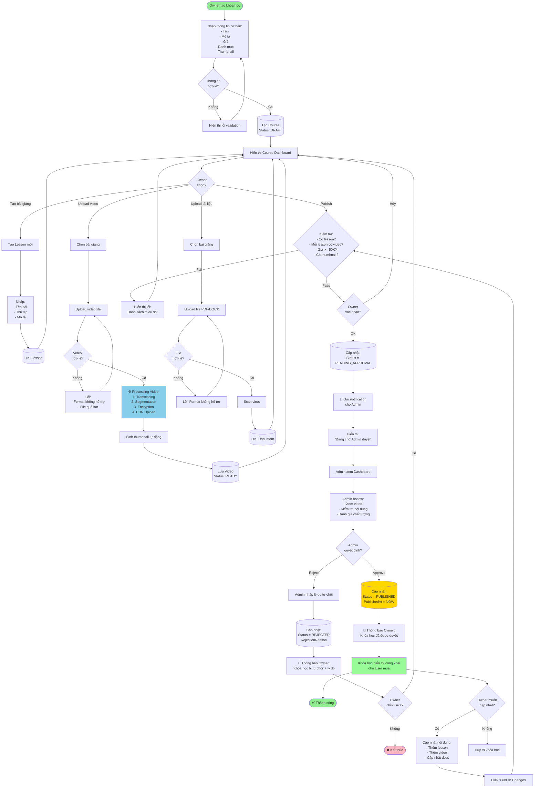

# QT-3: TẠO KHÓA HỌC

## Mục Lục
- [Mô Tả Tổng Quan](#mô-tả-tổng-quan)
- [Vai Trò Tham Gia](#vai-trò-tham-gia)
- [Luồng Nghiệp Vụ](#luồng-nghiệp-vụ)
- [Flowchart](#flowchart)
- [Sequence Diagram](#sequence-diagram)
- [Data Model](#data-model)
- [API Documentation](#api-documentation)
- [Business Rules](#business-rules)

---

## Mô Tả Tổng Quan

### Mục Đích
Cho phép Owner tạo và quản lý khóa học với đầy đủ nội dung (bài giảng, video, tài liệu). Hệ thống áp dụng cơ chế duyệt nội dung để đảm bảo chất lượng trước khi công khai.

### Tính Năng Chính
- Tạo khóa học với thông tin cơ bản
- Tạo cấu trúc bài giảng (lessons)
- Upload video cho từng bài (multi-resolution)
- Upload tài liệu (PDF, DOCX)
- Publish để chờ Admin duyệt
- Cập nhật và re-publish khóa học

### Quy Trình
```
DRAFT → PENDING_APPROVAL → PUBLISHED/REJECTED → (Update) → PENDING_APPROVAL
```

---

## Vai Trò Tham Gia

### 1. Owner (Giảng Viên)
**Trách nhiệm:**
- Tạo khóa học với thông tin đầy đủ
- Thiết kế cấu trúc bài giảng logic
- Chuẩn bị và upload video chất lượng
- Upload tài liệu bổ trợ
- Publish khóa học để Admin duyệt
- Cập nhật nội dung theo feedback

**Quyền hạn:**
- Tạo/Sửa/Xóa khóa học (DRAFT)
- Quản lý bài giảng
- Upload/Delete video và tài liệu
- Publish/Unpublish khóa học
- Xem thống kê khóa học

### 2. Admin (Quản Trị Viên)
**Trách nhiệm:**
- Kiểm tra chất lượng nội dung
- Duyệt/Từ chối khóa học
- Đưa ra feedback nếu từ chối
- Giám sát nội dung vi phạm
- Unpublish khóa học vi phạm

**Quyền hạn:**
- Xem tất cả khóa học
- Approve/Reject khóa học
- Unpublish khóa học bất kỳ lúc nào
- Xem báo cáo vi phạm

### 3. System (Hệ Thống)
**Trách nhiệm:**
- Xử lý upload video (transcoding, segmentation)
- Mã hóa video (AES-128)
- Sinh thumbnail tự động
- Lưu trữ trên CDN
- Tính toán thời lượng khóa học
- Validate dữ liệu

---

## Luồng Nghiệp Vụ

### Phase 1: Tạo Khóa Học (DRAFT)

#### Bước 1: Tạo Khóa Học Mới
Owner nhập thông tin:
- **Tiêu đề**: Tên khóa học (VD: "Lập Trình Web Full-Stack 2025")
- **Mô tả**: Mô tả chi tiết, mục tiêu học tập
- **Danh mục**: Frontend, Backend, Mobile, Data Science...
- **Giá**: Số tiền (tối thiểu 50,000 VNĐ)
- **Thumbnail**: Ảnh đại diện khóa học
- **Yêu cầu**: Kiến thức cần có trước
- **Level**: Beginner, Intermediate, Advanced

Hệ thống:
- Tạo Course với status `DRAFT`
- Generate courseId unique
- Lưu vào database

#### Bước 2: Tạo Cấu Trúc Bài Giảng

Owner tạo lessons:
```
Khóa học: "Lập Trình Web Full-Stack"
│
├── Section 1: HTML & CSS
│   ├── Bài 1: Giới thiệu HTML
│   ├── Bài 2: CSS Cơ bản
│   └── Bài 3: Responsive Design
│
├── Section 2: JavaScript
│   ├── Bài 4: JS Fundamentals
│   ├── Bài 5: DOM Manipulation
│   └── Bài 6: ES6+ Features
│
└── Section 3: React
    ├── Bài 7: React Components
    ├── Bài 8: State & Props
    └── Bài 9: React Hooks
```

Cho mỗi lesson, Owner nhập:
- Tên bài giảng
- Thứ tự (order)
- Mô tả ngắn

#### Bước 3: Upload Video

Cho mỗi lesson, Owner upload 1 hoặc nhiều video:

**Upload Process:**
1. Owner chọn video file (MP4, MOV, AVI)
2. Frontend upload lên backend
3. Backend lưu tạm vào storage
4. Trigger video processing job:
   ```
   Original Video (1080p)
   ↓
   Transcoding Pipeline:
   - 1080p (5 Mbps)
   - 720p (2.5 Mbps)
   - 480p (1 Mbps)
   - 360p (500 Kbps)
   ↓
   HLS Segmentation (10-second chunks)
   ↓
   AES-128 Encryption
   ↓
   Upload to CDN
   ↓
   Generate m3u8 playlist
   ↓
   Update video status: READY
   ```

5. Sinh thumbnail tự động (frame ở giây thứ 5)
6. Tính duration
7. Cập nhật video status

#### Bước 4: Upload Tài Liệu

Owner upload documents:
- **PDF**: Slide bài giảng, bài tập
- **DOCX**: Tài liệu hướng dẫn
- **TXT**: Source code examples

Hệ thống:
- Scan virus
- Validate file type
- Upload to storage
- Generate download URL (signed)

### Phase 2: Publish và Duyệt

#### Bước 5: Owner Publish

Owner click "Publish Course"

**Hệ thống validate:**
```javascript
function validateBeforePublish(course) {
  const errors = [];
  
  // Check has at least 1 lesson
  if (course.lessons.length === 0) {
    errors.push("Khóa học phải có ít nhất 1 bài giảng");
  }
  
  // Check each lesson has video
  for (const lesson of course.lessons) {
    if (lesson.videos.length === 0) {
      errors.push(`Bài ${lesson.title} chưa có video`);
    }
  }
  
  // Check price
  if (course.price < 50000) {
    errors.push("Giá khóa học tối thiểu 50,000 VNĐ");
  }
  
  // Check thumbnail
  if (!course.thumbnail) {
    errors.push("Chưa upload ảnh đại diện");
  }
  
  return errors;
}
```

**Nếu pass validation:**
- Cập nhật status: `PENDING_APPROVAL`
- Lưu `publishedAt` timestamp
- Gửi notification cho Admin
- Hiển thị thông báo cho Owner: "Đang chờ Admin duyệt"

#### Bước 6: Admin Review

Admin truy cập Dashboard:
- Xem danh sách khóa học `PENDING_APPROVAL`
- Click vào khóa học để review

**Admin kiểm tra:**
- Nội dung có phù hợp không?
- Video có rõ ràng, chất lượng tốt?
- Tài liệu có đầy đủ?
- Giá có hợp lý?
- Có vi phạm bản quyền không?
- Có nội dung không phù hợp không?

**Admin quyết định:**

**A. APPROVE:**
- Cập nhật status: `PUBLISHED`
- Khóa học hiển thị công khai
- Gửi notification cho Owner: "Khóa học đã được duyệt"

**B. REJECT:**
- Cập nhật status: `REJECTED`
- Nhập lý do từ chối
- Gửi notification cho Owner với feedback
- Owner chỉnh sửa và publish lại

### Phase 3: Cập Nhật Khóa Học

Owner có thể cập nhật khóa học đã PUBLISHED:

**Các thay đổi cho phép:**
- Thêm bài giảng mới
- Thêm video cho bài cũ
- Upload tài liệu bổ sung
- Cập nhật mô tả
- Sửa giá (không được tăng quá 30%)

**Quy trình:**
1. Owner cập nhật nội dung
2. Click "Publish Changes"
3. Status → `PENDING_APPROVAL` (lại)
4. Admin review lại
5. Approve/Reject

**Note:** Khóa học vẫn hiển thị công khai với nội dung cũ trong khi chờ duyệt phiên bản mới.

---

## Flowchart



---

## Sequence Diagram

```mermaid
sequenceDiagram
    participant O as Owner
    participant FE as Frontend
    participant BE as Backend API
    participant DB as Database
    participant S3 as Cloud Storage
    participant CDN as CDN
    participant VP as Video Processor
    participant Admin as Admin Dashboard
    participant Notif as Notification Service

    Note over O,Notif: PHASE 1: TẠO KHÓA HỌC (DRAFT)
    
    O->>FE: 1. Click "Tạo khóa học mới"
    FE->>O: 2. Hiển thị form
    
    O->>FE: 3. Nhập thông tin:<br/>- Tên: "Lập Trình Web"<br/>- Giá: 500,000<br/>- Danh mục: Programming
    FE->>FE: 4. Validate client-side
    
    O->>FE: 5. Upload thumbnail
    FE->>S3: 6. Upload image
    S3-->>FE: 7. Image URL
    
    O->>FE: 8. Click "Tạo khóa học"
    FE->>BE: 9. POST /api/courses<br/>{title, description, price, thumbnail...}
    activate BE
    
    BE->>BE: 10. Validate data
    BE->>DB: 11. INSERT Course (status: DRAFT)
    activate DB
    DB-->>BE: 12. courseId: "course_001"
    deactivate DB
    
    BE-->>FE: 13. {courseId, status: DRAFT}
    deactivate BE
    FE->>O: 14. ✅ Khóa học đã tạo<br/>Redirect to Course Dashboard
    
    Note over O,Notif: PHASE 2: TẠO BÀI GIẢNG
    
    O->>FE: 15. Click "Thêm bài giảng"
    O->>FE: 16. Nhập: "Bài 1: HTML Cơ bản"
    FE->>BE: 17. POST /api/courses/course_001/lessons<br/>{title, order: 1}
    activate BE
    BE->>DB: 18. INSERT Lesson
    activate DB
    DB-->>BE: 19. lessonId: "lesson_001"
    deactivate DB
    BE-->>FE: 20. {lessonId, title}
    deactivate BE
    FE->>O: 21. ✅ Bài giảng đã tạo
    
    Note over O,Notif: PHASE 3: UPLOAD VIDEO
    
    O->>FE: 22. Chọn "Bài 1" → Upload video
    O->>FE: 23. Chọn file video (video.mp4, 500MB)
    
    FE->>BE: 24. POST /api/lessons/lesson_001/videos/upload<br/>(multipart/form-data)
    activate BE
    
    BE->>BE: 25. Validate:<br/>- Format (mp4/mov/avi)<br/>- Size (<2GB)
    
    BE->>S3: 26. Upload original video
    activate S3
    S3-->>BE: 27. videoUrl (temporary)
    deactivate S3
    
    BE->>DB: 28. INSERT Video<br/>(status: UPLOADING)
    activate DB
    DB-->>BE: 29. videoId: "video_001"
    deactivate DB
    
    BE->>VP: 30. Trigger video processing job<br/>{videoId, sourceUrl}
    activate VP
    
    BE-->>FE: 31. {videoId, status: UPLOADING}
    deactivate BE
    FE->>O: 32. ⏳ Đang xử lý video...<br/>Bạn có thể tiếp tục làm việc khác
    
    Note over VP: VIDEO PROCESSING (Async)
    
    VP->>VP: 33. Download source video
    VP->>VP: 34. Transcode to multiple resolutions:<br/>- 1080p (5 Mbps)<br/>- 720p (2.5 Mbps)<br/>- 480p (1 Mbps)<br/>- 360p (500 Kbps)
    
    VP->>VP: 35. HLS Segmentation<br/>(10-second chunks)
    VP->>VP: 36. AES-128 Encryption
    VP->>VP: 37. Generate m3u8 playlists
    VP->>VP: 38. Extract thumbnail (frame at 5s)
    VP->>VP: 39. Calculate duration
    
    VP->>CDN: 40. Upload all segments + playlists
    activate CDN
    CDN-->>VP: 41. CDN URLs
    deactivate CDN
    
    VP->>DB: 42. UPDATE Video<br/>SET status='READY',<br/>streamUrl='...',<br/>thumbnailUrl='...',<br/>duration=600
    activate DB
    DB-->>VP: 43. Updated
    deactivate DB
    
    VP->>Notif: 44. Send notification to Owner<br/>"Video đã sẵn sàng"
    deactivate VP
    activate Notif
    Notif->>O: 45. 📧 Push notification
    deactivate Notif
    
    O->>FE: 46. Refresh page
    FE->>BE: 47. GET /api/videos/video_001/status
    BE->>DB: 48. SELECT status
    DB-->>BE: 49. status: READY
    BE-->>FE: 50. {status: READY, thumbnailUrl, duration}
    FE->>O: 51. ✅ Video đã sẵn sàng<br/>Hiển thị thumbnail + duration
    
    Note over O,Notif: PHASE 4: UPLOAD TÀI LIỆU
    
    O->>FE: 52. Upload tài liệu cho "Bài 1"
    O->>FE: 53. Chọn file: HTML_Guide.pdf
    
    FE->>BE: 54. POST /api/lessons/lesson_001/documents<br/>(multipart/form-data)
    activate BE
    BE->>BE: 55. Validate file type
    BE->>BE: 56. Scan virus
    BE->>S3: 57. Upload document
    S3-->>BE: 58. documentUrl
    BE->>DB: 59. INSERT Document
    DB-->>BE: 60. documentId
    BE-->>FE: 61. {documentId, title, fileUrl}
    deactivate BE
    FE->>O: 62. ✅ Tài liệu đã upload
    
    Note over O,Notif: PHASE 5: PUBLISH KHÓA HỌC
    
    O->>FE: 63. Click "Publish Course"
    FE->>BE: 64. POST /api/courses/course_001/publish
    activate BE
    
    BE->>DB: 65. SELECT course with lessons, videos
    activate DB
    DB-->>BE: 66. Full course data
    deactivate DB
    
    BE->>BE: 67. Validate:<br/>✅ Has 3 lessons<br/>✅ Each lesson has video<br/>✅ Price = 500,000 >= 50,000<br/>✅ Has thumbnail
    
    alt Validation Pass
        BE->>DB: 68. UPDATE Course<br/>SET status='PENDING_APPROVAL',<br/>publishRequestedAt=NOW()
        activate DB
        DB-->>BE: 69. Updated
        deactivate DB
        
        BE->>Notif: 70. Notify Admin<br/>"Khóa học mới cần duyệt"
        activate Notif
        Notif->>Admin: 71. 📧 Push notification
        deactivate Notif
        
        BE-->>FE: 72. {status: PENDING_APPROVAL}
        deactivate BE
        FE->>O: 73. ✅ Khóa học đã gửi duyệt<br/>Chờ Admin xét duyệt
        
    else Validation Fail
        BE-->>FE: ❌ {errors: ["Bài 2 chưa có video"]}
        FE->>O: Lỗi: Vui lòng hoàn thiện nội dung
    end
    
    Note over O,Notif: PHASE 6: ADMIN DUYỆT
    
    Admin->>Admin: 74. Mở Dashboard "Khóa học chờ duyệt"
    Admin->>BE: 75. GET /api/admin/courses/pending
    BE->>DB: 76. SELECT * WHERE status='PENDING_APPROVAL'
    DB-->>BE: 77. List courses
    BE-->>Admin: 78. [course_001, ...]
    
    Admin->>BE: 79. GET /api/admin/courses/course_001
    BE->>DB: 80. SELECT full course details
    DB-->>BE: 81. Course with lessons, videos, docs
    BE-->>Admin: 82. Full course data
    
    Admin->>Admin: 83. Review:<br/>- Xem video samples<br/>- Kiểm tra nội dung<br/>- Đánh giá chất lượng
    
    alt Admin APPROVE
        Admin->>BE: 84. PUT /api/admin/courses/course_001/approve
        activate BE
        BE->>DB: 85. UPDATE Course<br/>SET status='PUBLISHED',<br/>publishedAt=NOW(),<br/>approvedBy='admin_001'
        activate DB
        DB-->>BE: 86. Updated
        deactivate DB
        
        BE->>Notif: 87. Notify Owner<br/>"Khóa học đã được duyệt"
        activate Notif
        Notif->>O: 88. 📧 "Chúc mừng! Khóa học đã được công khai"
        deactivate Notif
        
        BE-->>Admin: 89. {success: true}
        deactivate BE
        Admin->>Admin: 90. ✅ Đã duyệt
        
    else Admin REJECT
        Admin->>BE: 91. PUT /api/admin/courses/course_001/reject<br/>{reason: "Video chất lượng kém, âm thanh không rõ"}
        activate BE
        BE->>DB: 92. UPDATE Course<br/>SET status='REJECTED',<br/>rejectionReason='...'
        activate DB
        DB-->>BE: 93. Updated
        deactivate DB
        
        BE->>Notif: 94. Notify Owner<br/>"Khóa học bị từ chối" + lý do
        activate Notif
        Notif->>O: 95. 📧 Feedback từ Admin
        deactivate Notif
        
        BE-->>Admin: 96. {success: true}
        deactivate BE
        Admin->>Admin: 97. ✅ Đã từ chối
    end
    
    Note over O,Notif: PHASE 7: KHÓA HỌC CÔNG KHAI
    
    O->>FE: 98. Refresh Dashboard
    FE->>BE: 99. GET /api/courses/course_001/status
    BE->>DB: 100. SELECT status
    DB-->>BE: 101. status: PUBLISHED
    BE-->>FE: 102. {status: PUBLISHED, publishedAt}
    FE->>O: 103. 🎉 Khóa học đã công khai!<br/>User có thể mua và học
```



---

## Data Model

### ERD Diagram

```mermaid
erDiagram
    USERS ||--o{ COURSES : creates
    COURSES ||--o{ LESSONS : contains
    LESSONS ||--o{ VIDEOS : has
    LESSONS ||--o{ DOCUMENTS : has
    COURSES ||--o{ CATEGORIES : belongs_to
    USERS ||--o{ COURSE_APPROVALS : approves
    
    USERS {
        varchar(50) id PK
        varchar(255) email UK
        enum role
        varchar(255) fullName
    }
    
    COURSES {
        varchar(50) id PK
        varchar(50) ownerId FK
        varchar(255) title
        text description
        decimal(15,2) price
        varchar(500) thumbnailUrl
        varchar(50) categoryId FK
        enum level
        enum status
        text rejectionReason
        varchar(50) approvedBy FK
        timestamp publishedAt
        timestamp createdAt
        timestamp updatedAt
    }
    
    LESSONS {
        varchar(50) id PK
        varchar(50) courseId FK
        varchar(255) title
        text description
        int lessonOrder
        timestamp createdAt
    }
    
    VIDEOS {
        varchar(50) id PK
        varchar(50) lessonId FK
        varchar(255) title
        varchar(500) streamUrl
        varchar(500) thumbnailUrl
        int duration
        enum status
        json resolutions
        timestamp createdAt
    }
    
    DOCUMENTS {
        varchar(50) id PK
        varchar(50) lessonId FK
        varchar(255) title
        varchar(500) fileUrl
        varchar(50) fileType
        bigint fileSize
        timestamp createdAt
    }
    
    CATEGORIES {
        varchar(50) id PK
        varchar(100) name
        varchar(100) slug UK
        text description
    }
    
    COURSE_APPROVALS {
        varchar(50) id PK
        varchar(50) courseId FK
        varchar(50) adminId FK
        enum action
        text note
        timestamp createdAt
    }
```

### Database Schema

#### 1. Courses Table

```sql
CREATE TABLE Courses (
    -- Primary Key
    id VARCHAR(50) PRIMARY KEY COMMENT 'course_{uuid}',
    
    -- Foreign Keys
    ownerId VARCHAR(50) NOT NULL COMMENT 'Owner tạo khóa học',
    categoryId VARCHAR(50) NOT NULL COMMENT 'Danh mục khóa học',
    
    -- Basic Info
    title VARCHAR(255) NOT NULL COMMENT 'Tên khóa học',
    slug VARCHAR(255) NOT NULL UNIQUE COMMENT 'URL-friendly slug',
    description TEXT NOT NULL COMMENT 'Mô tả chi tiết',
    shortDescription VARCHAR(500) NULL COMMENT 'Mô tả ngắn gọn',
    
    -- Pricing
    price DECIMAL(15,2) NOT NULL COMMENT 'Giá khóa học (VNĐ)',
    originalPrice DECIMAL(15,2) NULL COMMENT 'Giá gốc (nếu có giảm giá)',
    
    -- Media
    thumbnailUrl VARCHAR(500) NOT NULL COMMENT 'Ảnh đại diện',
    previewVideoUrl VARCHAR(500) NULL COMMENT 'Video giới thiệu',
    
    -- Course Details
    level ENUM('BEGINNER', 'INTERMEDIATE', 'ADVANCED') NOT NULL COMMENT 'Độ khó',
    requirements TEXT NULL COMMENT 'Yêu cầu trước khi học (JSON array)',
    whatYouLearn TEXT NULL COMMENT 'Học được gì (JSON array)',
    targetAudience TEXT NULL COMMENT 'Đối tượng học viên (JSON array)',
    language VARCHAR(10) DEFAULT 'vi' COMMENT 'Ngôn ngữ khóa học',
    
    -- Status
    status ENUM(
        'DRAFT',              -- Nháp, đang soạn
        'PENDING_APPROVAL',   -- Chờ Admin duyệt
        'PUBLISHED',          -- Đã công khai
        'REJECTED',           -- Bị từ chối
        'UNPUBLISHED'         -- Gỡ công khai
    ) NOT NULL DEFAULT 'DRAFT',
    
    -- Approval
    rejectionReason TEXT NULL COMMENT 'Lý do từ chối',
    approvedBy VARCHAR(50) NULL COMMENT 'Admin ID duyệt',
    publishedAt TIMESTAMP NULL COMMENT 'Thời gian công khai',
    publishRequestedAt TIMESTAMP NULL COMMENT 'Thời gian gửi yêu cầu publish',
    
    -- Statistics (denormalized for performance)
    totalLessons INT DEFAULT 0 COMMENT 'Tổng số bài giảng',
    totalVideos INT DEFAULT 0 COMMENT 'Tổng số video',
    totalDuration INT DEFAULT 0 COMMENT 'Tổng thời lượng (seconds)',
    totalEnrollments INT DEFAULT 0 COMMENT 'Số học viên đã mua',
    averageRating DECIMAL(3,2) DEFAULT 0 COMMENT 'Đánh giá trung bình',
    totalReviews INT DEFAULT 0 COMMENT 'Số lượng đánh giá',
    
    -- Timestamps
    createdAt TIMESTAMP DEFAULT CURRENT_TIMESTAMP,
    updatedAt TIMESTAMP DEFAULT CURRENT_TIMESTAMP ON UPDATE CURRENT_TIMESTAMP,
    
    -- Indexes
    INDEX idx_ownerId (ownerId),
    INDEX idx_categoryId (categoryId),
    INDEX idx_status (status),
    INDEX idx_publishedAt (publishedAt),
    INDEX idx_slug (slug),
    INDEX idx_level (level),
    
    -- Foreign Key Constraints
    FOREIGN KEY (ownerId) REFERENCES Users(id) ON DELETE CASCADE,
    FOREIGN KEY (categoryId) REFERENCES Categories(id) ON DELETE RESTRICT,
    FOREIGN KEY (approvedBy) REFERENCES Users(id) ON DELETE SET NULL,
    
    -- Constraints
    CHECK (price >= 50000),
    CHECK (totalLessons >= 0),
    CHECK (averageRating >= 0 AND averageRating <= 5)
) ENGINE=InnoDB DEFAULT CHARSET=utf8mb4 COLLATE=utf8mb4_unicode_ci
COMMENT='Khóa học';
```

#### 2. Lessons Table

```sql
CREATE TABLE Lessons (
    -- Primary Key
    id VARCHAR(50) PRIMARY KEY COMMENT 'lesson_{uuid}',
    
    -- Foreign Key
    courseId VARCHAR(50) NOT NULL COMMENT 'Khóa học chứa bài giảng',
    
    -- Lesson Info
    title VARCHAR(255) NOT NULL COMMENT 'Tên bài giảng',
    description TEXT NULL COMMENT 'Mô tả bài giảng',
    lessonOrder INT NOT NULL COMMENT 'Thứ tự bài (1, 2, 3...)',
    
    -- Status
    isFree BOOLEAN DEFAULT FALSE COMMENT 'Cho phép xem miễn phí (preview)',
    
    -- Statistics
    totalVideos INT DEFAULT 0 COMMENT 'Số video trong bài',
    totalDocuments INT DEFAULT 0 COMMENT 'Số tài liệu trong bài',
    duration INT DEFAULT 0 COMMENT 'Tổng thời lượng video (seconds)',
    
    -- Timestamps
    createdAt TIMESTAMP DEFAULT CURRENT_TIMESTAMP,
    updatedAt TIMESTAMP DEFAULT CURRENT_TIMESTAMP ON UPDATE CURRENT_TIMESTAMP,
    
    -- Indexes
    INDEX idx_courseId (courseId),
    INDEX idx_lessonOrder (lessonOrder),
    
    -- Foreign Key Constraints
    FOREIGN KEY (courseId) REFERENCES Courses(id) ON DELETE CASCADE,
    
    -- Unique: 1 course không có 2 lesson cùng order
    UNIQUE KEY unique_lesson_order (courseId, lessonOrder)
) ENGINE=InnoDB DEFAULT CHARSET=utf8mb4 COLLATE=utf8mb4_unicode_ci
COMMENT='Bài giảng';
```

#### 3. Videos Table

```sql
CREATE TABLE Videos (
    -- Primary Key
    id VARCHAR(50) PRIMARY KEY COMMENT 'video_{uuid}',
    
    -- Foreign Key
    lessonId VARCHAR(50) NOT NULL COMMENT 'Bài giảng chứa video',
    
    -- Video Info
    title VARCHAR(255) NOT NULL COMMENT 'Tên video',
    description TEXT NULL COMMENT 'Mô tả video',
    duration INT NOT NULL DEFAULT 0 COMMENT 'Thời lượng (seconds)',
    
    -- URLs
    streamUrl VARCHAR(500) NULL COMMENT 'HLS playlist URL (m3u8)',
    thumbnailUrl VARCHAR(500) NULL COMMENT 'URL thumbnail',
    sourceUrl VARCHAR(500) NULL COMMENT 'URL video gốc (temp storage)',
    
    -- Processing Status
    status ENUM(
        'UPLOADING',   -- Đang upload
        'PROCESSING',  -- Đang xử lý (transcode, segment)
        'READY',       -- Sẵn sàng phát
        'FAILED'       -- Xử lý thất bại
    ) NOT NULL DEFAULT 'UPLOADING',
    
    -- Resolutions Available
    resolutions JSON NULL COMMENT 'Array: ["360p", "480p", "720p", "1080p"]',
    
    -- Error Handling
    errorMessage TEXT NULL COMMENT 'Lỗi nếu processing failed',
    retryCount INT DEFAULT 0 COMMENT 'Số lần retry processing',
    
    -- Timestamps
    createdAt TIMESTAMP DEFAULT CURRENT_TIMESTAMP,
    processedAt TIMESTAMP NULL COMMENT 'Thời gian hoàn tất processing',
    updatedAt TIMESTAMP DEFAULT CURRENT_TIMESTAMP ON UPDATE CURRENT_TIMESTAMP,
    
    -- Indexes
    INDEX idx_lessonId (lessonId),
    INDEX idx_status (status),
    
    -- Foreign Key Constraints
    FOREIGN KEY (lessonId) REFERENCES Lessons(id) ON DELETE CASCADE
) ENGINE=InnoDB DEFAULT CHARSET=utf8mb4 COLLATE=utf8mb4_unicode_ci
COMMENT='Video bài giảng';
```

#### 4. Documents Table

```sql
CREATE TABLE Documents (
    -- Primary Key
    id VARCHAR(50) PRIMARY KEY COMMENT 'doc_{uuid}',
    
    -- Foreign Key
    lessonId VARCHAR(50) NOT NULL COMMENT 'Bài giảng chứa tài liệu',
    
    -- Document Info
    title VARCHAR(255) NOT NULL COMMENT 'Tên tài liệu',
    description TEXT NULL COMMENT 'Mô tả tài liệu',
    
    -- File Info
    fileUrl VARCHAR(500) NOT NULL COMMENT 'URL file (signed URL)',
    fileType VARCHAR(50) NOT NULL COMMENT 'pdf, docx, txt, zip...',
    fileSize BIGINT NOT NULL COMMENT 'Kích thước file (bytes)',
    fileName VARCHAR(255) NOT NULL COMMENT 'Tên file gốc',
    
    -- Downloads
    downloadCount INT DEFAULT 0 COMMENT 'Số lượt tải',
    
    -- Timestamps
    createdAt TIMESTAMP DEFAULT CURRENT_TIMESTAMP,
    updatedAt TIMESTAMP DEFAULT CURRENT_TIMESTAMP ON UPDATE CURRENT_TIMESTAMP,
    
    -- Indexes
    INDEX idx_lessonId (lessonId),
    INDEX idx_fileType (fileType),
    
    -- Foreign Key Constraints
    FOREIGN KEY (lessonId) REFERENCES Lessons(id) ON DELETE CASCADE
) ENGINE=InnoDB DEFAULT CHARSET=utf8mb4 COLLATE=utf8mb4_unicode_ci
COMMENT='Tài liệu bài giảng';
```

#### 5. Categories Table

```sql
CREATE TABLE Categories (
    -- Primary Key
    id VARCHAR(50) PRIMARY KEY COMMENT 'cat_{uuid}',
    
    -- Category Info
    name VARCHAR(100) NOT NULL COMMENT 'Tên danh mục',
    slug VARCHAR(100) NOT NULL UNIQUE COMMENT 'URL slug',
    description TEXT NULL COMMENT 'Mô tả danh mục',
    icon VARCHAR(100) NULL COMMENT 'Icon class hoặc URL',
    
    -- Hierarchy
    parentId VARCHAR(50) NULL COMMENT 'Danh mục cha (nếu có)',
    
    -- Display
    displayOrder INT DEFAULT 0 COMMENT 'Thứ tự hiển thị',
    isActive BOOLEAN DEFAULT TRUE COMMENT 'Hiển thị hay không',
    
    -- Statistics
    totalCourses INT DEFAULT 0 COMMENT 'Số khóa học trong danh mục',
    
    -- Timestamps
    createdAt TIMESTAMP DEFAULT CURRENT_TIMESTAMP,
    updatedAt TIMESTAMP DEFAULT CURRENT_TIMESTAMP ON UPDATE CURRENT_TIMESTAMP,
    
    -- Indexes
    INDEX idx_parentId (parentId),
    INDEX idx_slug (slug),
    INDEX idx_isActive (isActive),
    
    -- Foreign Key Constraints
    FOREIGN KEY (parentId) REFERENCES Categories(id) ON DELETE SET NULL
) ENGINE=InnoDB DEFAULT CHARSET=utf8mb4 COLLATE=utf8mb4_unicode_ci
COMMENT='Danh mục khóa học';
```

#### 6. CourseApprovals Table

```sql
CREATE TABLE CourseApprovals (
    -- Primary Key
    id VARCHAR(50) PRIMARY KEY COMMENT 'approval_{uuid}',
    
    -- Foreign Keys
    courseId VARCHAR(50) NOT NULL COMMENT 'Khóa học được duyệt',
    adminId VARCHAR(50) NOT NULL COMMENT 'Admin thực hiện',
    
    -- Action
    action ENUM('APPROVED', 'REJECTED', 'UNPUBLISHED') NOT NULL COMMENT 'Hành động',
    note TEXT NULL COMMENT 'Ghi chú từ Admin',
    
    -- Course Snapshot (for audit)
    courseSnapshot JSON NULL COMMENT 'Snapshot khóa học tại thời điểm duyệt',
    
    -- Timestamp
    createdAt TIMESTAMP DEFAULT CURRENT_TIMESTAMP,
    
    -- Indexes
    INDEX idx_courseId (courseId),
    INDEX idx_adminId (adminId),
    INDEX idx_action (action),
    INDEX idx_createdAt (createdAt),
    
    -- Foreign Key Constraints
    FOREIGN KEY (courseId) REFERENCES Courses(id) ON DELETE CASCADE,
    FOREIGN KEY (adminId) REFERENCES Users(id) ON DELETE SET NULL
) ENGINE=InnoDB DEFAULT CHARSET=utf8mb4 COLLATE=utf8mb4_unicode_ci
COMMENT='Lịch sử duyệt khóa học';
```

### Sample Data

```sql
-- Categories
INSERT INTO Categories (id, name, slug, description, displayOrder) VALUES
('cat_001', 'Programming', 'programming', 'Lập trình', 1),
('cat_002', 'Design', 'design', 'Thiết kế', 2),
('cat_003', 'Business', 'business', 'Kinh doanh', 3);

-- Owner
INSERT INTO Users (id, email, fullName, role) VALUES
('owner_001', 'teacher@email.com', 'Nguyễn Văn Giảng', 'OWNER');

-- Course (DRAFT)
INSERT INTO Courses (
    id, ownerId, categoryId, title, slug, description,
    price, thumbnailUrl, level, status
) VALUES (
    'course_001',
    'owner_001',
    'cat_001',
    'Lập Trình Web Full-Stack 2025',
    'lap-trinh-web-full-stack-2025',
    'Khóa học đầy đủ về lập trình web từ cơ bản đến nâng cao',
    500000,
    'https://cdn.onlearn.com/thumbnails/course_001.jpg',
    'BEGINNER',
    'DRAFT'
);

-- Lessons
INSERT INTO Lessons (id, courseId, title, lessonOrder) VALUES
('lesson_001', 'course_001', 'Bài 1: Giới thiệu HTML', 1),
('lesson_002', 'course_001', 'Bài 2: CSS Cơ bản', 2),
('lesson_003', 'course_001', 'Bài 3: JavaScript Fundamentals', 3);

-- Videos
INSERT INTO Videos (
    id, lessonId, title, duration, streamUrl, thumbnailUrl, status, resolutions
) VALUES (
    'video_001',
    'lesson_001',
    'Giới thiệu HTML',
    600,
    'https://cdn.onlearn.com/hls/video_001/playlist.m3u8',
    'https://cdn.onlearn.com/thumbs/video_001.jpg',
    'READY',
    '["360p", "480p", "720p", "1080p"]'
);

-- Documents
INSERT INTO Documents (
    id, lessonId, title, fileUrl, fileType, fileSize, fileName
) VALUES (
    'doc_001',
    'lesson_001',
    'HTML Cheat Sheet',
    'https://cdn.onlearn.com/docs/doc_001.pdf',
    'pdf',
    1048576,
    'HTML_CheatSheet.pdf'
);
```

---

## API Documentation

### 1. Create Course

**Endpoint:** `POST /api/courses`

**Authentication:** Required (Owner)

**Request:**
```json
{
  "title": "Lập Trình Web Full-Stack 2025",
  "description": "Khóa học từ cơ bản đến nâng cao...",
  "shortDescription": "Học lập trình web từ A-Z",
  "price": 500000,
  "categoryId": "cat_001",
  "level": "BEGINNER",
  "language": "vi",
  "thumbnailUrl": "https://cdn.onlearn.com/thumbnails/abc.jpg",
  "requirements": ["Biết sử dụng máy tính", "Có laptop"],
  "whatYouLearn": ["HTML/CSS", "JavaScript", "React", "Node.js"],
  "targetAudience": ["Người mới bắt đầu", "Sinh viên"]
}
```

**Response (201):**
```json
{
  "success": true,
  "data": {
    "courseId": "course_001",
    "title": "Lập Trình Web Full-Stack 2025",
    "slug": "lap-trinh-web-full-stack-2025",
    "status": "DRAFT",
    "createdAt": "2025-12-09T10:00:00Z"
  }
}
```

---

### 2. Create Lesson

**Endpoint:** `POST /api/courses/:courseId/lessons`

**Authentication:** Required (Owner)

**Request:**
```json
{
  "title": "Bài 1: Giới thiệu HTML",
  "description": "Học cú pháp cơ bản của HTML",
  "lessonOrder": 1,
  "isFree": false
}
```

**Response (201):**
```json
{
  "success": true,
  "data": {
    "lessonId": "lesson_001",
    "title": "Bài 1: Giới thiệu HTML",
    "lessonOrder": 1
  }
}
```

---

### 3. Upload Video

**Endpoint:** `POST /api/lessons/:lessonId/videos/upload`

**Authentication:** Required (Owner)

**Request:** multipart/form-data
- `file`: Video file (MP4/MOV/AVI)
- `title`: Video title
- `description`: Video description

**Response (202 Accepted):**
```json
{
  "success": true,
  "message": "Video đang được xử lý",
  "data": {
    "videoId": "video_001",
    "status": "UPLOADING",
    "estimatedTime": "5-10 phút"
  }
}
```

---

### 4. Get Video Processing Status

**Endpoint:** `GET /api/videos/:videoId/status`

**Authentication:** Required (Owner)

**Response (200):**
```json
{
  "success": true,
  "data": {
    "videoId": "video_001",
    "status": "READY",
    "progress": 100,
    "streamUrl": "https://cdn.onlearn.com/hls/video_001/playlist.m3u8",
    "thumbnailUrl": "https://cdn.onlearn.com/thumbs/video_001.jpg",
    "duration": 600,
    "resolutions": ["360p", "480p", "720p", "1080p"]
  }
}
```

---

### 5. Publish Course

**Endpoint:** `POST /api/courses/:courseId/publish`

**Authentication:** Required (Owner)

**Response Success (200):**
```json
{
  "success": true,
  "message": "Khóa học đã gửi để Admin duyệt",
  "data": {
    "courseId": "course_001",
    "status": "PENDING_APPROVAL",
    "publishRequestedAt": "2025-12-09T15:30:00Z"
  }
}
```

**Response Error (400):**
```json
{
  "success": false,
  "error": {
    "code": "COURSE_INCOMPLETE",
    "message": "Khóa học chưa đủ điều kiện publish",
    "validationErrors": [
      "Bài 2 chưa có video",
      "Giá khóa học phải >= 50,000 VNĐ"
    ]
  }
}
```

---

### 6. Admin: Approve Course

**Endpoint:** `PUT /api/admin/courses/:courseId/approve`

**Authentication:** Required (Admin)

**Request:**
```json
{
  "note": "Khóa học chất lượng tốt, nội dung đầy đủ"
}
```

**Response (200):**
```json
{
  "success": true,
  "message": "Khóa học đã được duyệt",
  "data": {
    "courseId": "course_001",
    "status": "PUBLISHED",
    "publishedAt": "2025-12-09T16:00:00Z"
  }
}
```

---

### 7. Admin: Reject Course

**Endpoint:** `PUT /api/admin/courses/:courseId/reject`

**Authentication:** Required (Admin)

**Request:**
```json
{
  "reason": "Video bài 1 chất lượng kém, âm thanh không rõ. Vui lòng quay lại."
}
```

**Response (200):**
```json
{
  "success": true,
  "message": "Khóa học đã bị từ chối",
  "data": {
    "courseId": "course_001",
    "status": "REJECTED",
    "rejectionReason": "Video bài 1 chất lượng kém..."
  }
}
```

---

## Business Rules

### 1. Điều Kiện Tạo Khóa Học
- Chỉ Owner mới được tạo khóa học
- Giá tối thiểu: 50,000 VNĐ
- Phải chọn danh mục
- Phải upload thumbnail

### 2. Điều Kiện Publish
- Có ít nhất 1 bài giảng
- Mỗi bài giảng có ít nhất 1 video
- Video status = READY
- Giá >= 50,000 VNĐ
- Có thumbnail

### 3. Video Processing
- Format hỗ trợ: MP4, MOV, AVI
- Size tối đa: 2GB/video
- Transcode: 360p, 480p, 720p, 1080p
- HLS segmentation: 10 seconds/chunk
- Encryption: AES-128

### 4. Cập Nhật Khóa Học
- Owner có thể cập nhật khóa học PUBLISHED
- Mỗi lần cập nhật phải re-publish
- Khóa học vẫn hiển thị phiên bản cũ khi chờ duyệt

### 5. Admin Review
- SLA: 48-72 giờ
- Admin phải xem ít nhất 20% nội dung video
- Có quyền unpublish bất kỳ lúc nào

---

**Document Version:** 1.0  
**Last Updated:** December 9, 2025  
**Author:** OnLearn Technical Team
