# QT-4: MUA KHÓA HỌC

## Mục Lục
- [Mô Tả Tổng Quan](#mô-tả-tổng-quan)
- [Vai Trò Tham Gia](#vai-trò-tham-gia)
- [Luồng Nghiệp Vụ](#luồng-nghiệp-vụ)
- [Flowchart](#flowchart)
- [Sequence Diagram](#sequence-diagram)
- [Data Model](#data-model)
- [API Documentation](#api-documentation)
- [Business Rules](#business-rules)
- [Error Handling](#error-handling)

---

## Mô Tả Tổng Quan

### Mục Đích
Cho phép User mua khóa học bằng số dư trong ví. Hệ thống áp dụng cơ chế giữ tiền (holding funds) trong X ngày trước khi chuyển Y% cho Owner, nhằm bảo vệ quyền lợi người học và ngăn chặn gian lận.

### Tính Năng Chính
- Mua khóa học bằng số dư ví
- Holding funds X ngày (do Admin cấu hình)
- Tự động chuyển Y% cho Owner sau X ngày
- Phần còn lại là doanh thu hệ thống
- Tracking enrollment và progress

### Đặc Điểm Kỹ Thuật
- **Phương thức thanh toán**: Số dư ví nội bộ
- **Holding period**: X ngày (cấu hình)
- **Revenue sharing**: Y% cho Owner (cấu hình)
- **Auto release**: Cron job hàng ngày

---

## Vai Trò Tham Gia

### 1. User (Học Viên)
**Trách nhiệm:**
- Xem thông tin khóa học
- Kiểm tra số dư ví
- Xác nhận mua khóa học
- Học tập và theo dõi progress
- Có thể refund trong thời gian cho phép

**Quyền hạn:**
- Xem danh sách khóa học đã mua
- Truy cập nội dung khóa học
- Xem tiến độ học tập
- Đánh giá và báo cáo khóa học

**Điều kiện:**
- Có tài khoản User
- Có số dư >= giá khóa học
- Chưa mua khóa học đó

### 2. Owner (Giảng Viên)
**Quyền lợi:**
- Nhận Y% doanh thu sau X ngày
- Xem danh sách học viên
- Nhận thông báo khi có User mua khóa học
- Theo dõi doanh thu

**Lưu ý:**
- Tiền chưa nhận ngay khi User mua
- Phải chờ hết holding period
- Nếu User refund, Owner không nhận được tiền

### 3. Admin (Quản Trị Viên)
**Trách nhiệm:**
- Cấu hình holding period (X ngày)
- Cấu hình revenue sharing (Y%)
- Giám sát giao dịch
- Xử lý tranh chấp

**Công cụ:**
- Dashboard doanh thu
- Báo cáo holding funds
- Thống kê enrollment

### 4. System (Hệ Thống)
**Trách nhiệm:**
- Validate số dư trước khi mua
- Trừ tiền và tạo enrollment
- Giữ tiền trong holding funds
- Auto release sau X ngày
- Tính toán và chia sẻ doanh thu
- Ghi log toàn bộ giao dịch

---

## Luồng Nghiệp Vụ

### Phase 1: User Xem và Chọn Khóa Học

#### Bước 1: Tìm Kiếm Khóa Học
1. User browse danh sách khóa học
2. Lọc theo:
   - Danh mục
   - Giá
   - Đánh giá
   - Level (Beginner/Intermediate/Advanced)
3. Click vào khóa học quan tâm

#### Bước 2: Xem Chi Tiết Khóa Học
User xem:
- Thông tin tổng quan
- Giá khóa học
- Nội dung bài giảng (outline)
- Đánh giá từ học viên khác
- Thông tin Owner
- Video preview (nếu có)

#### Bước 3: Quyết Định Mua
User click "Mua khóa học"

### Phase 2: Xác Nhận và Thanh Toán

#### Bước 4: Kiểm Tra Điều Kiện
Hệ thống validate:
```javascript
function validatePurchase(userId, courseId) {
  const errors = [];
  
  // Check đã mua chưa
  const enrollment = await Enrollment.findOne({ userId, courseId });
  if (enrollment) {
    errors.push("Bạn đã mua khóa học này rồi");
  }
  
  // Check số dư
  const user = await User.findById(userId);
  const course = await Course.findById(courseId);
  
  if (user.balance < course.price) {
    errors.push(`Số dư không đủ. Cần: ${course.price}, Có: ${user.balance}`);
  }
  
  // Check khóa học published
  if (course.status !== 'PUBLISHED') {
    errors.push("Khóa học chưa được công khai");
  }
  
  return errors;
}
```

#### Bước 5: Hiển Thị Xác Nhận
Hiển thị popup xác nhận:
- Tên khóa học
- Giá
- Số dư hiện tại
- Số dư sau khi mua
- Thông báo về chính sách refund

#### Bước 6: Thực Hiện Giao Dịch
User click "Xác nhận mua"

Hệ thống thực hiện transaction:
```sql
BEGIN TRANSACTION;

-- 1. Trừ tiền User
UPDATE Users 
SET balance = balance - @coursePrice
WHERE id = @userId AND balance >= @coursePrice;

-- 2. Tạo Enrollment
INSERT INTO Enrollments (id, userId, courseId, pricePaid, status, enrolledAt)
VALUES (@enrollmentId, @userId, @courseId, @coursePrice, 'ACTIVE', NOW());

-- 3. Tạo HoldingFunds
INSERT INTO HoldingFunds (
  id, enrollmentId, ownerId, amount, status, releaseDate
) VALUES (
  @holdingId, @enrollmentId, @ownerId, @coursePrice, 
  'HOLDING', DATE_ADD(NOW(), INTERVAL @holdingDays DAY)
);

-- 4. Ghi log
INSERT INTO TransactionLogs (
  id, userId, orderId, transactionType, amount, balanceBefore, balanceAfter
) VALUES (
  @logId, @userId, @enrollmentId, 'PURCHASE_COURSE', 
  -@coursePrice, @oldBalance, @newBalance, 'Mua khóa học: ' + @courseTitle
);

COMMIT;
```

#### Bước 7: Thông Báo Thành Công
- Gửi notification cho User: "Mua khóa học thành công"
- Gửi notification cho Owner: "Có học viên mới"
- Redirect User đến trang học

### Phase 3: Holding Funds và Release

#### Bước 8: Holding Period (X ngày)
Trong X ngày:
- Tiền nằm trong `HoldingFunds` với status `HOLDING`
- User có thể refund
- Owner chưa nhận được tiền
- User có thể học bình thường

#### Bước 9: Auto Release (Sau X ngày)
Cron job chạy hàng ngày:

```javascript
// Chạy mỗi ngày lúc 00:00
cron.schedule('0 0 * * *', async () => {
  // Lấy các holding funds đã đến ngày release
  const readyToRelease = await HoldingFunds.find({
    status: 'HOLDING',
    releaseDate: { $lte: new Date() }
  }).populate('enrollment');
  
  for (const holding of readyToRelease) {
    // Kiểm tra enrollment vẫn ACTIVE (không bị refund)
    if (holding.enrollment.status === 'ACTIVE') {
      await releaseHoldingFunds(holding);
    }
  }
});

async function releaseHoldingFunds(holding) {
  const revenueSharePercent = await getSystemConfig('owner_revenue_percentage'); // Ví dụ: 80
  
  const ownerAmount = holding.amount * (revenueSharePercent / 100);
  const platformRevenue = holding.amount - ownerAmount;
  
  await sequelize.transaction(async (t) => {
    // Cộng tiền cho Owner
    await User.increment('balance', {
      by: ownerAmount,
      where: { id: holding.ownerId },
      transaction: t
    });
    
    // Update holding funds
    await HoldingFunds.update({
      status: 'RELEASED',
      releasedAt: new Date()
    }, {
      where: { id: holding.id },
      transaction: t
    });
    
    // Ghi log cho Owner
    await TransactionLog.create({
      userId: holding.ownerId,
      orderId: holding.enrollmentId,
      transactionType: 'COMMISSION',
      amount: ownerAmount,
      description: `Nhận ${revenueSharePercent}% doanh thu khóa học`
    }, { transaction: t });
    
    // Ghi doanh thu hệ thống
    await SystemRevenue.create({
      enrollmentId: holding.enrollmentId,
      amount: platformRevenue
    }, { transaction: t });
  });
  
  // Gửi notification cho Owner
  await sendNotification(holding.ownerId, 
    `Bạn đã nhận ${formatCurrency(ownerAmount)} từ khóa học`
  );
}
```

---

## Flowchart

```mermaid
flowchart TD
    Start([User xem khóa học]) --> ViewCourse[Xem chi tiết khóa học:<br/>- Nội dung<br/>- Giá<br/>- Đánh giá<br/>- Owner]
    
    ViewCourse --> Decision{User muốn mua?}
    Decision -->|Không| End1([Kết thúc])
    
    Decision -->|Có| ClickBuy[Click "Mua khóa học"]
    ClickBuy --> CheckAlready{Đã mua<br/>khóa học này?}
    
    CheckAlready -->|Rồi| Error1[❌ Bạn đã sở hữu khóa học này]
    Error1 --> RedirectLearn[Redirect đến trang học]
    RedirectLearn --> End1
    
    CheckAlready -->|Chưa| CheckBalance{Số dư<br/>đủ?}
    
    CheckBalance -->|Không| Error2[❌ Số dư không đủ<br/>Cần nạp thêm tiền]
    Error2 --> ShowDeposit[Hiển thị link nạp tiền]
    ShowDeposit --> End1
    
    CheckBalance -->|Đủ| CheckPublished{Khóa học<br/>PUBLISHED?}
    
    CheckPublished -->|Không| Error3[❌ Khóa học không khả dụng]
    Error3 --> End1
    
    CheckPublished -->|Có| ShowConfirm[Hiển thị popup xác nhận:<br/>- Tên khóa học<br/>- Giá<br/>- Số dư sau khi mua<br/>- Chính sách refund]
    
    ShowConfirm --> UserConfirm{User<br/>xác nhận?}
    UserConfirm -->|Hủy| End1
    
    UserConfirm -->|OK| LockUser[🔒 Lock User để tránh<br/>race condition]
    LockUser --> RecheckBalance{Số dư<br/>vẫn đủ?}
    
    RecheckBalance -->|Không| UnlockError[Unlock và báo lỗi]
    UnlockError --> End1
    
    RecheckBalance -->|Đủ| Transaction[💰 BEGIN TRANSACTION]
    
    Transaction --> Step1[1. Trừ tiền User:<br/>User.balance -= price]
    Step1 --> Step2[2. Tạo Enrollment:<br/>status = ACTIVE]
    Step2 --> Step3[3. Tạo HoldingFunds:<br/>status = HOLDING<br/>releaseDate = NOW + X days]
    Step3 --> Step4[4. Ghi TransactionLog]
    Step4 --> Commit[COMMIT TRANSACTION]
    
    Commit --> Unlock[🔓 Unlock User]
    Unlock --> NotifyUser[📧 Thông báo User:<br/>'Mua khóa học thành công']
    NotifyUser --> NotifyOwner[📧 Thông báo Owner:<br/>'Có học viên mới']
    NotifyOwner --> ShowSuccess[✅ Hiển thị thành công<br/>Redirect đến trang học]
    
    ShowSuccess --> UserLearn[User bắt đầu học]
    
    %% Holding Period
    UserLearn --> HoldingPeriod[⏳ Tiền giữ trong HoldingFunds<br/>Status: HOLDING<br/>X ngày]
    
    HoldingPeriod --> CheckRefund{User<br/>refund?}
    
    CheckRefund -->|Có| ProcessRefund[Xử lý refund<br/>Xem QT-6]
    ProcessRefund --> EndRefund([Kết thúc - Đã refund])
    
    CheckRefund -->|Không| WaitXDays[Chờ đủ X ngày...]
    
    %% Auto Release
    WaitXDays --> CronJob[🤖 Cron Job chạy hàng ngày]
    CronJob --> CheckReleaseDate{releaseDate<br/><= TODAY?}
    
    CheckReleaseDate -->|Chưa| WaitXDays
    
    CheckReleaseDate -->|Rồi| CheckEnrollmentStatus{Enrollment<br/>status = ACTIVE?}
    
    CheckEnrollmentStatus -->|Không<br/>Đã refund| SkipRelease[Bỏ qua, không release]
    SkipRelease --> End2([Kết thúc])
    
    CheckEnrollmentStatus -->|Có| CalculateRevenue[Tính toán:<br/>ownerAmount = price × Y%<br/>platformRevenue = price - ownerAmount]
    
    CalculateRevenue --> ReleaseTransaction[BEGIN TRANSACTION]
    ReleaseTransaction --> Release1[1. Cộng tiền cho Owner:<br/>Owner.balance += ownerAmount]
    Release1 --> Release2[2. Update HoldingFunds:<br/>status = RELEASED]
    Release2 --> Release3[3. Ghi SystemRevenue:<br/>amount = platformRevenue]
    Release3 --> Release4[4. Ghi TransactionLog]
    Release4 --> ReleaseCommit[COMMIT]
    
    ReleaseCommit --> NotifyOwnerRevenue[📧 Thông báo Owner:<br/>'Nhận doanh thu Y%']
    NotifyOwnerRevenue --> EndSuccess([✅ Kết thúc - Thành công])
    
    style Start fill:#90EE90
    style EndSuccess fill:#90EE90
    style End1 fill:#D3D3D3
    style End2 fill:#D3D3D3
    style EndRefund fill:#FFB6C1
    style Error1 fill:#FFB6C1
    style Error2 fill:#FFB6C1
    style Error3 fill:#FFB6C1
    style Transaction fill:#87CEEB
    style ReleaseTransaction fill:#87CEEB
    style HoldingPeriod fill:#FFD700
    style CronJob fill:#9370DB
```

---

## Sequence Diagram

```mermaid
sequenceDiagram
    participant U as User
    participant FE as Frontend
    participant BE as Backend API
    participant DB as Database
    participant Lock as Redis Lock
    participant Owner as Owner
    participant Notif as Notification Service
    participant Cron as Cron Job

    Note over U,Cron: PHASE 1: USER MUA KHÓA HỌC
    
    U->>FE: 1. Browse khóa học
    FE->>BE: 2. GET /api/courses?category=programming
    BE->>DB: 3. SELECT published courses
    DB-->>BE: 4. List courses
    BE-->>FE: 5. Course list
    FE->>U: 6. Hiển thị danh sách
    
    U->>FE: 7. Click vào khóa học "Lập Trình Web"
    FE->>BE: 8. GET /api/courses/course_001
    BE->>DB: 9. SELECT course details
    DB-->>BE: 10. Course info (price: 500,000)
    BE-->>FE: 11. Full course details
    FE->>U: 12. Hiển thị chi tiết khóa học
    
    U->>FE: 13. Click "Mua khóa học"
    FE->>BE: 14. POST /api/courses/course_001/check-purchase
    activate BE
    
    BE->>DB: 15. Check enrollment exists
    activate DB
    DB-->>BE: 16. Not found (chưa mua)
    
    BE->>DB: 17. SELECT balance FROM Users<br/>WHERE id='user_001'
    DB-->>BE: 18. balance: 1,000,000
    deactivate DB
    
    BE->>BE: 19. Validate:<br/>✅ Chưa mua<br/>✅ Balance (1M) >= Price (500K)<br/>✅ Course PUBLISHED
    
    BE-->>FE: 20. {canPurchase: true, balance, price}
    deactivate BE
    
    FE->>U: 21. Hiển thị popup xác nhận:<br/>- Giá: 500,000<br/>- Số dư sau: 500,000<br/>- Refund trong X ngày
    
    U->>FE: 22. Click "Xác nhận mua"
    FE->>BE: 23. POST /api/enrollments/purchase<br/>{courseId: "course_001"}
    activate BE
    
    BE->>Lock: 24. Acquire lock: "purchase:user_001"
    activate Lock
    Lock-->>BE: 25. Lock acquired
    
    BE->>DB: 26. BEGIN TRANSACTION
    activate DB
    
    BE->>DB: 27. SELECT balance FROM Users<br/>WHERE id='user_001' FOR UPDATE
    DB-->>BE: 28. balance: 1,000,000 (still enough)
    
    BE->>DB: 29. UPDATE Users<br/>SET balance = balance - 500000<br/>WHERE id = 'user_001'
    
    BE->>DB: 30. INSERT Enrollments<br/>(id, userId, courseId, pricePaid, status='ACTIVE')
    
    BE->>DB: 31. Get system config
    DB-->>BE: 32. holdingDays: 7, revenueSharePercent: 80
    
    BE->>DB: 33. INSERT HoldingFunds<br/>(enrollmentId, ownerId, amount=500000,<br/>status='HOLDING', releaseDate=NOW()+7days)
    
    BE->>DB: 34. INSERT TransactionLogs<br/>(type: PURCHASE_COURSE, amount: -500000)
    
    BE->>DB: 35. UPDATE Courses<br/>SET totalEnrollments = totalEnrollments + 1
    
    BE->>DB: 36. COMMIT
    DB-->>BE: 37. Transaction success
    deactivate DB
    
    BE->>Lock: 38. Release lock
    deactivate Lock
    
    BE->>Notif: 39. Notify User<br/>"Mua khóa học thành công"
    activate Notif
    Notif->>U: 40. 📧 Push notification
    deactivate Notif
    
    BE->>Notif: 41. Notify Owner<br/>"Có học viên mới"
    activate Notif
    Notif->>Owner: 42. 📧 Push notification
    deactivate Notif
    
    BE-->>FE: 43. {success: true, enrollmentId,<br/>newBalance: 500000}
    deactivate BE
    
    FE->>U: 44. ✅ Mua thành công!<br/>Redirect đến trang học
    
    Note over U,Cron: PHASE 2: USER HỌC TẬP
    
    U->>FE: 45. Truy cập "Khóa học của tôi"
    FE->>BE: 46. GET /api/enrollments/my-courses
    BE->>DB: 47. SELECT enrollments + courses
    DB-->>BE: 48. List enrolled courses
    BE-->>FE: 49. My courses
    FE->>U: 50. Hiển thị khóa học đã mua
    
    U->>FE: 51. Click vào khóa học
    FE->>BE: 52. GET /api/courses/course_001/learn
    BE->>DB: 53. Check enrollment + Get lessons
    DB-->>BE: 54. Access granted + Lessons
    BE-->>FE: 55. Course content + Progress
    FE->>U: 56. Hiển thị nội dung học
    
    U->>U: 57. Học tập trong 7 ngày...
    
    Note over U,Cron: PHASE 3: AUTO RELEASE (SAU 7 NGÀY)
    
    loop Mỗi ngày lúc 00:00
        Cron->>DB: 58. SELECT * FROM HoldingFunds<br/>WHERE status='HOLDING'<br/>AND releaseDate <= CURDATE()
        activate DB
        DB-->>Cron: 59. List ready to release
        deactivate DB
        
        alt Có HoldingFunds cần release
            Cron->>DB: 60. Check Enrollment status
            activate DB
            DB-->>Cron: 61. status = 'ACTIVE' (không bị refund)
            
            Cron->>DB: 62. Get config: revenueSharePercent
            DB-->>Cron: 63. 80%
            
            Cron->>Cron: 64. Calculate:<br/>ownerAmount = 500,000 × 80% = 400,000<br/>platformRevenue = 100,000
            
            Cron->>DB: 65. BEGIN TRANSACTION
            
            Cron->>DB: 66. UPDATE Users<br/>SET balance = balance + 400000<br/>WHERE id = 'owner_001'
            
            Cron->>DB: 67. UPDATE HoldingFunds<br/>SET status='RELEASED', releasedAt=NOW()
            
            Cron->>DB: 68. INSERT SystemRevenue<br/>(enrollmentId, amount=100000)
            
            Cron->>DB: 69. INSERT TransactionLogs<br/>(ownerId, type: COMMISSION, amount: 400000)
            
            Cron->>DB: 70. COMMIT
            DB-->>Cron: 71. Success
            deactivate DB
            
            Cron->>Notif: 72. Notify Owner<br/>"Nhận 400,000 VNĐ từ khóa học"
            activate Notif
            Notif->>Owner: 73. 📧 Push notification
            deactivate Notif
        end
    end
    
    Owner->>FE: 74. Check số dư
    FE->>BE: 75. GET /api/users/balance
    BE->>DB: 76. SELECT balance
    DB-->>BE: 77. balance (đã tăng)
    BE-->>FE: 78. New balance
    FE->>Owner: 79. Hiển thị số dư mới
```



---

## Data Model

### ERD Diagram

```mermaid
erDiagram
    USERS ||--o{ ENROLLMENTS : purchases
    COURSES ||--o{ ENROLLMENTS : has
    ENROLLMENTS ||--|| HOLDING_FUNDS : holds
    ENROLLMENTS ||--o{ TRANSACTION_LOGS : records
    ENROLLMENTS ||--o| SYSTEM_REVENUE : generates
    USERS ||--o{ TRANSACTION_LOGS : has
    
    USERS {
        varchar(50) id PK
        varchar(255) email UK
        decimal(15,2) balance
        enum role
    }
    
    COURSES {
        varchar(50) id PK
        varchar(50) ownerId FK
        varchar(255) title
        decimal(15,2) price
        int totalEnrollments
        enum status
    }
    
    ENROLLMENTS {
        varchar(50) id PK
        varchar(50) userId FK
        varchar(50) courseId FK
        decimal(15,2) pricePaid
        enum status
        boolean canRefund
        timestamp enrolledAt
        timestamp refundedAt
    }
    
    HOLDING_FUNDS {
        varchar(50) id PK
        varchar(50) enrollmentId FK "UK"
        varchar(50) ownerId FK
        decimal(15,2) amount
        enum status
        date releaseDate
        timestamp releasedAt
    }
    
    TRANSACTION_LOGS {
        varchar(50) id PK
        varchar(50) userId FK
        varchar(50) orderId FK
        enum transactionType
        decimal(15,2) amount
        timestamp createdAt
    }
    
    SYSTEM_REVENUE {
        varchar(50) id PK
        varchar(50) enrollmentId FK
        decimal(15,2) amount
        timestamp createdAt
    }
```

### Database Schema

#### 1. Enrollments Table

```sql
CREATE TABLE Enrollments (
    -- Primary Key
    id VARCHAR(50) PRIMARY KEY COMMENT 'enr_{uuid}',
    
    -- Foreign Keys
    userId VARCHAR(50) NOT NULL COMMENT 'User đã mua',
    courseId VARCHAR(50) NOT NULL COMMENT 'Khóa học đã mua',
    
    -- Purchase Info
    pricePaid DECIMAL(15,2) NOT NULL COMMENT 'Giá đã trả (VNĐ)',
    
    -- Status
    status ENUM(
        'ACTIVE',      -- Đang học
        'REFUNDED',    -- Đã hoàn tiền
        'SUSPENDED'    -- Bị khóa
    ) NOT NULL DEFAULT 'ACTIVE',
    
    -- Refund Control
    canRefund BOOLEAN DEFAULT TRUE COMMENT 'Còn được refund không',
    refundCount INT DEFAULT 0 COMMENT 'Số lần đã refund khóa học này',
    
    -- Progress Tracking
    progressPercent DECIMAL(5,2) DEFAULT 0 COMMENT 'Tiến độ học (%)',
    lastAccessedAt TIMESTAMP NULL COMMENT 'Lần học gần nhất',
    completedAt TIMESTAMP NULL COMMENT 'Thời gian hoàn thành',
    
    -- Timestamps
    enrolledAt TIMESTAMP DEFAULT CURRENT_TIMESTAMP COMMENT 'Thời gian mua',
    refundedAt TIMESTAMP NULL COMMENT 'Thời gian refund',
    
    -- Indexes
    INDEX idx_userId (userId),
    INDEX idx_courseId (courseId),
    INDEX idx_status (status),
    INDEX idx_enrolledAt (enrolledAt),
    
    -- Foreign Key Constraints
    FOREIGN KEY (userId) REFERENCES Users(id) ON DELETE CASCADE,
    FOREIGN KEY (courseId) REFERENCES Courses(id) ON DELETE RESTRICT,
    
    -- Unique: 1 user không mua trùng 1 khóa học
    UNIQUE KEY unique_enrollment (userId, courseId),
    
    -- Constraints
    CHECK (pricePaid >= 0),
    CHECK (progressPercent >= 0 AND progressPercent <= 100)
) ENGINE=InnoDB DEFAULT CHARSET=utf8mb4 COLLATE=utf8mb4_unicode_ci
COMMENT='Ghi danh khóa học';
```

#### 2. HoldingFunds Table

```sql
CREATE TABLE HoldingFunds (
    -- Primary Key
    id VARCHAR(50) PRIMARY KEY COMMENT 'hold_{uuid}',
    
    -- Foreign Keys
    enrollmentId VARCHAR(50) NOT NULL UNIQUE COMMENT 'Enrollment liên quan',
    ownerId VARCHAR(50) NOT NULL COMMENT 'Owner sẽ nhận tiền',
    
    -- Amount
    amount DECIMAL(15,2) NOT NULL COMMENT 'Số tiền giữ (VNĐ)',
    
    -- Status
    status ENUM(
        'HOLDING',   -- Đang giữ
        'RELEASED',  -- Đã chuyển cho Owner
        'REFUNDED'   -- Đã hoàn lại User
    ) NOT NULL DEFAULT 'HOLDING',
    
    -- Release Schedule
    releaseDate DATE NOT NULL COMMENT 'Ngày dự kiến release',
    releasedAt TIMESTAMP NULL COMMENT 'Thời gian thực tế release',
    
    -- Timestamps
    createdAt TIMESTAMP DEFAULT CURRENT_TIMESTAMP,
    
    -- Indexes
    INDEX idx_enrollmentId (enrollmentId),
    INDEX idx_ownerId (ownerId),
    INDEX idx_status (status),
    INDEX idx_releaseDate (releaseDate),
    
    -- Foreign Key Constraints
    FOREIGN KEY (enrollmentId) REFERENCES Enrollments(id) ON DELETE CASCADE,
    FOREIGN KEY (ownerId) REFERENCES Users(id) ON DELETE RESTRICT,
    
    -- Constraints
    CHECK (amount > 0)
) ENGINE=InnoDB DEFAULT CHARSET=utf8mb4 COLLATE=utf8mb4_unicode_ci
COMMENT='Tiền giữ chờ release';
```

#### 3. SystemRevenue Table

```sql
CREATE TABLE SystemRevenue (
    -- Primary Key
    id VARCHAR(50) PRIMARY KEY COMMENT 'rev_{uuid}',
    
    -- Foreign Key
    enrollmentId VARCHAR(50) NOT NULL COMMENT 'Enrollment tạo ra doanh thu',
    
    -- Revenue
    amount DECIMAL(15,2) NOT NULL COMMENT 'Doanh thu hệ thống (VNĐ)',
    
    -- Calculation
    originalAmount DECIMAL(15,2) NOT NULL COMMENT 'Giá gốc khóa học',
    ownerAmount DECIMAL(15,2) NOT NULL COMMENT 'Số tiền đã trả cho Owner',
    revenuePercent DECIMAL(5,2) NOT NULL COMMENT 'Tỷ lệ % doanh thu hệ thống',
    
    -- Timestamps
    createdAt TIMESTAMP DEFAULT CURRENT_TIMESTAMP,
    
    -- Indexes
    INDEX idx_enrollmentId (enrollmentId),
    INDEX idx_createdAt (createdAt),
    
    -- Foreign Key Constraints
    FOREIGN KEY (enrollmentId) REFERENCES Enrollments(id) ON DELETE RESTRICT,
    
    -- Constraints
    CHECK (amount >= 0),
    CHECK (originalAmount = ownerAmount + amount)
) ENGINE=InnoDB DEFAULT CHARSET=utf8mb4 COLLATE=utf8mb4_unicode_ci
COMMENT='Doanh thu hệ thống';
```

#### 4. SystemConfig Table

```sql
CREATE TABLE SystemConfig (
    -- Primary Key
    id INT PRIMARY KEY AUTO_INCREMENT,
    
    -- Config
    configKey VARCHAR(100) NOT NULL UNIQUE COMMENT 'Key cấu hình',
    configValue VARCHAR(500) NOT NULL COMMENT 'Giá trị',
    dataType ENUM('STRING', 'NUMBER', 'BOOLEAN', 'JSON') DEFAULT 'STRING',
    
    -- Description
    description TEXT NULL COMMENT 'Mô tả',
    category VARCHAR(50) NULL COMMENT 'Danh mục config',
    
    -- Timestamps
    updatedAt TIMESTAMP DEFAULT CURRENT_TIMESTAMP ON UPDATE CURRENT_TIMESTAMP,
    updatedBy VARCHAR(50) NULL COMMENT 'Admin ID cập nhật',
    
    -- Indexes
    INDEX idx_configKey (configKey),
    INDEX idx_category (category)
) ENGINE=InnoDB DEFAULT CHARSET=utf8mb4 COLLATE=utf8mb4_unicode_ci
COMMENT='Cấu hình hệ thống';

-- Insert default configs
INSERT INTO SystemConfig (configKey, configValue, dataType, description, category) VALUES
('holding_period_days', '7', 'NUMBER', 'Số ngày giữ tiền trước khi chuyển cho Owner', 'payment'),
('owner_revenue_percentage', '80', 'NUMBER', 'Phần trăm doanh thu Owner nhận được', 'payment'),
('max_refund_limit', '3', 'NUMBER', 'Số lần refund tối đa của User', 'refund');
```

### Sample Data

```sql
-- User
INSERT INTO Users (id, email, fullName, role, balance) VALUES
('user_001', 'hocvien@email.com', 'Nguyễn Văn Học', 'USER', 1000000);

-- Owner
INSERT INTO Users (id, email, fullName, role, balance) VALUES
('owner_001', 'giangvien@email.com', 'Trần Thị Giảng', 'OWNER', 0);

-- Course
INSERT INTO Courses (id, ownerId, title, price, status, totalEnrollments) VALUES
('course_001', 'owner_001', 'Lập Trình Web Full-Stack', 500000, 'PUBLISHED', 0);

-- Enrollment (sau khi User mua)
INSERT INTO Enrollments (
    id, userId, courseId, pricePaid, status, enrolledAt
) VALUES (
    'enr_001',
    'user_001',
    'course_001',
    500000,
    'ACTIVE',
    NOW()
);

-- HoldingFunds (tiền đang giữ)
INSERT INTO HoldingFunds (
    id, enrollmentId, ownerId, amount, status, releaseDate
) VALUES (
    'hold_001',
    'enr_001',
    'owner_001',
    500000,
    'HOLDING',
    DATE_ADD(CURDATE(), INTERVAL 7 DAY)
);

-- TransactionLog
INSERT INTO TransactionLogs (
    id, userId, orderId, transactionType, 
    amount, balanceBefore, balanceAfter, description
) VALUES (
    'txn_001',
    'user_001',
    'enr_001',
    'PURCHASE_COURSE',
    -500000,
    1000000,
    500000,
    'Mua khóa học: Lập Trình Web Full-Stack'
);
```

---

## API Documentation

### 1. Check Purchase Eligibility

**Endpoint:** `POST /api/courses/:courseId/check-purchase`

**Description:** Kiểm tra User có thể mua khóa học không

**Authentication:** Required (User)

**Response Success (200):**

```json
{
  "success": true,
  "data": {
    "canPurchase": true,
    "userBalance": 1000000,
    "coursePrice": 500000,
    "balanceAfterPurchase": 500000,
    "refundPolicy": {
      "refundPeriodDays": 7,
      "canRefundOnce": true
    }
  }
}
```

**Response Error (400):**

```json
{
  "success": false,
  "error": {
    "code": "ALREADY_ENROLLED",
    "message": "Bạn đã mua khóa học này rồi",
    "enrollmentId": "enr_001"
  }
}
```

---

### 2. Purchase Course

**Endpoint:** `POST /api/enrollments/purchase`

**Description:** Mua khóa học

**Authentication:** Required (User)

**Request:**

```json
{
  "courseId": "course_001"
}
```

**Response Success (201):**

```json
{
  "success": true,
  "message": "Mua khóa học thành công",
  "data": {
    "enrollmentId": "enr_001",
    "courseId": "course_001",
    "courseTitle": "Lập Trình Web Full-Stack",
    "pricePaid": 500000,
    "newBalance": 500000,
    "enrolledAt": "2025-12-09T10:00:00Z",
    "refundDeadline": "2025-12-16T23:59:59Z",
    "holdingInfo": {
      "amount": 500000,
      "releaseDate": "2025-12-16",
      "ownerWillReceive": 400000,
      "revenueSharePercent": 80
    }
  }
}
```

---

### 3. Get My Courses

**Endpoint:** `GET /api/enrollments/my-courses`

**Description:** Lấy danh sách khóa học đã mua

**Authentication:** Required (User)

**Query Parameters:**

| Parameter | Type | Default | Description |
|-----------|------|---------|-------------|
| status | string | all | Lọc theo trạng thái |
| page | number | 1 | Trang |
| limit | number | 20 | Số record/trang |

**Response Success (200):**

```json
{
  "success": true,
  "data": {
    "enrollments": [
      {
        "enrollmentId": "enr_001",
        "course": {
          "id": "course_001",
          "title": "Lập Trình Web Full-Stack",
          "thumbnail": "https://cdn.onlearn.com/thumbs/course_001.jpg",
          "owner": {
            "id": "owner_001",
            "fullName": "Trần Thị Giảng"
          }
        },
        "pricePaid": 500000,
        "progressPercent": 35,
        "enrolledAt": "2025-12-09T10:00:00Z",
        "lastAccessedAt": "2025-12-09T15:30:00Z",
        "canRefund": true,
        "refundDeadline": "2025-12-16T23:59:59Z"
      }
    ],
    "pagination": {
      "currentPage": 1,
      "totalPages": 1,
      "totalRecords": 1
    }
  }
}
```

---

### 4. Access Course Content

**Endpoint:** `GET /api/courses/:courseId/learn`

**Description:** Truy cập nội dung khóa học (sau khi đã mua)

**Authentication:** Required (User)

**Response Success (200):**

```json
{
  "success": true,
  "data": {
    "course": {
      "id": "course_001",
      "title": "Lập Trình Web Full-Stack",
      "description": "...",
      "owner": {
        "id": "owner_001",
        "fullName": "Trần Thị Giảng",
        "avatar": "..."
      }
    },
    "enrollment": {
      "enrolledAt": "2025-12-09T10:00:00Z",
      "progressPercent": 35,
      "canRefund": true
    },
    "lessons": [
      {
        "id": "lesson_001",
        "title": "Bài 1: HTML Cơ bản",
        "order": 1,
        "videos": [
          {
            "id": "video_001",
            "title": "Giới thiệu HTML",
            "duration": 600,
            "streamUrl": "https://cdn.onlearn.com/hls/video_001/playlist.m3u8?token=...",
            "thumbnailUrl": "..."
          }
        ],
        "documents": [
          {
            "id": "doc_001",
            "title": "HTML Cheat Sheet",
            "fileUrl": "https://cdn.onlearn.com/docs/doc_001.pdf?token=...",
            "fileType": "pdf"
          }
        ]
      }
    ]
  }
}
```

**Response Error (403):**

```json
{
  "success": false,
  "error": {
    "code": "NOT_ENROLLED",
    "message": "Bạn chưa mua khóa học này"
  }
}
```

---

### 5. Admin: Get Holding Funds Report

**Endpoint:** `GET /api/admin/holding-funds`

**Description:** Xem báo cáo tiền đang giữ

**Authentication:** Required (Admin)

**Response Success (200):**

```json
{
  "success": true,
  "data": {
    "summary": {
      "totalHoldingAmount": 50000000,
      "totalHoldingCount": 100,
      "readyToReleaseToday": 5,
      "readyToReleaseAmount": 2500000
    },
    "holdingFunds": [
      {
        "id": "hold_001",
        "enrollment": {
          "id": "enr_001",
          "user": {
            "fullName": "Nguyễn Văn Học"
          },
          "course": {
            "title": "Lập Trình Web"
          }
        },
        "owner": {
          "id": "owner_001",
          "fullName": "Trần Thị Giảng"
        },
        "amount": 500000,
        "releaseDate": "2025-12-16",
        "daysUntilRelease": 7,
        "status": "HOLDING"
      }
    ]
  }
}
```

---

## Business Rules

### 1. Điều Kiện Mua Khóa Học
- User phải có số dư >= giá khóa học
- Chưa mua khóa học đó trước đây
- Khóa học phải ở trạng thái PUBLISHED
- 1 User chỉ mua 1 lần/khóa học

### 2. Holding Period
- **Thời gian giữ tiền**: X ngày (do Admin config, mặc định 7 ngày)
- **Mục đích**: 
  - Bảo vệ quyền lợi User (có thời gian refund)
  - Ngăn chặn gian lận của Owner
  - Đảm bảo chất lượng khóa học

### 3. Revenue Sharing
- **Owner nhận**: Y% (do Admin config, mặc định 80%)
- **Platform nhận**: (100 - Y)%
- **Thời điểm trả**: Sau X ngày, nếu không bị refund

### 4. Auto Release
- Cron job chạy hàng ngày lúc 00:00
- Chỉ release những HoldingFunds:
  - `releaseDate <= TODAY`
  - `status = HOLDING`
  - `enrollment.status = ACTIVE` (không bị refund)

### 5. Refund Impact
- Nếu User refund trong X ngày:
  - `HoldingFunds.status = REFUNDED`
  - Owner không nhận được tiền
  - Hệ thống không có doanh thu

---

## Error Handling

### Error Codes

| Code | Message | HTTP Status |
|------|---------|-------------|
| PURCHASE_001 | Insufficient balance | 400 |
| PURCHASE_002 | Already enrolled | 400 |
| PURCHASE_003 | Course not published | 400 |
| PURCHASE_004 | Course not found | 404 |
| PURCHASE_005 | Not enrolled | 403 |
| PURCHASE_006 | Cannot purchase own course | 400 |
| PURCHASE_007 | System config error | 500 |

---

**Document Version:** 1.0  
**Last Updated:** December 9, 2025  
**Author:** OnLearn Technical Team
