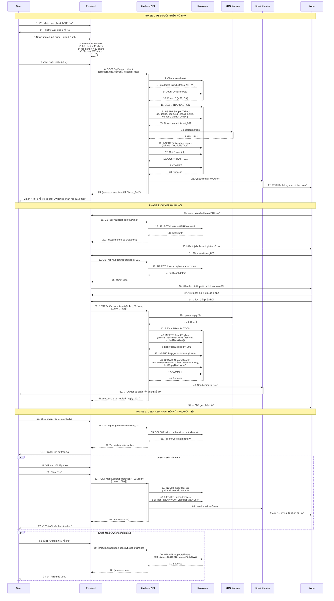
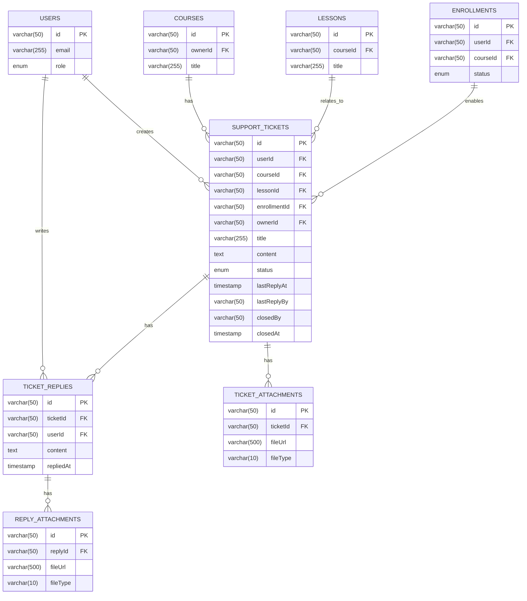

# QT-5: TRAO ĐỔI USER-OWNER (PHIẾU HỖ TRỢ)

## Mục Lục
- [Mô Tả Tổng Quan](#mô-tả-tổng-quan)
- [Vai Trò Tham Gia](#vai-trò-tham-gia)
- [Luồng Nghiệp Vụ](#luồng-nghiệp-vụ)
- [Flowchart](#flowchart)
- [Sequence Diagram](#sequence-diagram)
- [Data Model](#data-model)
- [API Documentation](#api-documentation)
- [Business Rules](#business-rules)
- [Error Handling](#error-handling)

---

## Mô Tả Tổng Quan

### Mục Đích
Sau khi mua khóa học, User có thể gửi phiếu hỗ trợ (support ticket) về lý thuyết, bài tập, hoặc những gì chưa hiểu đến Owner. Owner sẽ đọc và phản hồi khi có thời gian, giống như hệ thống email.

### Tính Năng Chính
- User gửi phiếu hỗ trợ text/image từ trong khóa học
- Owner nhận email notification và phản hồi qua giao diện web
- Lịch sử trao đổi được lưu trữ (như email thread)
- User và Owner có thể reply nhiều lần
- Owner có thể đóng phiếu hỗ trợ sau khi giải quyết xong

### Đặc Điểm Kỹ Thuật
- **Không có real-time chat**: Phản hồi bất đồng bộ như email
- **File upload**: Max 5MB/file, tối đa 3 files/phiếu
- **Notification**: Email thông báo khi có phiếu mới hoặc phản hồi
- **Trạng thái phiếu**: OPEN (mới), REPLIED (đã phản hồi), CLOSED (đã đóng)

---

## Vai Trò Tham Gia

### 1. User (Học Viên)
**Quyền hạn:**
- Gửi phiếu hỗ trợ cho khóa học đã mua
- Attach files (ảnh, code snippet)
- Xem lịch sử phiếu hỗ trợ
- Reply tiếp trên phiếu đã gửi
- Đóng phiếu khi đã giải quyết xong

**Giới hạn:**
- Chỉ hỏi khóa học đã mua (enrollment ACTIVE)
- Tối đa 20 phiếu OPEN/khóa học

### 2. Owner (Giảng Viên)
**Quyền hạn:**
- Xem danh sách phiếu hỗ trợ từ học viên
- Phản hồi phiếu hỗ trợ
- Đóng phiếu sau khi giải quyết xong
- Attach files trong phản hồi

**Trách nhiệm:**
- Phản hồi các phiếu hỗ trợ của học viên (không có SLA bắt buộc)
- Cung cấp câu trả lời hữu ích

**Lưu ý:**
- Không có SLA cứng
- Owner tự quản lý thời gian phản hồi
- Được khuyến khích phản hồi sớm để tăng chất lượng khóa học

### 3. Admin (Quản Trị Viên)
**Trách nhiệm:**
- Xem thống kê phiếu hỗ trợ
- Xử lý report spam
- Giám sát chất lượng trao đổi

### 4. System (Hệ Thống)
**Trách nhiệm:**
- Gửi email notification khi có phiếu mới
- Gửi email notification khi Owner phản hồi
- Lưu trữ lịch sử trao đổi
- Hiển thị danh sách phiếu hỗ trợ

---

## Luồng Nghiệp Vụ

### Phase 1: User Gửi Phiếu Hỗ Trợ

#### Bước 1: Truy Cập Khóa Học
1. User đang học khóa học đã mua
2. Gặp vấn đề cần hỗ trợ
3. Click tab "Hỗ trợ" hoặc "Gửi phiếu hỗ trợ" trong khóa học

#### Bước 2: Viết Phiếu Hỗ Trợ
User nhập:
- **Tiêu đề** (bắt buộc): "Làm sao để setup Docker trong Windows?"
- **Nội dung** (bắt buộc): Chi tiết vấn đề
- **Lesson liên quan** (optional): Chọn bài học cụ thể
- **Attachments** (optional): Upload ảnh/code

Validation:
```javascript
function validateTicket(data) {
  const errors = [];
  
  if (!data.title || data.title.length < 10) {
    errors.push("Tiêu đề phải >= 10 ký tự");
  }
  
  if (!data.content || data.content.length < 20) {
    errors.push("Nội dung phải >= 20 ký tự");
  }
  
  if (data.attachments && data.attachments.length > 3) {
    errors.push("Tối đa 3 files");
  }
  
  for (const file of data.attachments || []) {
    if (file.size > 5 * 1024 * 1024) { // 5MB
      errors.push(`File ${file.name} vượt quá 5MB`);
    }
  }
  
  return errors;
}
```

#### Bước 3: Kiểm Tra Điều Kiện
Hệ thống validate:
- User đã mua khóa học này
- Enrollment status = ACTIVE (không bị refund)
- Số phiếu OPEN < 20

#### Bước 4: Lưu Phiếu Hỗ Trợ
Hệ thống:
1. Tạo record `SupportTickets`
2. Upload attachments lên CDN
3. Tạo records `TicketAttachments`
4. Gửi email notification cho Owner

### Phase 2: Owner Nhận và Phản Hồi

#### Bước 5: Owner Nhận Email
Owner nhận email thông báo:
```
📧 Phiếu hỗ trợ mới từ học viên

Khóa học: Lập Trình Web Full-Stack
Học viên: Nguyễn Văn Học
Tiêu đề: Làm sao để setup Docker trong Windows?

Nội dung:
Em đang theo dõi bài học về Docker nhưng không biết cài đặt...

Đăng nhập để xem và phản hồi:
[Link to ticket]
```

#### Bước 6: Owner Xem Phiếu Hỗ Trợ
Owner truy cập:
- Dashboard "Phiếu hỗ trợ"
- Lọc theo:
  - Khóa học
  - Trạng thái (OPEN/REPLIED/CLOSED)
  - Ngày tạo

#### Bước 7: Owner Viết Phản Hồi
Owner nhập:
- **Nội dung phản hồi** (bắt buộc)
- **Attachments** (optional): Ảnh minh họa, file code

#### Bước 8: Lưu Phản Hồi
Hệ thống:
1. Tạo record `TicketReplies`
2. Update `SupportTickets.status = REPLIED`
3. Update `SupportTickets.lastReplyAt = NOW()`
4. Gửi email notification cho User

### Phase 3: User Xem Phản Hồi và Trao Đổi Tiếp

#### Bước 9: User Nhận Email
User nhận email thông báo:
```
✅ Owner đã phản hồi phiếu hỗ trợ của bạn

Khóa học: Lập Trình Web Full-Stack
Tiêu đề: Làm sao để setup Docker trong Windows?

Phản hồi từ Owner:
Chào em! Lỗi này xảy ra vì Windows của em chưa cài đặt WSL 2...

Đăng nhập để xem chi tiết:
[Link to ticket]
```

#### Bước 10: User Xem Phản Hồi
User:
- Vào tab "Hỗ trợ" trong khóa học
- Xem lịch sử trao đổi (như email thread)
- Có thể:
  - Gửi thêm câu hỏi tiếp (tạo reply mới)
  - Đóng phiếu nếu đã giải quyết xong
  - Không làm gì

#### Bước 11: Trao Đổi Tiếp
User hoặc Owner có thể reply nhiều lần, tạo thành chuỗi trao đổi:
```
Ticket #123: Làm sao để setup Docker?
├─ User: Em đang gặp lỗi WSL 2...
├─ Owner: Em cần cài đặt WSL 2 trước...
├─ User: Em đã cài rồi nhưng vẫn lỗi...
└─ Owner: Em thử chạy lệnh này xem...
```

### Phase 4: Đóng Phiếu Hỗ Trợ

#### Bước 12: Đóng Phiếu
Owner hoặc User có thể đóng phiếu:
```sql
UPDATE SupportTickets
SET 
  status = 'CLOSED',
  closedAt = NOW(),
  closedBy = @userId
WHERE id = @ticketId;
```

Sau khi đóng, phiếu vẫn có thể xem lại nhưng không thể reply thêm.

---

## Flowchart

```mermaid
flowchart TD
    Start([User đang học khóa học]) --> NeedHelp{Gặp vấn đề<br/>cần hỗ trợ?}
    
    NeedHelp -->|Không| KeepLearning[Tiếp tục học]
    KeepLearning --> End1([Kết thúc])
    
    NeedHelp -->|Có| ClickSupport[Click tab "Hỗ trợ"]
    ClickSupport --> ShowForm[Hiển thị form phiếu hỗ trợ]
    
    ShowForm --> UserFill[User nhập:<br/>- Tiêu đề<br/>- Nội dung<br/>- Lesson liên quan<br/>- Upload files]
    
    UserFill --> UserSubmit{User<br/>submit?}
    UserSubmit -->|Hủy| End1
    
    UserSubmit -->|OK| ValidateForm{Form<br/>hợp lệ?}
    
    ValidateForm -->|Không| ShowError1[❌ Hiển thị lỗi:<br/>- Tiêu đề >= 10 ký tự<br/>- Nội dung >= 20 ký tự<br/>- File <= 5MB]
    ShowError1 --> UserFill
    
    ValidateForm -->|Có| CheckEnrollment{Đã mua<br/>khóa học?}
    
    CheckEnrollment -->|Không| Error2[❌ Bạn chưa mua khóa học này]
    Error2 --> End1
    
    CheckEnrollment -->|Có| CheckQuota{Số phiếu<br/>OPEN < 20?}
    
    CheckQuota -->|Không| Error3[❌ Bạn đã có 20 phiếu<br/>chưa đóng.<br/>Vui lòng đóng phiếu cũ.]
    Error3 --> End1
    
    CheckQuota -->|Có| SaveTicket[💾 Lưu SupportTickets:<br/>status = OPEN<br/>createdAt = NOW]
    
    SaveTicket --> UploadFiles{Có<br/>files?}
    
    UploadFiles -->|Có| UploadToCDN[Upload files lên CDN]
    UploadToCDN --> SaveAttachments[Lưu TicketAttachments]
    SaveAttachments --> SendEmail
    
    UploadFiles -->|Không| SendEmail[📧 Gửi email cho Owner:<br/>"Phiếu hỗ trợ mới từ học viên"]
    
    SendEmail --> ShowSuccess1[✅ "Phiếu hỗ trợ đã gửi.<br/>Owner sẽ phản hồi qua email"]
    ShowSuccess1 --> WaitReply[⏳ Chờ Owner phản hồi...]
    
    %% Owner Side
    SendEmail --> OwnerReceive[📧 Owner nhận email]
    
    OwnerReceive --> OwnerDecision{Owner<br/>phản hồi?}
    
    OwnerDecision -->|Chưa| WaitReply
    
    %% Owner Reply
    OwnerDecision -->|Có| OwnerViewTicket[Owner đăng nhập,<br/>xem phiếu hỗ trợ]
    OwnerViewTicket --> OwnerWrite[Owner viết phản hồi:<br/>- Nội dung<br/>- Optional: attach files]
    
    OwnerWrite --> OwnerSubmit{Owner<br/>submit?}
    OwnerSubmit -->|Hủy| OwnerDecision
    
    OwnerSubmit -->|OK| SaveReply[💾 Lưu TicketReplies:<br/>repliedAt = NOW]
    
    SaveReply --> UpdateTicket[Update SupportTickets:<br/>status = REPLIED<br/>lastReplyAt = NOW]
    
    UpdateTicket --> SendEmailUser[📧 Gửi email cho User:<br/>"Owner đã phản hồi"]
    
    SendEmailUser --> UserReceive[📧 User nhận email]
    
    %% User View Reply
    UserReceive --> UserRead[User đăng nhập,<br/>đọc phản hồi]
    UserRead --> UserAction{User<br/>làm gì?}
    
    UserAction -->|Gửi câu hỏi tiếp| SaveReply2[Tạo reply mới từ User]
    SaveReply2 --> SendEmailOwner2[📧 Gửi email cho Owner]
    SendEmailOwner2 --> OwnerDecision
    
    UserAction -->|Đóng phiếu| CloseTicket[Update status = CLOSED]
    CloseTicket --> End2([Kết thúc])
    
    UserAction -->|Không làm gì| End2
    
    OwnerViewTicket --> OwnerClose{Owner muốn<br/>đóng phiếu?}
    OwnerClose -->|Có| CloseTicket
    OwnerClose -->|Không| OwnerWrite
    
    style Start fill:#90EE90
    style End1 fill:#D3D3D3
    style End2 fill:#90EE90
    style Error2 fill:#FFB6C1
    style Error3 fill:#FFB6C1
    style ShowError1 fill:#FFB6C1
    style SaveTicket fill:#87CEEB
    style SaveReply fill:#87CEEB
    style SendEmail fill:#DDA0DD
    style SendEmailUser fill:#DDA0DD
```

---

## Sequence Diagram



---

## Data Model

### ERD Diagram



### Database Schema

#### 1. SupportTickets Table

```sql
CREATE TABLE SupportTickets (
    -- Primary Key
    id VARCHAR(50) PRIMARY KEY COMMENT 'ticket_{uuid}',
    
    -- Foreign Keys
    userId VARCHAR(50) NOT NULL COMMENT 'User gửi phiếu',
    courseId VARCHAR(50) NOT NULL COMMENT 'Khóa học',
    lessonId VARCHAR(50) NULL COMMENT 'Bài học cụ thể (optional)',
    enrollmentId VARCHAR(50) NOT NULL COMMENT 'Enrollment để verify đã mua',
    ownerId VARCHAR(50) NOT NULL COMMENT 'Owner sẽ phản hồi',
    
    -- Content
    title VARCHAR(255) NOT NULL COMMENT 'Tiêu đề phiếu hỗ trợ',
    content TEXT NOT NULL COMMENT 'Nội dung chi tiết',
    
    -- Status
    status ENUM(
        'OPEN',      -- Phiếu mới/đang chờ
        'REPLIED',   -- Owner đã phản hồi
        'CLOSED'     -- Đã đóng
    ) NOT NULL DEFAULT 'OPEN',
    
    -- Reply Tracking
    lastReplyAt TIMESTAMP NULL COMMENT 'Lần reply gần nhất',
    lastReplyBy VARCHAR(50) NULL COMMENT 'user hoặc owner',
    
    -- Close Info
    closedBy VARCHAR(50) NULL COMMENT 'User ID đóng phiếu',
    closedAt TIMESTAMP NULL COMMENT 'Thời gian đóng',
    
    -- Timestamps
    createdAt TIMESTAMP DEFAULT CURRENT_TIMESTAMP,
    
    -- Indexes
    INDEX idx_userId (userId),
    INDEX idx_courseId (courseId),
    INDEX idx_ownerId (ownerId),
    INDEX idx_status (status),
    INDEX idx_createdAt (createdAt),
    INDEX idx_composite (ownerId, status, createdAt),
    
    -- Foreign Key Constraints
    FOREIGN KEY (userId) REFERENCES Users(id) ON DELETE CASCADE,
    FOREIGN KEY (courseId) REFERENCES Courses(id) ON DELETE CASCADE,
    FOREIGN KEY (lessonId) REFERENCES Lessons(id) ON DELETE SET NULL,
    FOREIGN KEY (enrollmentId) REFERENCES Enrollments(id) ON DELETE CASCADE,
    FOREIGN KEY (ownerId) REFERENCES Users(id) ON DELETE RESTRICT,
    
    -- Constraints
    CHECK (CHAR_LENGTH(title) >= 10),
    CHECK (CHAR_LENGTH(content) >= 20)
) ENGINE=InnoDB DEFAULT CHARSET=utf8mb4 COLLATE=utf8mb4_unicode_ci
COMMENT='Phiếu hỗ trợ từ User đến Owner';
```

#### 2. TicketReplies Table

```sql
CREATE TABLE TicketReplies (
    -- Primary Key
    id VARCHAR(50) PRIMARY KEY COMMENT 'reply_{uuid}',
    
    -- Foreign Keys
    ticketId VARCHAR(50) NOT NULL COMMENT 'Phiếu hỗ trợ',
    userId VARCHAR(50) NOT NULL COMMENT 'User hoặc Owner reply',
    
    -- Content
    content TEXT NOT NULL COMMENT 'Nội dung phản hồi',
    
    -- Timestamps
    repliedAt TIMESTAMP DEFAULT CURRENT_TIMESTAMP,
    
    -- Indexes
    INDEX idx_ticketId (ticketId),
    INDEX idx_userId (userId),
    INDEX idx_repliedAt (repliedAt),
    
    -- Foreign Key Constraints
    FOREIGN KEY (ticketId) REFERENCES SupportTickets(id) ON DELETE CASCADE,
    FOREIGN KEY (userId) REFERENCES Users(id) ON DELETE RESTRICT,
    
    -- Constraints
    CHECK (CHAR_LENGTH(content) >= 10)
) ENGINE=InnoDB DEFAULT CHARSET=utf8mb4 COLLATE=utf8mb4_unicode_ci
COMMENT='Phản hồi trong phiếu hỗ trợ';
```

#### 3. TicketAttachments Table

```sql
CREATE TABLE TicketAttachments (
    -- Primary Key
    id VARCHAR(50) PRIMARY KEY COMMENT 'tatt_{uuid}',
    
    -- Foreign Key
    ticketId VARCHAR(50) NOT NULL COMMENT 'Phiếu hỗ trợ',
    
    -- File Info
    fileUrl VARCHAR(500) NOT NULL COMMENT 'CDN URL',
    fileName VARCHAR(255) NOT NULL COMMENT 'Tên file gốc',
    fileSize INT NOT NULL COMMENT 'Size (bytes)',
    fileType VARCHAR(10) NOT NULL COMMENT 'jpg, png, pdf, txt',
    
    -- Timestamps
    uploadedAt TIMESTAMP DEFAULT CURRENT_TIMESTAMP,
    
    -- Indexes
    INDEX idx_ticketId (ticketId),
    
    -- Foreign Key Constraints
    FOREIGN KEY (ticketId) REFERENCES SupportTickets(id) ON DELETE CASCADE,
    
    -- Constraints
    CHECK (fileSize > 0 AND fileSize <= 5242880) -- Max 5MB
) ENGINE=InnoDB DEFAULT CHARSET=utf8mb4 COLLATE=utf8mb4_unicode_ci
COMMENT='File đính kèm phiếu hỗ trợ';
```

#### 4. ReplyAttachments Table

```sql
CREATE TABLE ReplyAttachments (
    -- Primary Key
    id VARCHAR(50) PRIMARY KEY COMMENT 'ratt_{uuid}',
    
    -- Foreign Key
    replyId VARCHAR(50) NOT NULL COMMENT 'Phản hồi',
    
    -- File Info
    fileUrl VARCHAR(500) NOT NULL COMMENT 'CDN URL',
    fileName VARCHAR(255) NOT NULL COMMENT 'Tên file gốc',
    fileSize INT NOT NULL COMMENT 'Size (bytes)',
    fileType VARCHAR(10) NOT NULL COMMENT 'jpg, png, pdf, txt',
    
    -- Timestamps
    uploadedAt TIMESTAMP DEFAULT CURRENT_TIMESTAMP,
    
    -- Indexes
    INDEX idx_replyId (replyId),
    
    -- Foreign Key Constraints
    FOREIGN KEY (replyId) REFERENCES TicketReplies(id) ON DELETE CASCADE,
    
    -- Constraints
    CHECK (fileSize > 0 AND fileSize <= 5242880) -- Max 5MB
) ENGINE=InnoDB DEFAULT CHARSET=utf8mb4 COLLATE=utf8mb4_unicode_ci
COMMENT='File đính kèm phản hồi';
```

### Sample Data

```sql
-- User
INSERT INTO Users (id, email, fullName, role) VALUES
('user_001', 'hocvien@email.com', 'Nguyễn Văn Học', 'USER');

-- Owner
INSERT INTO Users (id, email, fullName, role) VALUES
('owner_001', 'giangvien@email.com', 'Trần Thị Giảng', 'OWNER');

-- Enrollment
INSERT INTO Enrollments (id, userId, courseId, status) VALUES
('enr_001', 'user_001', 'course_001', 'ACTIVE');

-- Support Ticket
INSERT INTO SupportTickets (
    id, userId, courseId, lessonId, enrollmentId, ownerId,
    title, content, status
) VALUES (
    'ticket_001',
    'user_001',
    'course_001',
    'lesson_003',
    'enr_001',
    'owner_001',
    'Làm sao để setup Docker trong Windows?',
    'Em đang theo dõi bài học về Docker nhưng không biết cài đặt như thế nào trên Windows 10. Em đã tải Docker Desktop nhưng khi chạy báo lỗi "WSL 2 installation is incomplete". Thầy có thể hướng dẫn chi tiết được không ạ?',
    'OPEN'
);

-- Ticket Attachments
INSERT INTO TicketAttachments (id, ticketId, fileUrl, fileName, fileSize, fileType) VALUES
('tatt_001', 'ticket_001', 'https://cdn.onlearn.com/tickets/error_screenshot.png', 'error_screenshot.png', 245678, 'png');

-- Reply từ Owner
INSERT INTO TicketReplies (
    id, ticketId, userId, content, repliedAt
) VALUES (
    'reply_001',
    'ticket_001',
    'owner_001',
    'Chào em! Lỗi này xảy ra vì Windows của em chưa cài đặt WSL 2. Đây là các bước chi tiết:\n\n1. Mở PowerShell với quyền Administrator\n2. Chạy lệnh: wsl --install\n3. Restart máy\n4. Sau khi restart, mở lại PowerShell và chạy: wsl --set-default-version 2\n5. Giờ mở Docker Desktop, nó sẽ chạy bình thường.\n\nNếu vẫn lỗi, em check xem trong BIOS đã bật Virtualization chưa nhé.',
    NOW()
);

-- Update ticket
UPDATE SupportTickets 
SET status = 'REPLIED', lastReplyAt = NOW(), lastReplyBy = 'owner' 
WHERE id = 'ticket_001';
```

---

## API Documentation

### 1. Create Support Ticket

**Endpoint:** `POST /api/support-tickets`

**Description:** User gửi phiếu hỗ trợ cho Owner

**Authentication:** Required (User)

**Request (multipart/form-data):**

```
courseId: course_001
lessonId: lesson_003 (optional)
title: Làm sao để setup Docker trong Windows?
content: Em đang theo dõi bài học về Docker nhưng...
files[]: [File1, File2] (max 3 files, 5MB each)
```

**Response Success (201):**

```json
{
  "success": true,
  "message": "Phiếu hỗ trợ đã được gửi. Owner sẽ phản hồi qua email.",
  "data": {
    "ticketId": "ticket_001",
    "title": "Làm sao để setup Docker trong Windows?",
    "status": "OPEN",
    "attachments": [
      {
        "id": "tatt_001",
        "fileName": "error_screenshot.png",
        "fileUrl": "https://cdn.onlearn.com/tickets/error_screenshot.png"
      }
    ],
    "createdAt": "2025-12-09T10:00:00Z"
  }
}
```

---

### 2. Get My Tickets

**Endpoint:** `GET /api/support-tickets/my-tickets`

**Description:** User xem danh sách phiếu hỗ trợ đã gửi

**Authentication:** Required (User)

**Query Parameters:**

| Parameter | Type | Default | Description |
|-----------|------|---------|-------------|
| courseId | string | all | Lọc theo khóa học |
| status | string | all | OPEN/REPLIED/CLOSED |
| page | number | 1 | Trang |
| limit | number | 20 | Số record/trang |

**Response Success (200):**

```json
{
  "success": true,
  "data": {
    "tickets": [
      {
        "id": "ticket_001",
        "title": "Làm sao để setup Docker?",
        "course": {
          "id": "course_001",
          "title": "Lập Trình Web"
        },
        "lesson": {
          "id": "lesson_003",
          "title": "Bài 3: Docker"
        },
        "status": "REPLIED",
        "replyCount": 3,
        "lastReplyAt": "2025-12-09T13:00:00Z",
        "createdAt": "2025-12-09T10:00:00Z"
      }
    ],
    "pagination": {
      "currentPage": 1,
      "totalPages": 1,
      "totalRecords": 1
    }
  }
}
```

---

### 3. Get Ticket Detail

**Endpoint:** `GET /api/support-tickets/:ticketId`

**Description:** Xem chi tiết phiếu hỗ trợ và lịch sử trao đổi

**Authentication:** Required (User/Owner)

**Response Success (200):**

```json
{
  "success": true,
  "data": {
    "ticket": {
      "id": "ticket_001",
      "title": "Làm sao để setup Docker trong Windows?",
      "content": "Em đang theo dõi bài học về Docker...",
      "user": {
        "id": "user_001",
        "fullName": "Nguyễn Văn Học",
        "avatar": "..."
      },
      "course": {
        "id": "course_001",
        "title": "Lập Trình Web"
      },
      "lesson": {
        "id": "lesson_003",
        "title": "Bài 3: Docker"
      },
      "attachments": [
        {
          "id": "tatt_001",
          "fileName": "error_screenshot.png",
          "fileUrl": "https://cdn.onlearn.com/tickets/error_screenshot.png",
          "fileType": "png",
          "fileSize": 245678
        }
      ],
      "status": "REPLIED",
      "createdAt": "2025-12-09T10:00:00Z"
    },
    "replies": [
      {
        "id": "reply_001",
        "content": "Chào em! Lỗi này xảy ra vì...",
        "user": {
          "id": "owner_001",
          "fullName": "Trần Thị Giảng",
          "role": "OWNER",
          "avatar": "..."
        },
        "attachments": [],
        "repliedAt": "2025-12-09T13:00:00Z"
      },
      {
        "id": "reply_002",
        "content": "Em đã làm theo nhưng vẫn lỗi...",
        "user": {
          "id": "user_001",
          "fullName": "Nguyễn Văn Học",
          "role": "USER"
        },
        "attachments": [],
        "repliedAt": "2025-12-09T15:00:00Z"
      }
    ]
  }
}
```

---

### 4. Reply to Ticket

**Endpoint:** `POST /api/support-tickets/:ticketId/reply`

**Description:** User hoặc Owner phản hồi phiếu hỗ trợ

**Authentication:** Required (User/Owner)

**Request (multipart/form-data):**

```
content: Chào em! Lỗi này xảy ra vì...
files[]: [File1] (optional)
```

**Response Success (201):**

```json
{
  "success": true,
  "message": "Đã gửi phản hồi",
  "data": {
    "replyId": "reply_001",
    "ticketId": "ticket_001",
    "repliedAt": "2025-12-09T13:00:00Z"
  }
}
```

---

### 5. Close Ticket

**Endpoint:** `PATCH /api/support-tickets/:ticketId/close`

**Description:** User hoặc Owner đóng phiếu hỗ trợ

**Authentication:** Required (User/Owner)

**Response Success (200):**

```json
{
  "success": true,
  "message": "Phiếu hỗ trợ đã đóng"
}
```

---

### 6. Get Owner Tickets

**Endpoint:** `GET /api/support-tickets/owner`

**Description:** Owner xem danh sách phiếu hỗ trợ

**Authentication:** Required (Owner)

**Query Parameters:**

| Parameter | Type | Default | Description |
|-----------|------|---------|-------------|
| courseId | string | all | Lọc theo khóa học |
| status | string | all | OPEN/REPLIED/CLOSED |
| sortBy | string | newest | newest/oldest |
| page | number | 1 | Trang |
| limit | number | 20 | Số record/trang |

**Response Success (200):**

```json
{
  "success": true,
  "data": {
    "summary": {
      "totalOpen": 5,
      "totalReplied": 12,
      "totalClosed": 100
    },
    "tickets": [
      {
        "id": "ticket_002",
        "title": "Cách debug lỗi 404?",
        "course": {
          "id": "course_001",
          "title": "Lập Trình Web"
        },
        "user": {
          "id": "user_002",
          "fullName": "Lê Văn B"
        },
        "status": "OPEN",
        "replyCount": 0,
        "createdAt": "2025-12-08T15:00:00Z"
      }
    ],
    "pagination": {
      "currentPage": 1,
      "totalPages": 1,
      "totalRecords": 17
    }
  }
}
```

---

## Business Rules

### 1. Điều Kiện Gửi Phiếu
- User phải đã mua khóa học (có enrollment ACTIVE)
- Tối đa 20 phiếu OPEN/khóa học
- Title >= 10 ký tự
- Content >= 20 ký tự
- Tối đa 3 files, mỗi file <= 5MB

### 2. Phản Hồi
- Cả User và Owner đều có thể reply
- Không giới hạn số lần reply
- Tạo thành chuỗi trao đổi như email thread
- Reply >= 10 ký tự

### 3. Đóng Phiếu
- Cả User và Owner đều có thể đóng phiếu
- Sau khi đóng, không thể reply thêm
- Vẫn có thể xem lại lịch sử

### 4. Notification
- Gửi email khi có phiếu mới
- Gửi email khi có reply mới
- Không có notification real-time

---

## Error Handling

### Error Codes

| Code | Message | HTTP Status |
|------|---------|-------------|
| TICKET_001 | Not enrolled in course | 403 |
| TICKET_002 | Ticket quota exceeded (20 open) | 400 |
| TICKET_003 | Title must be >= 10 characters | 400 |
| TICKET_004 | Content must be >= 20 characters | 400 |
| TICKET_005 | Max 3 attachments allowed | 400 |
| TICKET_006 | File size exceeds 5MB | 400 |
| TICKET_007 | Invalid file type | 400 |
| TICKET_008 | Ticket not found | 404 |
| TICKET_009 | Ticket already closed | 400 |
| TICKET_010 | Reply content must be >= 10 chars | 400 |
| TICKET_011 | Not authorized to access ticket | 403 |

---

**Document Version:** 1.0  
**Last Updated:** December 9, 2025  
**Author:** OnLearn Technical Team
