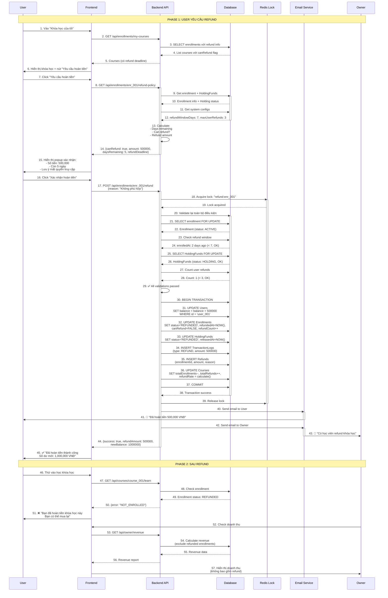

# QT-6: REFUND (HOÀN TIỀN)

## Mục Lục
- [Mô Tả Tổng Quan](#mô-tả-tổng-quan)
- [Vai Trò Tham Gia](#vai-trò-tham-gia)
- [Luồng Nghiệp Vụ](#luồng-nghiệp-vụ)
- [Flowchart](#flowchart)
- [Sequence Diagram](#sequence-diagram)
- [Data Model](#data-model)
- [API Documentation](#api-documentation)
- [Business Rules](#business-rules)
- [Error Handling](#error-handling)

---

## Mô Tả Tổng Quan

### Mục Đích
Cho phép User yêu cầu hoàn tiền cho khóa học đã mua nếu không hài lòng, trong thời gian cho phép. Hệ thống sẽ validate điều kiện refund, xử lý hoàn tiền, và cập nhật trạng thái enrollment.

### Tính Năng Chính
- User yêu cầu refund trong X ngày (do Admin config)
- Chỉ được refund nếu tiền còn trong HoldingFunds (chưa release cho Owner)
- Hệ thống tự động hoàn tiền vào ví User
- Owner không nhận được tiền nếu bị refund
- Giới hạn số lần refund để chống abuse

### Đặc Điểm Kỹ Thuật
- **Refund window**: X ngày (cấu hình, mặc định 7 ngày)
- **Điều kiện**: Enrollment ACTIVE, HoldingFunds status = HOLDING
- **Xử lý tự động**: Hoàn tiền ngay lập tức
- **Chống abuse**: Giới hạn số lần refund của User (ví dụ: max 3 lần)

---

## Vai Trò Tham Gia

### 1. User (Học Viên)
**Quyền hạn:**
- Xem chính sách refund
- Yêu cầu refund cho khóa học đã mua
- Xem lịch sử refund

**Điều kiện:**
- Đã mua khóa học (enrollment ACTIVE)
- Trong thời gian cho phép refund (X ngày)
- Chưa vượt quá số lần refund cho phép
- Tiền còn trong HoldingFunds (chưa release cho Owner)

**Lưu ý:**
- Sau khi refund, mất quyền truy cập khóa học
- Có thể mua lại khóa học sau khi refund
- Refund quá nhiều lần sẽ bị giới hạn

### 2. Owner (Giảng Viên)
**Ảnh hưởng:**
- Không nhận được tiền nếu User refund trong holding period
- Nhận notification khi có refund
- Có thể xem thống kê refund rate

**Lưu ý:**
- Refund rate cao ảnh hưởng đến uy tín khóa học
- Cần cải thiện chất lượng nếu refund nhiều

### 3. Admin (Quản Trị Viên)
**Trách nhiệm:**
- Cấu hình refund window (X ngày)
- Cấu hình số lần refund tối đa
- Xem báo cáo refund
- Xử lý tranh chấp refund

**Công cụ:**
- Dashboard refund statistics
- User refund history
- Course refund rate

### 4. System (Hệ Thống)
**Trách nhiệm:**
- Validate điều kiện refund
- Xử lý hoàn tiền tự động
- Update enrollment status = REFUNDED
- Update HoldingFunds status = REFUNDED
- Hoàn tiền vào User.balance
- Ghi log giao dịch
- Gửi notification

---

## Luồng Nghiệp Vụ

### Phase 1: User Xem và Quyết Định Refund

#### Bước 1: Truy Cập Khóa Học
1. User vào "Khóa học của tôi"
2. Click vào khóa học đã mua
3. Thấy nút "Yêu cầu hoàn tiền" (nếu trong thời gian cho phép)

#### Bước 2: Xem Chính Sách Refund
User xem thông tin:
- Thời gian còn lại để refund (ví dụ: "Còn 5 ngày")
- Số tiền sẽ được hoàn (100% giá khóa học)
- Chính sách: Sau khi refund, mất quyền truy cập

#### Bước 3: Click "Yêu cầu hoàn tiền"
Hiển thị popup xác nhận:
```
⚠️ Xác nhận hoàn tiền

Bạn có chắc muốn hoàn tiền khóa học này?

Khóa học: Lập Trình Web Full-Stack
Số tiền hoàn: 500,000 VNĐ

Lưu ý:
- Bạn sẽ mất quyền truy cập khóa học
- Tiền sẽ được hoàn vào ví ngay lập tức
- Bạn có thể mua lại khóa học sau

[Hủy]  [Xác nhận hoàn tiền]
```

### Phase 2: Hệ Thống Xử Lý Refund

#### Bước 4: Validate Điều Kiện
Hệ thống kiểm tra:

```javascript
async function validateRefund(enrollmentId) {
  const errors = [];
  
  // 1. Get enrollment
  const enrollment = await Enrollment.findById(enrollmentId);
  if (!enrollment) {
    errors.push("Enrollment không tồn tại");
    return errors;
  }
  
  // 2. Check status
  if (enrollment.status !== 'ACTIVE') {
    errors.push("Khóa học không ở trạng thái ACTIVE");
  }
  
  // 3. Check refund window
  const refundWindowDays = await getSystemConfig('refund_window_days'); // 7
  const daysSincePurchase = daysBetween(enrollment.enrolledAt, new Date());
  
  if (daysSincePurchase > refundWindowDays) {
    errors.push(`Đã quá thời gian hoàn tiền (${refundWindowDays} ngày)`);
  }
  
  // 4. Check HoldingFunds
  const holdingFund = await HoldingFunds.findOne({
    enrollmentId: enrollmentId,
    status: 'HOLDING'
  });
  
  if (!holdingFund) {
    errors.push("Tiền đã được chuyển cho Owner, không thể hoàn tiền");
  }
  
  // 5. Check User refund limit
  const maxRefunds = await getSystemConfig('max_user_refunds'); // 3
  const userRefundCount = await Enrollment.count({
    userId: enrollment.userId,
    status: 'REFUNDED'
  });
  
  if (userRefundCount >= maxRefunds) {
    errors.push(`Bạn đã refund ${maxRefunds} lần. Không thể refund thêm.`);
  }
  
  return errors;
}
```

#### Bước 5: Thực Hiện Refund
Nếu validate pass, hệ thống thực hiện transaction:

```sql
BEGIN TRANSACTION;

-- 1. Hoàn tiền cho User
UPDATE Users
SET balance = balance + @refundAmount
WHERE id = @userId;

-- 2. Update Enrollment
UPDATE Enrollments
SET 
  status = 'REFUNDED',
  refundedAt = NOW(),
  canRefund = FALSE,
  refundCount = refundCount + 1
WHERE id = @enrollmentId;

-- 3. Update HoldingFunds
UPDATE HoldingFunds
SET 
  status = 'REFUNDED',
  releasedAt = NOW()
WHERE enrollmentId = @enrollmentId;

-- 4. Ghi log
INSERT INTO TransactionLogs (
  id, userId, orderId, transactionType,
  amount, balanceBefore, balanceAfter, description
) VALUES (
  @logId, @userId, @enrollmentId, 'REFUND',
  @refundAmount, @oldBalance, @newBalance,
  'Hoàn tiền khóa học: ' + @courseTitle
);

-- 5. Ghi refund record
INSERT INTO Refunds (
  id, enrollmentId, userId, courseId, amount, reason, processedAt
) VALUES (
  @refundId, @enrollmentId, @userId, @courseId, 
  @refundAmount, @reason, NOW()
);

-- 6. Update course stats
UPDATE Courses
SET 
  totalEnrollments = totalEnrollments - 1,
  totalRefunds = totalRefunds + 1,
  refundRate = (totalRefunds * 100.0 / (totalEnrollments + totalRefunds))
WHERE id = @courseId;

COMMIT;
```

#### Bước 6: Gửi Notification
- Gửi email cho User: "Đã hoàn tiền thành công"
- Gửi email cho Owner: "Có học viên refund khóa học"

### Phase 3: Sau Refund

#### Bước 7: User Mất Quyền Truy Cập
- Enrollment status = REFUNDED
- User không thể vào học khóa học nữa
- Hiển thị message: "Bạn đã hoàn tiền khóa học này"

#### Bước 8: User Có Thể Mua Lại
- User có thể mua lại khóa học sau khi refund
- Tạo enrollment mới
- Không giới hạn số lần mua lại

---

## Flowchart

```mermaid
flowchart TD
    Start([User vào khóa học đã mua]) --> CheckRefundButton{Có nút<br/>"Yêu cầu hoàn tiền"?}
    
    CheckRefundButton -->|Không| ShowNoRefund[Hiển thị:<br/>"Đã hết thời gian hoàn tiền"]
    ShowNoRefund --> End1([Kết thúc])
    
    CheckRefundButton -->|Có| ClickRefund[User click "Yêu cầu hoàn tiền"]
    
    ClickRefund --> ShowPolicy[Hiển thị chính sách refund:<br/>- Số tiền hoàn<br/>- Thời gian còn lại<br/>- Lưu ý mất quyền truy cập]
    
    ShowPolicy --> ShowConfirm[Hiển thị popup xác nhận]
    
    ShowConfirm --> UserConfirm{User<br/>xác nhận?}
    UserConfirm -->|Hủy| End1
    
    UserConfirm -->|OK| ValidateStatus{Enrollment<br/>status = ACTIVE?}
    
    ValidateStatus -->|Không| Error1[❌ Khóa học không ở trạng thái hợp lệ]
    Error1 --> End1
    
    ValidateStatus -->|Có| ValidateTime{Trong thời gian<br/>refund (X ngày)?}
    
    ValidateTime -->|Không| Error2[❌ Đã quá thời gian hoàn tiền]
    Error2 --> End1
    
    ValidateTime -->|Có| ValidateHolding{HoldingFunds<br/>status = HOLDING?}
    
    ValidateHolding -->|Không| Error3[❌ Tiền đã được chuyển cho Owner<br/>Không thể hoàn tiền]
    Error3 --> End1
    
    ValidateHolding -->|Có| ValidateRefundLimit{User refund count<br/>< max limit?}
    
    ValidateRefundLimit -->|Không| Error4[❌ Bạn đã refund quá nhiều lần<br/>Không thể refund thêm]
    Error4 --> End1
    
    ValidateRefundLimit -->|Có| LockUser[🔒 Lock User và Enrollment]
    
    LockUser --> BeginTransaction[BEGIN TRANSACTION]
    
    BeginTransaction --> Step1[1. Hoàn tiền cho User:<br/>User.balance += refundAmount]
    
    Step1 --> Step2[2. Update Enrollment:<br/>status = REFUNDED<br/>refundedAt = NOW<br/>canRefund = FALSE<br/>refundCount++]
    
    Step2 --> Step3[3. Update HoldingFunds:<br/>status = REFUNDED<br/>releasedAt = NOW]
    
    Step3 --> Step4[4. Ghi TransactionLog:<br/>type = REFUND]
    
    Step4 --> Step5[5. Tạo Refund record]
    
    Step5 --> Step6[6. Update Course stats:<br/>totalEnrollments--<br/>totalRefunds++<br/>refundRate]
    
    Step6 --> Commit[COMMIT TRANSACTION]
    
    Commit --> Unlock[🔓 Unlock User]
    
    Unlock --> NotifyUser[📧 Gửi email cho User:<br/>"Đã hoàn tiền thành công"]
    
    NotifyUser --> NotifyOwner[📧 Gửi email cho Owner:<br/>"Có học viên refund"]
    
    NotifyOwner --> ShowSuccess[✅ Hiển thị thành công:<br/>"Đã hoàn tiền 500,000 VNĐ<br/>vào ví của bạn"]
    
    ShowSuccess --> RemoveAccess[Xóa quyền truy cập khóa học]
    
    RemoveAccess --> End2([✅ Kết thúc - Refund thành công])
    
    %% Error handling
    BeginTransaction -.->|Lỗi| Rollback[ROLLBACK]
    Step1 -.->|Lỗi| Rollback
    Step2 -.->|Lỗi| Rollback
    Step3 -.->|Lỗi| Rollback
    Step4 -.->|Lỗi| Rollback
    Step5 -.->|Lỗi| Rollback
    Step6 -.->|Lỗi| Rollback
    
    Rollback --> UnlockError[Unlock và báo lỗi]
    UnlockError --> End1
    
    style Start fill:#90EE90
    style End1 fill:#D3D3D3
    style End2 fill:#90EE90
    style Error1 fill:#FFB6C1
    style Error2 fill:#FFB6C1
    style Error3 fill:#FFB6C1
    style Error4 fill:#FFB6C1
    style BeginTransaction fill:#87CEEB
    style Commit fill:#87CEEB
    style Rollback fill:#FF6B6B
    style NotifyUser fill:#DDA0DD
    style NotifyOwner fill:#DDA0DD
```

---

## Sequence Diagram



---

## Data Model

### ERD Diagram

```mermaid
erDiagram
    USERS ||--o{ ENROLLMENTS : has
    USERS ||--o{ REFUNDS : requests
    COURSES ||--o{ ENROLLMENTS : has
    COURSES ||--o{ REFUNDS : has
    ENROLLMENTS ||--|| REFUNDS : generates
    ENROLLMENTS ||--|| HOLDING_FUNDS : holds
    ENROLLMENTS ||--o{ TRANSACTION_LOGS : records
    
    USERS {
        varchar(50) id PK
        decimal(15,2) balance
    }
    
    COURSES {
        varchar(50) id PK
        int totalEnrollments
        int totalRefunds
        decimal(5,2) refundRate
    }
    
    ENROLLMENTS {
        varchar(50) id PK
        varchar(50) userId FK
        varchar(50) courseId FK
        enum status
        boolean canRefund
        int refundCount
        timestamp enrolledAt
        timestamp refundedAt
    }
    
    HOLDING_FUNDS {
        varchar(50) id PK
        varchar(50) enrollmentId FK "UK"
        enum status
        decimal(15,2) amount
    }
    
    REFUNDS {
        varchar(50) id PK
        varchar(50) enrollmentId FK "UK"
        varchar(50) userId FK
        varchar(50) courseId FK
        decimal(15,2) amount
        text reason
        timestamp processedAt
    }
    
    TRANSACTION_LOGS {
        varchar(50) id PK
        varchar(50) userId FK
        varchar(50) orderId FK
        enum transactionType
        decimal(15,2) amount
    }
```

### Database Schema

#### 1. Refunds Table

```sql
CREATE TABLE Refunds (
    -- Primary Key
    id VARCHAR(50) PRIMARY KEY COMMENT 'ref_{uuid}',
    
    -- Foreign Keys
    enrollmentId VARCHAR(50) NOT NULL UNIQUE COMMENT '1 enrollment chỉ refund 1 lần',
    userId VARCHAR(50) NOT NULL COMMENT 'User refund',
    courseId VARCHAR(50) NOT NULL COMMENT 'Khóa học bị refund',
    
    -- Refund Info
    amount DECIMAL(15,2) NOT NULL COMMENT 'Số tiền hoàn (VNĐ)',
    reason TEXT NULL COMMENT 'Lý do refund (optional)',
    
    -- Processing
    processedAt TIMESTAMP DEFAULT CURRENT_TIMESTAMP COMMENT 'Thời gian xử lý refund',
    processedBy VARCHAR(50) NULL COMMENT 'Admin ID nếu xử lý thủ công',
    
    -- Timestamps
    createdAt TIMESTAMP DEFAULT CURRENT_TIMESTAMP,
    
    -- Indexes
    INDEX idx_enrollmentId (enrollmentId),
    INDEX idx_userId (userId),
    INDEX idx_courseId (courseId),
    INDEX idx_processedAt (processedAt),
    
    -- Foreign Key Constraints
    FOREIGN KEY (enrollmentId) REFERENCES Enrollments(id) ON DELETE RESTRICT,
    FOREIGN KEY (userId) REFERENCES Users(id) ON DELETE RESTRICT,
    FOREIGN KEY (courseId) REFERENCES Courses(id) ON DELETE RESTRICT,
    
    -- Constraints
    CHECK (amount > 0)
) ENGINE=InnoDB DEFAULT CHARSET=utf8mb4 COLLATE=utf8mb4_unicode_ci
COMMENT='Lịch sử hoàn tiền';
```

#### 2. Update Enrollments Table

```sql
-- Add refund-related columns
ALTER TABLE Enrollments ADD COLUMN canRefund BOOLEAN DEFAULT TRUE COMMENT 'Còn được refund không';
ALTER TABLE Enrollments ADD COLUMN refundCount INT DEFAULT 0 COMMENT 'Số lần đã refund khóa học này';
ALTER TABLE Enrollments ADD COLUMN refundedAt TIMESTAMP NULL COMMENT 'Thời gian refund';
```

#### 3. Update Courses Table

```sql
-- Add refund statistics
ALTER TABLE Courses ADD COLUMN totalRefunds INT DEFAULT 0 COMMENT 'Tổng số refund';
ALTER TABLE Courses ADD COLUMN refundRate DECIMAL(5,2) DEFAULT 0 COMMENT 'Tỷ lệ refund (%)';
```

#### 4. Update SystemConfig Table

```sql
-- Refund configs
INSERT INTO SystemConfig (configKey, configValue, dataType, description, category) VALUES
('refund_window_days', '7', 'NUMBER', 'Số ngày được phép refund sau khi mua', 'refund'),
('max_user_refunds', '3', 'NUMBER', 'Số lần refund tối đa của 1 User', 'refund');
```

### Sample Data

```sql
-- User đã mua khóa học
INSERT INTO Enrollments (
    id, userId, courseId, pricePaid, status, enrolledAt, canRefund
) VALUES (
    'enr_001',
    'user_001',
    'course_001',
    500000,
    'ACTIVE',
    DATE_SUB(NOW(), INTERVAL 2 DAY), -- Mua 2 ngày trước
    TRUE
);

-- HoldingFunds đang giữ tiền
INSERT INTO HoldingFunds (
    id, enrollmentId, ownerId, amount, status, releaseDate
) VALUES (
    'hold_001',
    'enr_001',
    'owner_001',
    500000,
    'HOLDING',
    DATE_ADD(CURDATE(), INTERVAL 5 DAY) -- Còn 5 ngày nữa release
);

-- Sau khi User refund
INSERT INTO Refunds (
    id, enrollmentId, userId, courseId, amount, reason
) VALUES (
    'ref_001',
    'enr_001',
    'user_001',
    'course_001',
    500000,
    'Khóa học không phù hợp với trình độ của tôi'
);

-- Update enrollment
UPDATE Enrollments 
SET status = 'REFUNDED', refundedAt = NOW(), canRefund = FALSE, refundCount = 1
WHERE id = 'enr_001';

-- Update HoldingFunds
UPDATE HoldingFunds
SET status = 'REFUNDED', releasedAt = NOW()
WHERE enrollmentId = 'enr_001';

-- Hoàn tiền cho User
UPDATE Users
SET balance = balance + 500000
WHERE id = 'user_001';
```

---

## API Documentation

### 1. Get Refund Policy

**Endpoint:** `GET /api/enrollments/:enrollmentId/refund-policy`

**Description:** Lấy thông tin chính sách refund cho enrollment

**Authentication:** Required (User)

**Response Success (200):**

```json
{
  "success": true,
  "data": {
    "canRefund": true,
    "enrollment": {
      "id": "enr_001",
      "courseId": "course_001",
      "courseTitle": "Lập Trình Web Full-Stack",
      "pricePaid": 500000,
      "enrolledAt": "2025-12-07T10:00:00Z"
    },
    "refundInfo": {
      "refundAmount": 500000,
      "refundWindowDays": 7,
      "daysSincePurchase": 2,
      "daysRemaining": 5,
      "refundDeadline": "2025-12-14T23:59:59Z"
    },
    "userRefundHistory": {
      "totalRefunds": 1,
      "maxRefunds": 3,
      "remainingRefunds": 2
    },
    "warnings": [
      "Bạn sẽ mất quyền truy cập khóa học sau khi hoàn tiền",
      "Bạn có thể mua lại khóa học sau"
    ]
  }
}
```

**Response Error (403):**

```json
{
  "success": false,
  "error": {
    "code": "REFUND_NOT_ALLOWED",
    "message": "Không thể hoàn tiền",
    "reasons": [
      "Đã quá 7 ngày kể từ khi mua",
      "Tiền đã được chuyển cho Owner"
    ]
  }
}
```

---

### 2. Request Refund

**Endpoint:** `POST /api/enrollments/:enrollmentId/refund`

**Description:** User yêu cầu hoàn tiền

**Authentication:** Required (User)

**Request:**

```json
{
  "reason": "Khóa học không phù hợp với trình độ của tôi" // optional
}
```

**Response Success (200):**

```json
{
  "success": true,
  "message": "Đã hoàn tiền thành công",
  "data": {
    "refundId": "ref_001",
    "enrollmentId": "enr_001",
    "refundAmount": 500000,
    "newBalance": 1000000,
    "processedAt": "2025-12-09T10:00:00Z"
  }
}
```

**Response Error (400):**

```json
{
  "success": false,
  "error": {
    "code": "REFUND_WINDOW_EXPIRED",
    "message": "Đã quá thời gian hoàn tiền (7 ngày)",
    "details": {
      "daysSincePurchase": 10,
      "refundWindowDays": 7
    }
  }
}
```

---

### 3. Get My Refund History

**Endpoint:** `GET /api/refunds/my-history`

**Description:** User xem lịch sử refund

**Authentication:** Required (User)

**Response Success (200):**

```json
{
  "success": true,
  "data": {
    "summary": {
      "totalRefunds": 2,
      "totalAmount": 1000000,
      "maxRefunds": 3,
      "remainingRefunds": 1
    },
    "refunds": [
      {
        "id": "ref_001",
        "course": {
          "id": "course_001",
          "title": "Lập Trình Web",
          "thumbnail": "..."
        },
        "amount": 500000,
        "reason": "Không phù hợp",
        "processedAt": "2025-12-09T10:00:00Z"
      }
    ]
  }
}
```

---

### 4. Admin: Get Refund Statistics

**Endpoint:** `GET /api/admin/refund-statistics`

**Description:** Admin xem thống kê refund

**Authentication:** Required (Admin)

**Response Success (200):**

```json
{
  "success": true,
  "data": {
    "overview": {
      "totalRefunds": 150,
      "totalRefundAmount": 75000000,
      "avgRefundAmount": 500000,
      "overallRefundRate": 5.5
    },
    "topRefundedCourses": [
      {
        "courseId": "course_005",
        "title": "Course có vấn đề",
        "totalEnrollments": 100,
        "totalRefunds": 20,
        "refundRate": 20,
        "owner": {
          "id": "owner_005",
          "fullName": "Nguyễn Văn Owner"
        }
      }
    ],
    "topRefundUsers": [
      {
        "userId": "user_999",
        "fullName": "User Abuse",
        "totalRefunds": 3,
        "totalRefundAmount": 1500000
      }
    ]
  }
}
```

---

### 5. Owner: Get Course Refund Report

**Endpoint:** `GET /api/owner/courses/:courseId/refunds`

**Description:** Owner xem báo cáo refund của khóa học

**Authentication:** Required (Owner)

**Response Success (200):**

```json
{
  "success": true,
  "data": {
    "course": {
      "id": "course_001",
      "title": "Lập Trình Web",
      "totalEnrollments": 100,
      "totalRefunds": 5,
      "refundRate": 5
    },
    "refunds": [
      {
        "id": "ref_001",
        "user": {
          "id": "user_001",
          "fullName": "Nguyễn Văn Học"
        },
        "amount": 500000,
        "reason": "Không phù hợp",
        "daysSincePurchase": 2,
        "processedAt": "2025-12-09T10:00:00Z"
      }
    ],
    "commonReasons": [
      {
        "reason": "Không phù hợp với trình độ",
        "count": 3
      },
      {
        "reason": "Khóa học không như mong đợi",
        "count": 2
      }
    ]
  }
}
```

---

## Business Rules

### 1. Điều Kiện Refund
- **Trong thời gian cho phép**: <= X ngày (do Admin config, mặc định 7 ngày)
- **Enrollment status = ACTIVE**: Chưa bị refund hoặc suspend
- **HoldingFunds status = HOLDING**: Tiền chưa được release cho Owner
- **User refund count < max**: Chưa vượt quá số lần refund cho phép (mặc định 3 lần)

### 2. Xử Lý Refund
- **Hoàn tiền 100%**: Trả lại toàn bộ giá khóa học
- **Tự động ngay lập tức**: Không cần Admin duyệt
- **Update status**: Enrollment = REFUNDED, HoldingFunds = REFUNDED
- **Ghi log**: TransactionLog với type = REFUND

### 3. Sau Refund
- **Mất quyền truy cập**: User không thể học khóa học nữa
- **Có thể mua lại**: User có thể mua lại khóa học bất cứ lúc nào
- **Owner không nhận tiền**: HoldingFunds không release cho Owner

### 4. Giới Hạn Refund
- **Max refunds per user**: 3 lần (cấu hình)
- **Mục đích**: Chống abuse, ngăn User mua-refund liên tục
- **Reset**: Không reset, giới hạn vĩnh viễn

### 5. Refund Rate
- **Công thức**: `refundRate = (totalRefunds / (totalEnrollments + totalRefunds)) * 100`
- **Ảnh hưởng**: Refund rate cao ảnh hưởng đến uy tín khóa học
- **Cảnh báo**: Admin cảnh báo Owner nếu refund rate > 10%

---

## Error Handling

### Error Codes

| Code | Message | HTTP Status |
|------|---------|-------------|
| REFUND_001 | Enrollment not found | 404 |
| REFUND_002 | Enrollment not in ACTIVE status | 400 |
| REFUND_003 | Refund window expired (X days) | 400 |
| REFUND_004 | Money already released to Owner | 400 |
| REFUND_005 | User refund limit exceeded | 400 |
| REFUND_006 | Cannot refund own course | 400 |
| REFUND_007 | Already refunded | 400 |
| REFUND_008 | Insufficient balance to refund | 500 |

---

**Document Version:** 1.0  
**Last Updated:** December 9, 2025  
**Author:** OnLearn Technical Team
