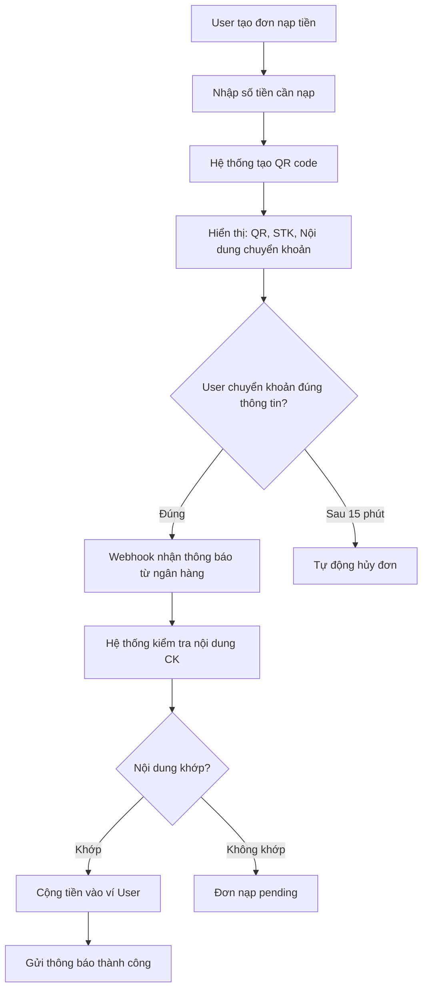
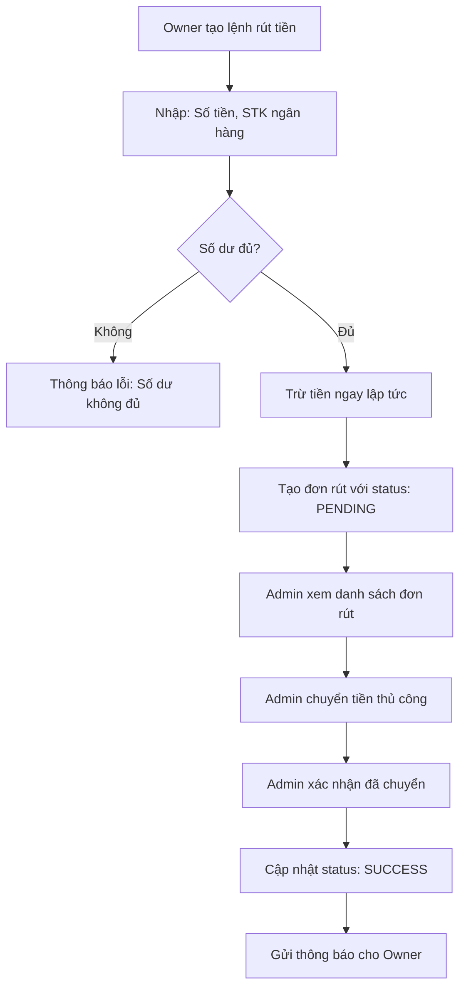
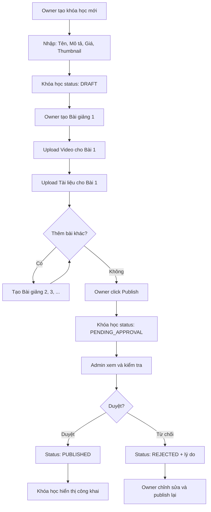
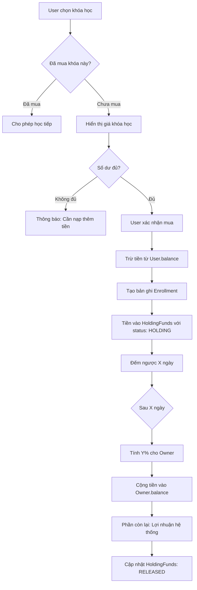
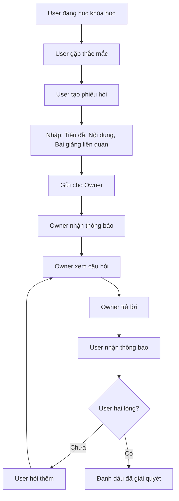
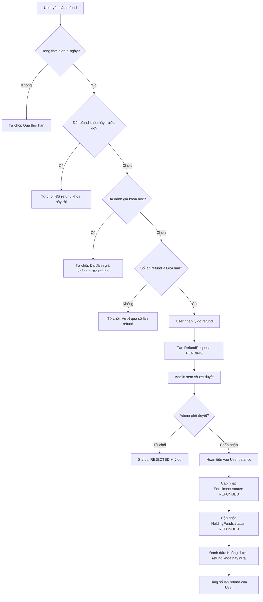
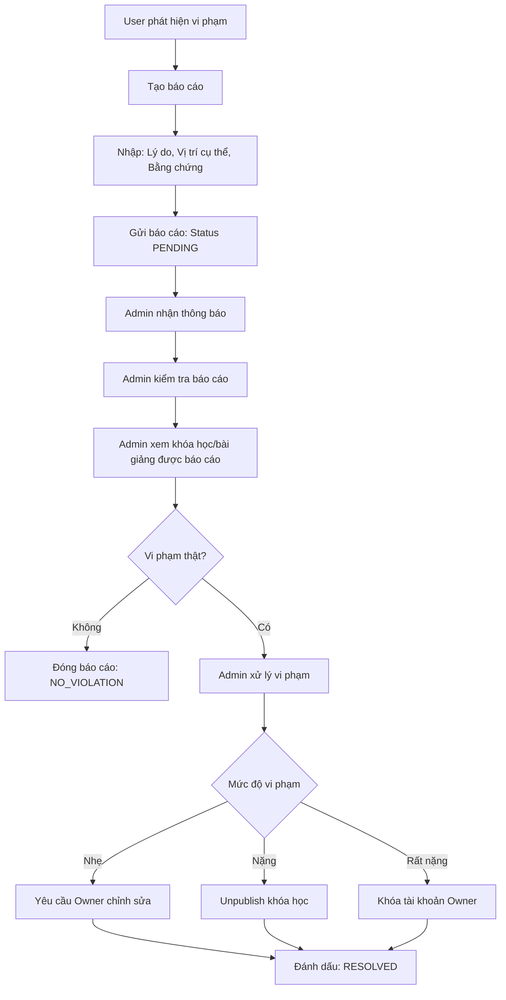
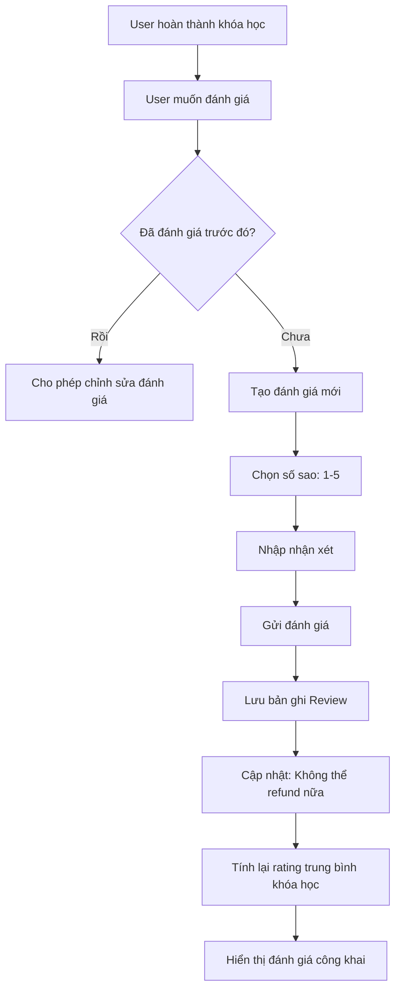

# Hệ Thống Khóa Học Video Online - OnLearn

## Tổng Quan

Hệ thống quản lý và phân phối khóa học video trực tuyến với các tính năng bảo mật cao, quản lý giao dịch tài chính, và tương tác giữa người học và giảng viên.

## Mục Lục

- [Yêu Cầu Phi Chức Năng](#yêu-cầu-phi-chức-năng)
- [Phân Quyền Hệ Thống](#phân-quyền-hệ-thống)
- [Các Quy Trình Nghiệp Vụ](#các-quy-trình-nghiệp-vụ)
- [Sơ Đồ Luồng Dữ Liệu](#sơ-đồ-luồng-dữ-liệu)
- [Cấu Trúc Database](#cấu-trúc-database)

---

## Yêu Cầu Phi Chức Năng

### 1. Bảo Mật Video

#### 1.1 Chặn Tải Video
- **DRM (Digital Rights Management)**: Mã hóa video để ngăn chặn tải xuống trái phép
- **Watermark động**: Thêm watermark với thông tin người dùng vào video
- **Disable Right-Click**: Vô hiệu hóa chuột phải, inspect element
- **Screen Recording Detection**: Phát hiện và cảnh báo khi có hành vi quay màn hình

#### 1.2 Link Tạm Thời (Temporary URLs)
- **Signed URLs**: Tạo URL có chữ ký số với thời gian hết hạn
  - Thời gian sống: 1-2 giờ
  - Chứa token xác thực người dùng
  - Không thể sử dụng lại sau khi hết hạn
- **Token Refresh**: Tự động làm mới token khi video đang phát
- **IP/Device Binding**: Gắn token với IP và device ID của người dùng

#### 1.3 CDN & Streaming Security
- **HLS (HTTP Live Streaming)**: Chia video thành các segment nhỏ
- **AES Encryption**: Mã hóa từng segment video
- **Key Rotation**: Thay đổi key mã hóa định kỳ

### 2. Tối Ưu Hóa Video

#### 2.1 Băm Video (Video Segmentation)
- **Adaptive Bitrate Streaming (ABR)**:
  - 360p: 500 kbps (mobile, mạng chậm)
  - 480p: 1 Mbps (mobile, wifi yếu)
  - 720p: 2.5 Mbps (desktop, wifi tốt)
  - 1080p: 5 Mbps (desktop, wifi mạnh)
- **Chunk Size**: Mỗi segment dài 2-10 giây
- **Preloading**: Tải trước 2-3 segment tiếp theo

#### 2.2 Video Processing Pipeline
```
Upload → Transcoding → Segmentation → Encryption → CDN Distribution
```

#### 2.3 Progressive Learning
- **Resume Playback**: Lưu vị trí xem gần nhất
- **Bookmarking**: Đánh dấu các điểm quan trọng
- **Speed Control**: Điều chỉnh tốc độ phát (0.5x - 2x)
- **Quality Auto-Switch**: Tự động điều chỉnh chất lượng theo băng thông

---

## Phân Quyền Hệ Thống

### 1. Admin (Quản Trị Viên)
**Quyền hạn:**
- Duyệt khóa học (publish/unpublish)
- Xem và xử lý đơn rút tiền của Owner
- Xem và xử lý báo cáo khóa học
- Cấu hình tham số hệ thống:
  - Thời gian giữ tiền (holding period)
  - Tỷ lệ chia sẻ doanh thu với Owner
  - Số lần refund tối đa cho phép
- Quản lý người dùng (khóa/mở khóa tài khoản)
- Thống kê, báo cáo tổng quan

### 2. Owner (Giảng Viên)
**Quyền hạn:**
- Tạo, chỉnh sửa, publish khóa học
- Upload video, tài liệu (docs)
- Rút tiền từ doanh thu khóa học
- Xem danh sách học viên đã mua khóa học
- Trả lời câu hỏi từ học viên
- Xem đánh giá và phản hồi
- Xem thống kê khóa học của mình

**Ràng buộc:**
- Phải liên kết tài khoản ngân hàng
- Nhận được phần trăm doanh thu sau khi hết thời gian giữ tiền

### 3. User (Học Viên)
**Quyền hạn:**
- Nạp tiền vào tài khoản
- Mua khóa học
- Xem video, tài liệu khóa học đã mua
- Gửi câu hỏi cho Owner
- Đánh giá khóa học
- Báo cáo khóa học vi phạm
- Yêu cầu refund

**Ràng buộc:**
- Phải liên kết tài khoản ngân hàng (unique)
- Giới hạn số lần refund

---

## Các Quy Trình Nghiệp Vụ

### QT-1: Nạp Tiền

#### Mô Tả
Người dùng nạp tiền vào ví hệ thống để có thể mua khóa học.

#### Luồng Nghiệp Vụ



#### Chi Tiết Kỹ Thuật

**Input:**
- `userId`: ID người dùng
- `amount`: Số tiền nạp (VNĐ)

**Process:**
1. Tạo mã đơn nạp tiền unique (ví dụ: `DEP{timestamp}{random}`)
2. Sinh QR code chứa thông tin:
   - Số tài khoản ngân hàng hệ thống
   - Số tiền
   - Nội dung: Mã đơn nạp tiền
3. Lưu đơn nạp với trạng thái `PENDING`
4. Set timeout 15 phút
5. Lắng nghe webhook từ ngân hàng:
   - So khớp nội dung chuyển khoản với mã đơn
   - Kiểm tra số tiền
   - Cập nhật trạng thái đơn: `SUCCESS` hoặc `FAILED`
6. Cộng tiền vào `User.balance`

**Output:**
- Trạng thái đơn nạp tiền
- Số dư tài khoản mới

**Business Rules:**
- Số tiền tối thiểu: 10,000 VNĐ
- Số tiền tối đa: 50,000,000 VNĐ/lần
- Thời gian timeout: 15 phút
- Nội dung chuyển khoản phải chính xác 100%

**Database Schema:**
```sql
CREATE TABLE DepositOrders (
    id VARCHAR(50) PRIMARY KEY,
    userId VARCHAR(50) NOT NULL,
    amount DECIMAL(15,2) NOT NULL,
    status ENUM('PENDING', 'SUCCESS', 'FAILED', 'CANCELLED'),
    qrCode TEXT,
    bankAccountNumber VARCHAR(50),
    transactionContent VARCHAR(100),
    createdAt TIMESTAMP DEFAULT CURRENT_TIMESTAMP,
    expiredAt TIMESTAMP,
    completedAt TIMESTAMP,
    FOREIGN KEY (userId) REFERENCES Users(id)
);
```

---

### QT-2: Rút Tiền

#### Mô Tả
Owner rút tiền từ doanh thu khóa học về tài khoản ngân hàng cá nhân.

#### Luồng Nghiệp Vụ



#### Chi Tiết Kỹ Thuật

**Input:**
- `ownerId`: ID của Owner
- `amount`: Số tiền muốn rút
- `bankAccountNumber`: Số tài khoản ngân hàng
- `bankName`: Tên ngân hàng
- `accountHolderName`: Tên chủ tài khoản

**Process:**
1. Kiểm tra `Owner.balance >= amount`
2. Trừ tiền ngay: `Owner.balance -= amount`
3. Tạo bản ghi `WithdrawOrder` với status `PENDING`
4. Admin xem danh sách đơn rút chưa xử lý
5. Admin thực hiện chuyển khoản thủ công
6. Admin click "Xác nhận đã chuyển"
7. Cập nhật status thành `SUCCESS`
8. Gửi notification cho Owner

**Output:**
- Đơn rút tiền với trạng thái
- Số dư Owner sau khi trừ

**Business Rules:**
- Số tiền rút tối thiểu: 50,000 VNĐ
- Số tiền rút tối đa: Không giới hạn (dựa trên số dư)
- Chỉ Owner mới được rút tiền
- Owner phải liên kết tài khoản ngân hàng trước
- Tiền bị trừ ngay khi tạo lệnh (tránh rút vượt số dư)
- Nếu Admin từ chối, tiền sẽ được hoàn lại

**Database Schema:**
```sql
CREATE TABLE WithdrawOrders (
    id VARCHAR(50) PRIMARY KEY,
    ownerId VARCHAR(50) NOT NULL,
    amount DECIMAL(15,2) NOT NULL,
    bankAccountNumber VARCHAR(50) NOT NULL,
    bankName VARCHAR(100) NOT NULL,
    accountHolderName VARCHAR(100) NOT NULL,
    status ENUM('PENDING', 'SUCCESS', 'REJECTED'),
    rejectionReason TEXT,
    createdAt TIMESTAMP DEFAULT CURRENT_TIMESTAMP,
    processedAt TIMESTAMP,
    processedBy VARCHAR(50), -- Admin ID
    FOREIGN KEY (ownerId) REFERENCES Users(id)
);
```

---

### QT-3: Tạo Khóa Học

#### Mô Tả
Owner tạo khóa học với các bài giảng, video, và tài liệu, sau đó publish để Admin duyệt.

#### Luồng Nghiệp Vụ



#### Cấu Trúc Khóa Học

```
Khóa học: "Lập Trình Web"
├── Bài 1: HTML & CSS Cơ Bản
│   ├── Video 1.1: Giới thiệu HTML (10 phút)
│   ├── Video 1.2: CSS Styling (15 phút)
│   └── Tài liệu: HTML_CSS_Guide.pdf
├── Bài 2: JavaScript Fundamentals
│   ├── Video 2.1: Biến và kiểu dữ liệu (12 phút)
│   ├── Video 2.2: Hàm và vòng lặp (18 phút)
│   └── Tài liệu: JavaScript_Exercises.pdf
└── Bài 3: React Framework
    ├── Video 3.1: Component và Props (20 phút)
    └── Tài liệu: React_Cheatsheet.pdf
```

#### Chi Tiết Kỹ Thuật

**Input:**
- **Course Info:**
  - `title`: Tên khóa học
  - `description`: Mô tả chi tiết
  - `price`: Giá (VNĐ)
  - `thumbnail`: Ảnh đại diện
  - `category`: Danh mục
- **Lesson Info:**
  - `lessonTitle`: Tên bài giảng
  - `lessonOrder`: Thứ tự bài
- **Video Info:**
  - `videoFile`: File video
  - `videoTitle`: Tên video
  - `duration`: Thời lượng
- **Document Info:**
  - `documentFile`: File PDF/DOCX
  - `documentTitle`: Tên tài liệu

**Process:**
1. Tạo Course với status `DRAFT`
2. Owner tạo các Lesson thuộc Course
3. Upload video:
   - Transcode sang nhiều độ phân giải (360p, 480p, 720p, 1080p)
   - Chia thành segments (HLS)
   - Mã hóa AES-128
   - Upload lên CDN/Storage
4. Upload tài liệu (PDF/DOCX)
5. Owner click "Publish"
6. Hệ thống kiểm tra:
   - Có ít nhất 1 bài giảng
   - Mỗi bài có ít nhất 1 video
   - Giá > 0
7. Chuyển status thành `PENDING_APPROVAL`
8. Admin duyệt:
   - Nếu OK: `PUBLISHED`
   - Nếu không OK: `REJECTED` + lý do

**Output:**
- Khóa học với trạng thái
- Danh sách bài giảng, video, tài liệu

**Business Rules:**
- Mỗi khóa học phải có ít nhất 1 bài giảng
- Mỗi bài giảng phải có ít nhất 1 video
- Giá khóa học tối thiểu: 50,000 VNĐ
- Video format cho phép: MP4, MOV, AVI
- Video size tối đa: 2GB/video
- Document format: PDF, DOCX
- Owner có thể cập nhật khóa học đã publish, nhưng phải publish lại
- Mỗi lần publish lại đều phải chờ Admin duyệt

**Database Schema:**
```sql
CREATE TABLE Courses (
    id VARCHAR(50) PRIMARY KEY,
    ownerId VARCHAR(50) NOT NULL,
    title VARCHAR(255) NOT NULL,
    description TEXT,
    price DECIMAL(15,2) NOT NULL,
    thumbnail VARCHAR(500),
    category VARCHAR(100),
    status ENUM('DRAFT', 'PENDING_APPROVAL', 'PUBLISHED', 'REJECTED', 'UNPUBLISHED'),
    rejectionReason TEXT,
    publishedAt TIMESTAMP,
    createdAt TIMESTAMP DEFAULT CURRENT_TIMESTAMP,
    updatedAt TIMESTAMP DEFAULT CURRENT_TIMESTAMP ON UPDATE CURRENT_TIMESTAMP,
    FOREIGN KEY (ownerId) REFERENCES Users(id)
);

CREATE TABLE Lessons (
    id VARCHAR(50) PRIMARY KEY,
    courseId VARCHAR(50) NOT NULL,
    title VARCHAR(255) NOT NULL,
    lessonOrder INT NOT NULL,
    createdAt TIMESTAMP DEFAULT CURRENT_TIMESTAMP,
    FOREIGN KEY (courseId) REFERENCES Courses(id) ON DELETE CASCADE
);

CREATE TABLE Videos (
    id VARCHAR(50) PRIMARY KEY,
    lessonId VARCHAR(50) NOT NULL,
    title VARCHAR(255) NOT NULL,
    duration INT, -- seconds
    videoUrl VARCHAR(500), -- CDN URL
    thumbnailUrl VARCHAR(500),
    status ENUM('UPLOADING', 'PROCESSING', 'READY', 'FAILED'),
    createdAt TIMESTAMP DEFAULT CURRENT_TIMESTAMP,
    FOREIGN KEY (lessonId) REFERENCES Lessons(id) ON DELETE CASCADE
);

CREATE TABLE Documents (
    id VARCHAR(50) PRIMARY KEY,
    lessonId VARCHAR(50) NOT NULL,
    title VARCHAR(255) NOT NULL,
    fileUrl VARCHAR(500),
    fileType VARCHAR(50),
    fileSize BIGINT,
    createdAt TIMESTAMP DEFAULT CURRENT_TIMESTAMP,
    FOREIGN KEY (lessonId) REFERENCES Lessons(id) ON DELETE CASCADE
);
```

---

### QT-4: Mua Khóa Học

#### Mô Tả
User mua khóa học bằng số dư trong ví. Tiền sẽ bị giữ trong hệ thống một khoảng thời gian trước khi chuyển cho Owner.

#### Luồng Nghiệp Vụ



#### Chi Tiết Kỹ Thuật

**Input:**
- `userId`: ID người dùng
- `courseId`: ID khóa học

**Process:**
1. Kiểm tra User đã mua khóa học chưa (check `Enrollments`)
2. Lấy giá khóa học: `course.price`
3. Kiểm tra: `User.balance >= course.price`
4. Trừ tiền: `User.balance -= course.price`
5. Tạo bản ghi `Enrollment`:
   - `userId`, `courseId`
   - `enrolledAt`: thời gian hiện tại
   - `status`: `ACTIVE`
6. Tạo bản ghi `HoldingFunds`:
   - `amount`: `course.price`
   - `status`: `HOLDING`
   - `releaseDate`: `enrolledAt + X days` (X từ config)
7. Sau X ngày (cron job):
   - Tính: `ownerAmount = course.price * Y%` (Y từ config)
   - Tính: `platformRevenue = course.price - ownerAmount`
   - Cộng tiền: `Owner.balance += ownerAmount`
   - Cập nhật: `HoldingFunds.status = RELEASED`

**Output:**
- Trạng thái ghi danh
- Quyền truy cập khóa học

**Business Rules:**
- User phải có đủ tiền trong ví
- Mỗi User chỉ được mua 1 lần/khóa học
- Thời gian giữ tiền (X): 7-30 ngày (do Admin config)
- Tỷ lệ chia sẻ cho Owner (Y): 70-90% (do Admin config)
- Nếu User refund trong thời gian giữ tiền, Owner không nhận được gì

**Database Schema:**
```sql
CREATE TABLE Enrollments (
    id VARCHAR(50) PRIMARY KEY,
    userId VARCHAR(50) NOT NULL,
    courseId VARCHAR(50) NOT NULL,
    pricePaid DECIMAL(15,2) NOT NULL,
    status ENUM('ACTIVE', 'REFUNDED', 'SUSPENDED'),
    enrolledAt TIMESTAMP DEFAULT CURRENT_TIMESTAMP,
    refundedAt TIMESTAMP,
    canRefund BOOLEAN DEFAULT TRUE, -- FALSE nếu đã refund lần đầu
    UNIQUE KEY unique_enrollment (userId, courseId),
    FOREIGN KEY (userId) REFERENCES Users(id),
    FOREIGN KEY (courseId) REFERENCES Courses(id)
);

CREATE TABLE HoldingFunds (
    id VARCHAR(50) PRIMARY KEY,
    enrollmentId VARCHAR(50) NOT NULL,
    ownerId VARCHAR(50) NOT NULL,
    amount DECIMAL(15,2) NOT NULL,
    status ENUM('HOLDING', 'RELEASED', 'REFUNDED'),
    releaseDate DATE NOT NULL,
    releasedAt TIMESTAMP,
    FOREIGN KEY (enrollmentId) REFERENCES Enrollments(id),
    FOREIGN KEY (ownerId) REFERENCES Users(id)
);

CREATE TABLE SystemRevenue (
    id VARCHAR(50) PRIMARY KEY,
    enrollmentId VARCHAR(50) NOT NULL,
    amount DECIMAL(15,2) NOT NULL,
    createdAt TIMESTAMP DEFAULT CURRENT_TIMESTAMP,
    FOREIGN KEY (enrollmentId) REFERENCES Enrollments(id)
);
```

---

### QT-5: Trao Đổi User-Owner

#### Mô Tả
User đã mua khóa học có thể gửi câu hỏi cho Owner và Owner có trách nhiệm trả lời.

#### Luồng Nghiệp Vụ



#### Chi Tiết Kỹ Thuật

**Input:**
- `userId`: ID người hỏi
- `courseId`: ID khóa học
- `lessonId`: ID bài giảng (optional)
- `title`: Tiêu đề câu hỏi
- `content`: Nội dung chi tiết

**Process:**
1. Kiểm tra User đã mua khóa học (`Enrollments.status = ACTIVE`)
2. Tạo bản ghi `Question`:
   - Lưu thông tin câu hỏi
   - Status: `OPEN`
3. Gửi notification cho Owner
4. Owner trả lời tạo bản ghi `Answer`
5. Gửi notification cho User
6. User có thể hỏi thêm (tạo follow-up question)
7. Owner có thể đánh dấu câu hỏi là "Resolved"

**Output:**
- Danh sách câu hỏi và câu trả lời
- Trạng thái giải quyết

**Business Rules:**
- Chỉ User đã mua khóa học mới được hỏi
- Owner phải trả lời trong vòng 48 giờ (có thông báo nhắc)
- Câu hỏi có thể đính kèm ảnh (screenshot lỗi, code)
- Có thể có nhiều lượt hỏi-đáp cho 1 câu hỏi

**Database Schema:**
```sql
CREATE TABLE Questions (
    id VARCHAR(50) PRIMARY KEY,
    userId VARCHAR(50) NOT NULL,
    courseId VARCHAR(50) NOT NULL,
    lessonId VARCHAR(50),
    title VARCHAR(255) NOT NULL,
    content TEXT NOT NULL,
    status ENUM('OPEN', 'ANSWERED', 'RESOLVED'),
    createdAt TIMESTAMP DEFAULT CURRENT_TIMESTAMP,
    resolvedAt TIMESTAMP,
    FOREIGN KEY (userId) REFERENCES Users(id),
    FOREIGN KEY (courseId) REFERENCES Courses(id),
    FOREIGN KEY (lessonId) REFERENCES Lessons(id)
);

CREATE TABLE Answers (
    id VARCHAR(50) PRIMARY KEY,
    questionId VARCHAR(50) NOT NULL,
    ownerId VARCHAR(50) NOT NULL,
    content TEXT NOT NULL,
    createdAt TIMESTAMP DEFAULT CURRENT_TIMESTAMP,
    FOREIGN KEY (questionId) REFERENCES Questions(id) ON DELETE CASCADE,
    FOREIGN KEY (ownerId) REFERENCES Users(id)
);

CREATE TABLE QuestionAttachments (
    id VARCHAR(50) PRIMARY KEY,
    questionId VARCHAR(50) NOT NULL,
    fileUrl VARCHAR(500) NOT NULL,
    fileType VARCHAR(50),
    FOREIGN KEY (questionId) REFERENCES Questions(id) ON DELETE CASCADE
);
```

---

### QT-6: Refund (Hoàn Tiền)

#### Mô Tả
User có thể yêu cầu hoàn tiền trong thời gian cho phép, với các điều kiện hạn chế để tránh lạm dụng.

#### Luồng Nghiệp Vụ



#### Chi Tiết Kỹ Thuật

**Input:**
- `userId`: ID người dùng
- `enrollmentId`: ID ghi danh
- `reason`: Lý do hoàn tiền

**Process:**
1. Kiểm tra điều kiện:
   - `enrolledAt + X days >= NOW()` (trong thời gian cho phép)
   - `Enrollment.canRefund = TRUE` (chưa refund khóa này)
   - `Review không tồn tại` (chưa đánh giá)
   - `User.refundCount < maxRefundLimit` (chưa vượt giới hạn)
2. Tạo `RefundRequest` với status `PENDING`
3. Admin review:
   - Xem lý do
   - Kiểm tra lịch sử refund của User
   - Quyết định: APPROVE hoặc REJECT
4. Nếu APPROVE:
   - Hoàn tiền: `User.balance += enrollment.pricePaid`
   - Cập nhật: `Enrollment.status = REFUNDED`
   - Cập nhật: `HoldingFunds.status = REFUNDED`
   - Đánh dấu: `Enrollment.canRefund = FALSE`
   - Tăng: `User.refundCount++`
5. Nếu REJECT:
   - Gửi thông báo với lý do từ chối

**Output:**
- Trạng thái refund
- Số dư User (nếu được duyệt)

**Business Rules:**
- **Thời gian refund**: Trong vòng X ngày kể từ ngày mua (X = holding period)
- **Giới hạn refund theo khóa học**: Mỗi khóa chỉ được refund 1 lần
  - Nếu User mua lại khóa đã refund → không được refund nữa
- **Giới hạn refund theo User**: Tối đa Y lần (Y do Admin config, ví dụ: 3-5 lần)
- **Không được refund nếu đã đánh giá**: User phải chọn giữa refund hoặc đánh giá
- **Liên kết ngân hàng unique**: 1 STK chỉ liên kết 1 tài khoản → giảm lạm dụng
- **Admin có quyền từ chối**: Nếu phát hiện hành vi lạm dụng

**Anti-Abuse Measures:**
1. **Bank Account Binding**: 1 ngân hàng = 1 tài khoản → không tạo nhiều tài khoản để refund
2. **Refund History Tracking**: Lưu lại toàn bộ lịch sử refund
3. **Behavioral Analysis**: 
   - User refund quá nhiều → đánh dấu suspicious
   - Refund ngay sau khi mua → cảnh báo
4. **Blacklist**: Admin có thể cấm refund với User có hành vi xấu

**Database Schema:**
```sql
CREATE TABLE RefundRequests (
    id VARCHAR(50) PRIMARY KEY,
    enrollmentId VARCHAR(50) NOT NULL,
    userId VARCHAR(50) NOT NULL,
    reason TEXT NOT NULL,
    status ENUM('PENDING', 'APPROVED', 'REJECTED'),
    adminNote TEXT,
    processedBy VARCHAR(50), -- Admin ID
    createdAt TIMESTAMP DEFAULT CURRENT_TIMESTAMP,
    processedAt TIMESTAMP,
    FOREIGN KEY (enrollmentId) REFERENCES Enrollments(id),
    FOREIGN KEY (userId) REFERENCES Users(id)
);

-- Thêm vào bảng Users
ALTER TABLE Users ADD COLUMN refundCount INT DEFAULT 0;
ALTER TABLE Users ADD COLUMN bankAccount VARCHAR(50) UNIQUE; -- Chống lạm dụng
```

---

### QT-7: Báo Cáo Khóa Học

#### Mô Tả
User đã mua khóa học có thể báo cáo vi phạm (nội dung sai, chất lượng kém, vi phạm bản quyền...).

#### Luồng Nghiệp Vụ



#### Chi Tiết Kỹ Thuật

**Input:**
- `userId`: ID người báo cáo
- `courseId`: ID khóa học
- `lessonId`: ID bài giảng (optional)
- `videoId`: ID video (optional)
- `reportType`: Loại vi phạm (COPYRIGHT, INAPPROPRIATE_CONTENT, POOR_QUALITY, SCAM, OTHER)
- `reason`: Mô tả chi tiết
- `evidence`: Link ảnh/video bằng chứng (optional)

**Process:**
1. Kiểm tra User đã mua khóa học
2. Tạo `CourseReport` với status `PENDING`
3. Gửi notification cho Admin
4. Admin review:
   - Xem nội dung khóa học/bài giảng
   - Đối chiếu với lý do báo cáo
   - Quyết định hành động
5. Xử lý theo mức độ:
   - **Vi phạm nhẹ**: Thông báo Owner chỉnh sửa, đợi re-publish
   - **Vi phạm nặng**: Unpublish khóa học ngay
   - **Vi phạm rất nặng**: Khóa tài khoản Owner, hoàn tiền cho tất cả User
6. Cập nhật status báo cáo

**Output:**
- Trạng thái báo cáo
- Hành động xử lý

**Business Rules:**
- Chỉ User đã mua khóa học mới được báo cáo
- Phải chỉ rõ vị trí vi phạm (bài giảng, video cụ thể)
- Admin phải xử lý trong 48-72 giờ
- Nếu vi phạm nghiêm trọng → hoàn tiền tự động cho tất cả User
- Owner có quyền giải trình trước khi bị xử lý

**Database Schema:**
```sql
CREATE TABLE CourseReports (
    id VARCHAR(50) PRIMARY KEY,
    userId VARCHAR(50) NOT NULL,
    courseId VARCHAR(50) NOT NULL,
    lessonId VARCHAR(50),
    videoId VARCHAR(50),
    reportType ENUM('COPYRIGHT', 'INAPPROPRIATE_CONTENT', 'POOR_QUALITY', 'SCAM', 'OTHER'),
    reason TEXT NOT NULL,
    evidence TEXT, -- JSON array of URLs
    status ENUM('PENDING', 'REVIEWING', 'RESOLVED', 'REJECTED'),
    adminNote TEXT,
    actionTaken TEXT,
    processedBy VARCHAR(50),
    createdAt TIMESTAMP DEFAULT CURRENT_TIMESTAMP,
    processedAt TIMESTAMP,
    FOREIGN KEY (userId) REFERENCES Users(id),
    FOREIGN KEY (courseId) REFERENCES Courses(id)
);
```

---

### QT-8: Đánh Giá Khóa Học

#### Mô Tả
User đã mua khóa học có thể đánh giá và để lại nhận xét. Sau khi đánh giá, không được refund.

#### Luồng Nghiệp Vụ



#### Chi Tiết Kỹ Thuật

**Input:**
- `userId`: ID người đánh giá
- `courseId`: ID khóa học
- `rating`: Số sao (1-5)
- `comment`: Nhận xét (optional)

**Process:**
1. Kiểm tra User đã mua khóa học
2. Kiểm tra đã đánh giá chưa:
   - Nếu chưa: Tạo mới
   - Nếu rồi: Cập nhật
3. Lưu `Review`:
   - Rating, comment
   - Timestamp
4. **Ngăn refund**: Đánh dấu User không thể refund khóa này nữa
5. Tính lại `Course.averageRating`:
   ```
   averageRating = SUM(all ratings) / COUNT(reviews)
   ```
6. Hiển thị đánh giá công khai trên trang khóa học

**Output:**
- Review đã lưu
- Rating trung bình khóa học

**Business Rules:**
- Chỉ User đã mua khóa học mới được đánh giá
- **Không được refund sau khi đánh giá**: User phải chọn giữa refund hoặc đánh giá
- Có thể chỉnh sửa đánh giá sau khi đã gửi
- Owner có thể trả lời đánh giá
- Đánh giá hiển thị công khai (tên User, rating, comment)

**Recommendation:**
- Khuyến khích User báo cáo trước nếu có vấn đề, rồi refund
- Sau khi hết thời gian refund, mới khuyến khích đánh giá

**Database Schema:**
```sql
CREATE TABLE Reviews (
    id VARCHAR(50) PRIMARY KEY,
    userId VARCHAR(50) NOT NULL,
    courseId VARCHAR(50) NOT NULL,
    rating INT NOT NULL CHECK (rating BETWEEN 1 AND 5),
    comment TEXT,
    createdAt TIMESTAMP DEFAULT CURRENT_TIMESTAMP,
    updatedAt TIMESTAMP DEFAULT CURRENT_TIMESTAMP ON UPDATE CURRENT_TIMESTAMP,
    UNIQUE KEY unique_review (userId, courseId),
    FOREIGN KEY (userId) REFERENCES Users(id),
    FOREIGN KEY (courseId) REFERENCES Courses(id)
);

CREATE TABLE ReviewReplies (
    id VARCHAR(50) PRIMARY KEY,
    reviewId VARCHAR(50) NOT NULL,
    ownerId VARCHAR(50) NOT NULL,
    content TEXT NOT NULL,
    createdAt TIMESTAMP DEFAULT CURRENT_TIMESTAMP,
    FOREIGN KEY (reviewId) REFERENCES Reviews(id) ON DELETE CASCADE,
    FOREIGN KEY (ownerId) REFERENCES Users(id)
);

-- Thêm vào bảng Courses
ALTER TABLE Courses ADD COLUMN averageRating DECIMAL(3,2) DEFAULT 0;
ALTER TABLE Courses ADD COLUMN totalReviews INT DEFAULT 0;
```

---

## Sơ Đồ Luồng Dữ Liệu

### Luồng Tiền Trong Hệ Thống

```
[User Nạp Tiền]
      ↓
[User.balance] ──Mua khóa học──→ [HoldingFunds (Giữ X ngày)]
                                         ↓
                        ┌────────────────┴────────────────┐
                        ↓                                  ↓
                [Owner.balance (Y%)]        [SystemRevenue (100%-Y%)]
                        ↓
                [Owner rút tiền] → [Admin xử lý] → [Tài khoản ngân hàng Owner]
```

### Luồng Hoàn Tiền (Refund)

```
[User yêu cầu refund]
      ↓
[Kiểm tra điều kiện]
      ↓
[Admin duyệt]
      ↓
[Hoàn tiền] → [User.balance]
      ↓
[HoldingFunds.status = REFUNDED] → [Owner không nhận được tiền]
```

---

## Cấu Trúc Database

### Bảng Users

```sql
CREATE TABLE Users (
    id VARCHAR(50) PRIMARY KEY,
    email VARCHAR(255) UNIQUE NOT NULL,
    password VARCHAR(255) NOT NULL,
    fullName VARCHAR(255) NOT NULL,
    role ENUM('ADMIN', 'OWNER', 'USER') NOT NULL,
    balance DECIMAL(15,2) DEFAULT 0, -- Số dư ví
    bankAccount VARCHAR(50) UNIQUE, -- STK ngân hàng (unique để chống lạm dụng)
    bankName VARCHAR(100),
    accountHolderName VARCHAR(100),
    refundCount INT DEFAULT 0, -- Số lần refund
    status ENUM('ACTIVE', 'SUSPENDED', 'BANNED'),
    createdAt TIMESTAMP DEFAULT CURRENT_TIMESTAMP,
    updatedAt TIMESTAMP DEFAULT CURRENT_TIMESTAMP ON UPDATE CURRENT_TIMESTAMP
);
```

### Bảng SystemConfig

```sql
CREATE TABLE SystemConfig (
    id INT PRIMARY KEY AUTO_INCREMENT,
    configKey VARCHAR(100) UNIQUE NOT NULL,
    configValue VARCHAR(500) NOT NULL,
    description TEXT,
    updatedAt TIMESTAMP DEFAULT CURRENT_TIMESTAMP ON UPDATE CURRENT_TIMESTAMP
);

-- Các config quan trọng:
-- holding_period_days: Số ngày giữ tiền (ví dụ: 7, 14, 30)
-- owner_revenue_percentage: % doanh thu cho Owner (ví dụ: 70, 80, 90)
-- max_refund_limit: Số lần refund tối đa (ví dụ: 3, 5)
```

### Quan Hệ Giữa Các Bảng

```
Users (1) ──< (N) Courses
Users (1) ──< (N) Enrollments
Courses (1) ──< (N) Enrollments
Courses (1) ──< (N) Lessons
Lessons (1) ──< (N) Videos
Lessons (1) ──< (N) Documents
Enrollments (1) ──< (1) HoldingFunds
Enrollments (1) ──< (N) RefundRequests
Users (1) ──< (N) Reviews
Courses (1) ──< (N) Reviews
Users (1) ──< (N) Questions
Courses (1) ──< (N) Questions
Questions (1) ──< (N) Answers
```

---

## Các Tính Năng Bảo Mật Bổ Sung

### 1. Xác Thực & Phân Quyền
- **JWT Authentication**: Token-based authentication
- **Role-Based Access Control (RBAC)**: Admin, Owner, User
- **Two-Factor Authentication (2FA)**: Bảo mật tài khoản

### 2. Bảo Mật API
- **Rate Limiting**: Giới hạn số request/IP
- **Input Validation**: Kiểm tra và sanitize input
- **SQL Injection Protection**: Prepared statements
- **XSS Protection**: Escape HTML output

### 3. Bảo Mật Video
- **HLS Encryption**: AES-128 encryption
- **Token-based Access**: Signed URLs
- **Playback Tracking**: Ghi log mỗi lần xem
- **Concurrent Stream Limit**: Giới hạn số thiết bị xem cùng lúc

### 4. Logging & Monitoring
- **Audit Logs**: Ghi lại mọi hành động quan trọng
- **Suspicious Activity Detection**: Phát hiện hành vi bất thường
- **Real-time Alerts**: Cảnh báo cho Admin

---

## Các API Endpoints Chính

### Authentication
- `POST /api/auth/register` - Đăng ký
- `POST /api/auth/login` - Đăng nhập
- `POST /api/auth/logout` - Đăng xuất
- `POST /api/auth/refresh-token` - Làm mới token

### User Management
- `GET /api/users/profile` - Lấy thông tin cá nhân
- `PUT /api/users/profile` - Cập nhật thông tin
- `POST /api/users/link-bank` - Liên kết ngân hàng

### Deposit & Withdraw
- `POST /api/deposit/create` - Tạo đơn nạp tiền
- `GET /api/deposit/:id` - Lấy thông tin đơn nạp
- `POST /api/withdraw/create` - Tạo lệnh rút tiền (Owner)
- `GET /api/withdraw/list` - Danh sách đơn rút (Admin)
- `PUT /api/withdraw/:id/approve` - Duyệt rút tiền (Admin)

### Courses
- `POST /api/courses` - Tạo khóa học (Owner)
- `GET /api/courses` - Danh sách khóa học
- `GET /api/courses/:id` - Chi tiết khóa học
- `PUT /api/courses/:id` - Cập nhật khóa học (Owner)
- `POST /api/courses/:id/publish` - Publish khóa học (Owner)
- `PUT /api/courses/:id/approve` - Duyệt khóa học (Admin)

### Lessons & Videos
- `POST /api/courses/:id/lessons` - Tạo bài giảng
- `POST /api/lessons/:id/videos` - Upload video
- `POST /api/lessons/:id/documents` - Upload tài liệu
- `GET /api/videos/:id/stream` - Lấy link stream video (signed URL)

### Enrollment
- `POST /api/enrollments` - Mua khóa học
- `GET /api/enrollments/my-courses` - Khóa học đã mua
- `GET /api/enrollments/:id/progress` - Tiến độ học

### Q&A
- `POST /api/questions` - Gửi câu hỏi (User)
- `GET /api/questions/my-questions` - Câu hỏi của tôi
- `POST /api/questions/:id/answers` - Trả lời câu hỏi (Owner)

### Refund
- `POST /api/refunds` - Yêu cầu hoàn tiền
- `GET /api/refunds/my-refunds` - Danh sách refund của tôi
- `PUT /api/refunds/:id/approve` - Duyệt refund (Admin)

### Reports
- `POST /api/reports` - Báo cáo khóa học
- `GET /api/reports` - Danh sách báo cáo (Admin)
- `PUT /api/reports/:id/resolve` - Xử lý báo cáo (Admin)

### Reviews
- `POST /api/reviews` - Đánh giá khóa học
- `GET /api/reviews/course/:id` - Đánh giá của khóa học
- `PUT /api/reviews/:id` - Cập nhật đánh giá

---

## Cron Jobs & Background Tasks

### 1. Release Holding Funds (Chạy mỗi ngày)
```javascript
// Giải phóng tiền đã giữ sau X ngày
SELECT * FROM HoldingFunds 
WHERE status = 'HOLDING' 
  AND releaseDate <= CURDATE();

// Tính toán và chuyển tiền cho Owner
```

### 2. Auto-Cancel Deposit Orders (Chạy mỗi phút)
```javascript
// Hủy đơn nạp tiền quá 15 phút
UPDATE DepositOrders 
SET status = 'CANCELLED' 
WHERE status = 'PENDING' 
  AND expiredAt <= NOW();
```

### 3. Remind Owner to Answer Questions (Chạy mỗi ngày)
```javascript
// Nhắc Owner trả lời câu hỏi quá 48 giờ
SELECT * FROM Questions 
WHERE status = 'OPEN' 
  AND createdAt <= NOW() - INTERVAL 48 HOUR;
```

### 4. Generate Video Stream Tokens (On-demand)
```javascript
// Tạo signed URL mỗi khi User yêu cầu xem video
function generateStreamURL(videoId, userId) {
    const token = jwt.sign(
        { videoId, userId, exp: Date.now() + 2 * 60 * 60 * 1000 }, // 2 hours
        SECRET_KEY
    );
    return `https://cdn.example.com/videos/${videoId}/playlist.m3u8?token=${token}`;
}
```

---

## Tổng Kết

Hệ thống OnLearn được thiết kế với các đặc điểm chính:

1. **Bảo mật video cao**: DRM, signed URLs, HLS encryption
2. **Tối ưu streaming**: Adaptive bitrate, segmentation, CDN
3. **Quản lý tài chính chặt chẽ**: Holding funds, revenue sharing
4. **Chống lạm dụng refund**: Bank account binding, refund limits
5. **Tương tác Owner-User**: Q&A, reviews, reports
6. **Workflow duyệt nội dung**: Admin review trước khi publish

Hệ thống đảm bảo cân bằng giữa quyền lợi của Owner, User và nền tảng, đồng thời ngăn chặn các hành vi gian lận.
